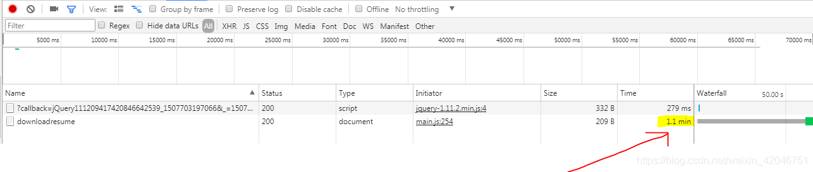

#nginx-状态码-502-503-504

>https://www.rfc-editor.org/rfc/rfc7231#section-6  http1.1 这本书；
>
>http://httpstat.us/

### 502 - Bad Gateway

官方解释：作为网关或者代理工作的服务器尝试执行请求时，从上游服务器接收到无效的响应。

1. 那么什么时候会出现上面的情况呢？

- php-fpm没有启动，nginx无法将请求交给php-fpm

- php-fpm运行脚本超时，php-fpm终止了脚本的执行和执行脚本的Worker进程，nginx发现自己与php-fpm的连接断开 一般是那两个超时；

- 

  -----

  nginx.conf   这两个参数错误的测试；找不到php-fpm怎么办；  这个不会返回任何参数；

  `````nginx
      fastcgi_read_timeout 1200;  
      fastcgi_param SCRIPT_FILENAME $document_root$fastcgi_script_name; 这个会返回 404
     	fastcgi_pass   php7.2:9000;  这个也算是502  只要你给他一个地址是一个有效的ip地址，那么就会返回502，如果修改成php:9000 那么就是http协议没有ip 肯定找不到会提示你网络是不是有问题啥的；有没有联网；
  `````

  

1. nginx和php-fpm 报告502的通信过程
    **nginx 在这里充当的是反向代理服务器的角色，是把 http 协议请求转成 fastcgi 协议的请求，通过 fastcgi_pass 指令传递给 php-fpm 进程，当 php-fpm 进程响应的内容是 nginx 无法理解的响应，就会返回 502 bad gateway。**
2. 502的问题如何解决

- 检查php-fpm是否启动
- 在 php.ini和 php-fpm.conf中分别有这样两个配置项：**max_execution_time和 request_terminate_timeout。**
- <font color=red>注意：request_terminate_timeout 会覆盖max_execution_time 的数据；所以只需要修改request_terminate_timeout就可以了；</font>
- 这两项都是用来配置一个 PHP 脚本的最大执行时间的。当超过这个时间时，**PHP-FPM不只会终止脚本的执行，还会终止执行脚本的Worker进程。所以Nginx会发现与自己通信的连接断掉了，就会返回给客户端502错误。**
- 只需将这两项的值调大一些就可以让PHP脚本不会因为执行时间长而被终止了。**request_terminate_timeout** 可以覆盖 max_execution_time，所以如果不想改全局的php.ini，那只改PHP-FPM的配置就可以了。

---


### 503 - Service Unavailable

> **503 状态码表示由于临时过载或计划维护，服务器当前无法处理请求**
>
> 

服务器目前无法使用（由于超载或停机维护）。通常，这只是暂时状态。（服务不可用）**。一个 http 请求占用一个 php-fpm 进程，瞬时请求量过大时，没有足够的 php-fpm 进程去处理请求，就会返回 503 service unavailable。** **这个仅仅是被挂起了吧；pending**

<font color=red>**停机维护为什么会返回503？？？？  这是状态码的最后一个问题；    503 怎么去复现的问题；**</font>

https://www.itpro.co.uk/web-browser/30394/what-is-http-error-503-and-how-do-you-fix-it


注意所有的内存或者磁盘单位都是KB；也就是说1918584 仅仅是1.9G；


```php
header('HTTP/1.1 503 Service Temporarily Unavailable');
header('Status: 503 Service Temporarily Unavailable');
header('Retry-After: 300');//300 seconds  300s后重试
```


**过载：**

　　服务器过载的情况分为两种：一种为瞬间过载，即服务器暂时的、短时间的超载，这种情况主要是由服务器负载的特点引起的。大量的研究表明，Web请求的网络通信量分布是自相似的，即Web请求的通信量可以在很大范围内有显著的变化。**这就造成服务器常常短时间的超载，但这样情况持续的时间一般很短。**

一种是服务器长时间的超载，这种情况一般是由某一特殊事件引起的，例如服务器受到拒绝服务攻击或者发生了“活锁”现象。


**死循环；** **cpu过高；**

```
sleep() ``//主要是让死循环得到休息，不至于崩溃。
set_time_limit(0); ``//设置执行最长时间，0为无限制。
ignore_user_abort(true); ``//关闭浏览器，服务器也能自动执行。
break``; ``//跳出循环
```

或者，**nginx 配置了频率限制，而 client 端又超过了配置的限制后就会收到 503 的响应。**


**limit-req模块的限制；**

---


### 504 Gateway Time-out


1. 504错误的产生情况

- **504 即 nginx 超过了自己设置的超时时间，不等待 php-fpm 的返回结果，nginx 的 fastcgi 模块有一个 fastcgi_read_timeout 配置，它表示从 FastCGI server 获取数据的超时时间。如果超过这个配置，直接给客户端返回 504 错误。但是此时 php-fpm 依然还在处理请求（在没有超出自己的超时时间的情况下）**
- 网关超时，客户端所发出的请求没有到达网关,在限定时间内没有得到php-fpm，或者完成php-fpm的传输数据的工作而超时 。比方说：即nginx的worker去php-fpm进程池去处理，但是没有fpm进程可以使用了，等啊等，还是没有，返回504。
- <font color=red>这里主要是fastcgi_read_timeout 设置的时间的大小和request_terminate_timeout 的时间大小的优化；fastcgi_read_timeout 比较小，那么就会返回504，如果rquest_terminate_timeout 比较小那么返回502</font>

1. 解决办法
    ***可以将nginx配置中的fastcgi_read_timeout 选项超时时间调大**


---


**404  有可能是url写错了，目录不存在，或者是fastcgi_param SCRIPT_FILENAME 是错误的；**


**没有权限是403 禁止访问；**

---


在Chrome DevTools 开发者工具窗口中，请求被“pending”是什么意思?


pending（挂起）：网络处于挂起状态，指发送的请求是“进行中”的状态，但还没有接到服务端的响应。（这类似于debug模式下加断点，请求被阻止住一样）


一旦服务端做出响应，时间将被更新为总运行时间。





----


502错误是所有用nginx跑php的运维人员不愿意看见的

nginx出现502有很多原因，但大部分原因可以归结为资源数量不够用,也就是说后端php-fpm处理有问题，nginx将正确的客户端请求发给了后端的php-fpm进程，但是因为php-fpm进程的问题导致不能正确解析php代码，最终返回给了客户端502错误。

服务器出现502的原因是连接超时 我们向服务器发送请求 由于服务器当前链接太多，导致服务器方面无法给于正常的响应,产生此类报错

**因此如果你服务器并发量非常大，那只能先增加机器，然后按以下方式优化会取得更好效果;但如果你并发不大却出现502，一般都可以归结为配置问题，脚本超时问题**。


**2. 调高调高linux内核打开文件数量**

可以使用这些命令(必须是root帐号)

echo 'ulimit -HSn 65536' >> /etc/profile

echo 'ulimit -HSn 65536' >> /etc/rc.local

source /etc/profile

 **3.脚本执行时间超时**

如果脚本因为某种原因长时间等待不返回 ，导致新来的请求不能得到处理，可以适当调小如下配置。

nginx.conf里面主要是如下

fastcgi_connect_timeout 300;
fastcgi_send_timeout 300;
fastcgi_read_timeout 300;

php-fpm.conf里如要是如下

request_terminate_timeout = 10s

**4.缓存设置比较小**

修改或增加配置到nginx.conf

proxy_buffer_size 64k;
proxy_buffers 512k;
proxy_busy_buffers_size 128k;

**5. recv() failed (104: Connection reset by peer) while reading response header from upstream**

可能的原因机房网络丢包或者机房有硬件防火墙禁止访问该域名

**但最重要的是程序里要设置好超时，不要使用php-fpm的request_terminate_timeout，**

最好设成request_terminate_timeout=0;

因为这个参数会直接杀掉php进程，然后重启php进程，这样前端nginx就会返回104: Connection reset by peer。这个过程是很慢，总体感觉就是网站很卡。

May 01 10:50:58.044162 [WARNING] [pool www] child 4074, script '/usr/local/nginx/html/quancha/sameip/detail.php' execution timed out (15.129933 sec), terminating
May 01 10:50:58.045725 [WARNING] [pool www] child 4074 exited on signal 15 SIGTERM after 90.227060 seconds from start
May 01 10:50:58.046818 [NOTICE] [pool www] child 4082 started

说一千道一万最重要的就是程序里控制好超时，gethostbyname、curl、file_get_contents等函数的都要设置超时时间。

另一个就是多说，这个东西是增加了网站的交互性，但是使用的多了反应就慢了，如果你网站超时且使用了多说是，可以关闭它。s