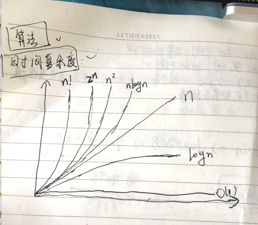

刷题leetcode 算法；

1. 看题  5-15分钟 不会直接去 答案，看一下最优解
2. 第二遍 直接自己写代码
3. 过一天之后 再写一遍代码 
4. 过一个星期，再写一遍代码
5. 面试一周前，再写一遍代码

### 时间复杂度

常见的七种时间复杂度 

* O(1)  constant 常数时间复杂度
* O(log n)  对数时间复杂度  二分查找法
* O(n) 线性时间复杂度
* O(n^2)
* O(n^3) 指数时间复杂度 
* O(2^n) 对数  fIbonacci 数列
* O(n!) 阶乘时间复杂度

注意：**只看最高复杂度的运算**；

事件复杂度 是 n! > 2^n >n^2> nlogn > n > logn > 1；

fibonacci数列，斐波那契数列

//直接用递归  需要重复操作的部分太多了,所以效率会非常的低

可以去参考一下 [leetcode-70](https://leetcode-cn.com/problems/climbing-stairs/)

~~~
f(n) = f(n-1) + f(n-2);
//可以看成走到n-2台阶的方法 加上走到n-1台阶的方法;
直接用递归 时间复杂度是  2^n 
递归树来计算时间复杂度最后一层执行的节点树 大概是 2^n 的事件复杂度
//这个递归需要计算很多重复的部分;

function fibo($n){
	if($n <= 2) return $n;
	return fibo($n-1) + fibo($n-2)
}
//所以这里做了一个优化 用记忆性递归
用 cache  做一个缓存；
class Solution{
	public $cache = [];
    function climbStairs($n) {
        if(isset($this->cache[$n])) return $this->cache[$n];
        if($n <= 2) return $n;
        $mid =  $this->climbStairs($n - 2) + $this->climbStairs($n - 1);
        $this->cache[$n] = $mid;
        return $mid;
    }
}
~~~

**递归树**

主定理：

binary search 二分查找 logn    每次查找都仅仅查找一半 

二叉树的遍历事件复杂度O(n) n代表的是节点数 每一个节点都会遍历一次 且仅访问一次

有序的二维数组进行 二分查找 就是  O(n)，记住i就行了；

merge sort 时间复杂度是 O(nlogn)  这个是最优的排序；

### 空间复杂度

* 存在数组，一般**数组的长度**就是你的空间复杂度；
* 递归，**递归的深度**就是你的空间复杂度;

###  递归

递归的复杂度

* 空间复杂度= **每次的递归操作的空间复杂度  * 递归树的深度**；（其实就是调用栈的大小）
* 事件复杂度 = **每次递归操作的空间复杂度 * 递归树的节点数**；（一般是叶子节点的节点数）

**ATT ：查看一下调用栈的入栈和出栈，栈的问题；**     

所以 递归的空间复杂度就是递归树的深度，就是调用栈的大小；  

