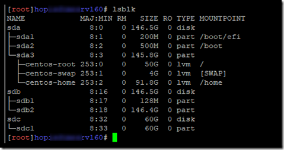

# 用户态和内核态---2022 6-6 误删 丢失过一次；

>用户态 => 内核态  切换的时候 需要copy数据到内核态；然后做处理；然后再把数据返回给用户态；
>
>转换条件：申请外部资源，申请硬件资源	
>
>为什么分这两个态：主要是为了保障硬件资源的安全；

**外部资源：**

1. 系统调用  system call
2. 中断  会发生系统调用； 我们遇到的主要是输入和输出的中断；
3. 异常

**系统调用：**

1. 进程 exit() fork() fork一个子进程
2. 文件 open write read close fopen(底层就是系统调用open fopen 其实就是对open的封装)
3. 设备 read write
4. 信息 getXXX
5. 内存有关的，emalloc ，efree；mmap 申请内存；
6. 通信  pipe  socket（connetion bind listen accept read write close）
7. 锁   互斥锁和自旋锁； 存在上下文的切换；会消耗cpu；？？？？？？？？？？？

**检测的工具**：

`````bash
#记录一下网卡的位置把；
#跟踪进程的系统调用 system trace ;
strace -p pid -f -e -o out.txt

# -f 跟踪fork 生成的子进程 注意跟踪的时候fork的产生的子进程，注意nginx的本身的work process本身就存在，所以并不能抓取到；
#-ff 如果提供-o filename,则所有进程的跟踪结果输出到相应的filename.pid中,pid是各进程的进程号.
#  nginx的监听 只能开三个shell分别监听不同的进程；


# -t  在输出的每一行信息前加上时间信息
#-tt 在输出中的每一行前加上t时间信息,微秒级. 
# -e 过滤
# -e trace=set   # 只跟踪指定的系统调用。例如，-e trace=open, close, read, write 表示只跟踪open、close、read和write这四种系统调用
# -e trace=file  # 只跟踪与文件操作相关的系统调用
# -e trace=process # 只跟踪与进程相关的系统调用
# -e trace=network # 只跟踪与网络相关的系统调用
# -e trace=signal # 值跟踪与信号相关的系统调用
# -e trace=ipc     # 只跟踪与进程间通信相关的系统调用
# -e signal=set    # 只跟踪指定的信号。

#-o 将strace输出写入指定的文件
#-e  过滤

strace -e bind,connect,socket,poll  ping www.baidu.com

strace -f -F -o ~/straceout.txt myserver
-f -F选项告诉strace同时跟踪fork和vfork出来的进程，-o选项把所有strace输出写到~/straceout.txt里 面，myserver是要启动和调试的程序。 

strace -e poll,connection,bind  

stat file_name 获取文件状态的命令

# strace -e bind,epoll,connection 
`````

````shell
tcpdump tcp的抓包工具 charles  wireshark   回环网卡（Loopback adaptor）
# 也是一个网络 数据包的截取分析工具；也就是抓包工具；
#参数
tcpdump port 8888
tcpdump tcp/arp/ip/
tcpdump src/dst（没有则，都要监听） host（ip的形式） hostname（域名） net（xxx.xxx.xxx/24）
#监听某一个网卡
tcpdump -i eth0/lo
tcpdump -w ~/wireshark/route.api.log
#也可以对条件使用and 来进行链接
tcpdump tcp port 80 and src host 127.10.0.5 and ！ip1 除了整个ip之外的
-c 100 ： 只抓取100个数据包
-t  不显示时间戳；
-s 0 ； 抓包的时候默认抓取长度为多少个字节；-S 0；是代表完全的数据包；
tcpdump -i ens33 tcp port 80 and dst host 192.168.146.18 -w ~/wireshark/request
````

````shell
curl 一个http请求；

````

````shell
iostat  iostat是I/O statistics  io的监视的数据统计；  debian  install apt-get install sysstat
#就是看一下 是否是io的瓶颈： iowait  太高了 就有可能存在io瓶颈   高过30%时IO压力高
#如果特别高 idle 还特别卡的话就是一个 内存问题；  
#%idle 太低 低于10 就是cpu的瓶颈；
iostat 2 3  2 秒显示一次 显示三次；
-c cpu  和 -d 互斥；
-d 磁盘  dish   可以指定磁盘   例如 iostat -d sda 
-k kb显示
-x 显示详情信息；    -x     Display extended statistics.
-m 以M的形式显示
-p device  查看这个块设备；

#如果%iowait的值过高，表示硬盘存在I/O瓶颈。
#如果 %util 接近 100%，说明产生的I/O请求太多，I/O系统已经满负荷，该磁盘可能存在瓶颈。
#如果 svctm 比较接近 await，说明 I/O 几乎没有等待时间；
#如果 await 远大于 svctm，说明I/O 队列太长，io响应太慢，则需要进行必要优化。
#如果avgqu-sz比较大，也表示有大量io在等待。

#avgque-sz  io队列的长度； 被阻塞了多少
#await 平均每次io操作的等待时间
#svctm  平均每次io操作的服务时间； service time 
#%util    就是一秒钟会有多少时间用于io操作     io消耗的cpu百分比；


iostat -m 参数

tps  transfers per second  传输次数  每秒的传输次数；  。“一次传输”意思是“一次I/O请求”。多个逻辑请求可能会被合并为“一次I/O请求”。“一次传输”请求的大小是未知的。 

read/s   每秒从设备读取的数据量；
write/s  每秒从设备写入的数据量；

kB_read：读取的总数据量；kB_wrtn：写入的总数量数据量；

# linux 内核  和 cpu数目
Linux 3.10.0-1160.el7.x86_64 (localhost.localdomain) 	05/18/2022 	_x86_64_	(1 CPU)

#cpu的平均负载；
avg-cpu:  %user   %nice %system %iowait  %steal   %idle
           0.28    0.01    0.72    0.03    0.00   98.96

#磁盘的读写情况
Device:            tps    kB_read/s    kB_wrtn/s    kB_read    kB_wrtn
sda               0.49         8.55        15.06     378273     666280
scd0              0.00         0.02         0.00       1028          0
dm-0              0.53         8.28        14.98     366143     662890
dm-1              0.01         0.05         0.03       2204       1252
-x显示详细情况；extend 信息
Device:         rrqm/s   wrqm/s     r/s     w/s    rkB/s    wkB/s avgrq-sz avgqu-sz   await r_await w_await  svctm  %util
sda               0.00     0.07    0.22    0.28     8.51    15.01    95.26     0.00    6.07    6.74    5.55   2.97   0.15
scd0              0.00     0.00    0.00    0.00     0.02     0.00   114.22     0.00    1.50    1.50    0.00   1.06   0.00
dm-0              0.00     0.00    0.19    0.34     8.24    14.93    87.90     0.00    6.37    7.66    5.65   2.77   0.15
dm-1              0.00     0.00    0.00    0.01     0.05     0.03    17.24     0.00    7.52    0.10    9.61   0.23   0.00

#avgrq-sz  平均io的数据大小  send size 
#avgqu-sz  平均队列长度
#await 平均等待时间 毫秒
util·%util： 一秒中有百分之多少的时间用于 I/O 操作,或者说一秒中有多少时间 I/O 队列是非空的，即 delta(use)/s/1000 (因为use的单位为毫秒)
如果是满的那么真的是存在io口的瓶颈；

````


````shell
crontab  执行计划；定时任务；
分 时 日 月 周

*代表 每
，并列
- 连续
/ 整除  能被整除都会被执行 能被整除才会运行  每隔多少分 或者每隔多少个小时运行一次；

*/2   2，4，6，8...58;
0/2  减去0 能被2 整除的会被执行；
7/2  也就是从 7分钟之后才会被执行；负的不会计算
秒的计时
* * * * *   执行脚本
* * * * * sleep 1;执行脚本   下一秒 运行脚本；每一秒运行脚本；
crontab -e 创建脚本
crontab -l 查看脚本
crontab -r 删除计划任务	
 # .---------------- minute (0 - 59)
  9 # |  .------------- hour (0 - 23)
 10 # |  |  .---------- day of month (1 - 31)
 11 # |  |  |  .------- month (1 - 12) OR jan,feb,mar,apr ...
 12 # |  |  |  |  .---- day of week (0 - 6) (Sunday=0 or 7) OR sun,mon,tue,wed,thu,fri,sat
vim /etc/crontab 
//
find 

curl 就是发送一个http请求

#看一下把；
示例：

0 4  * * 0     root emerge --sync && emerge -uD world              #每周日凌晨4点，更新系统

0 2 1 * *     root   rm -f /tmp/*                                                    #每月1号凌晨2点，清理/tmp下的文件

0 8 6 5 *   root     mail  robin < /home/galeki/happy.txt             #每年5月6日给robin发信祝他生日快乐

假如，我想每隔2分钟就要执行某个命令，或者我想在每天的6点、12点、18点执行命令，诸如此类的周期，可以通过 “ / ” 和 “ , ” 来设置：

*/2   *   *   *   *           root      ...............      #每两分钟就执行........

0 6,12,18   *   *   *    root      ...............      #每天6点、12点、18点执行........

每两个小时

0 */2 * * * echo "have a break now." >> /tmp/test.txt

晚上11点到早上8点之间每两个小时，早上八点

0 23-7/2，8 * * * echo "have a good dream：)" >> /tmp/test.txt

每个月的4号与每个礼拜的礼拜一到礼拜三的早上11点

0 11 4 * 1-3 command line

1月1日早上4点

0 4 1 1 * command line
# #ls /var/log/cron* 日志所在的位置；可以查看位置；
---
````

`````shell
curl 就是发送一个http请求
-s 省略进度条 slient  静默模式 
-o output 会进行下载  
-H 指定请求头 Hader
-d 请求的内容 data 
-X指定请求方法

man curl | grep "\-X"  --request 请求方式；  注意在正则里里面 - 代表从那里到那里

curl www.demo.com?ceshi=ceshi1&ceshi1=ceshi2 -s -H "A:B" -X post -d "ceshi=ceshi"


400 ;
由于某些被认为是客户端错误（例如，格式错误的请求语法、无效的请求消息帧或欺骗性请求路由），服务器不能或不会处理请求。
-X  POST | GET
curl 192.168.146.29/ -d "{\"ceshi\":26}"  -H "Content-Type:application/json"  -X GET

<!DOCTYPE html>
<html>
<head>
<title>Welcome to nginx!</title>
<style>
html { color-scheme: light dark; }
body { width: 35em; margin: 0 auto;
font-family: Tahoma, Verdana, Arial, sans-serif; }
</style>
</head>
<body>
<h1>nginx success!</h1>


<p><em>Thank you for using nginx.</em></p>
</body>
</html>

`````

````bash
find 查找
find / -name -size -mtime -ctime -type -print0|xargs 
#xargs 	xargs命令的作用，是将标准输入转为命令行参数。  就是把标准输入转换成命令行参数；
# 可以通过 type 来查找各种数据类型的文件；
find ./ -type f -print0 | xargs -0 ls -al
#但是一定要注意,-print0针对的是\n转\0,如果查找的文件名本身就含有空格,则find后-print0仍然会显示空格文件。、
# xargs -0 是一个 Linux 命令，用于从标准输入或文件中读取数据，并将其转换为参数传递给另一个命令。-0 选项是用于指定输入数据的字段分隔符为 null 字符(即 ASCII 码为 0 的字符)。

````


`````c
xargs -0 是一个 Linux 命令，用于从标准输入或文件中读取数据，并将其转换为参数传递给另一个命令。-0 选项是用于指定输入数据的字段分隔符为 null 字符(即 ASCII 码为 0 的字符)。

例如，下面的命令用于将文件列表传递给 rm 命令，以删除这些文件：

find . -name "*.tmp" -print0 | xargs -0 rm

在这个例子中，find 命令用于查找所有以 .tmp 为扩展名的文件，并使用 -print0 选项将它们的路径名以 null 字符分隔输出到标准输出。xargs 命令从标准输入中读取这些路径名，并将它们作为参数传递给 rm 命令。使用 -0 选项是为了确保 find 命令中使用的 null 字符能够正确地被 xargs 命令处理。
`````


ldd 查看程序的依赖库 其实就是ddl  动态链接库

````shell
[root@localhost ~]# ldd /usr/bin/bash
	linux-vdso.so.1 =>  (0x00007fffc9d07000)
	libtinfo.so.5 => /lib64/libtinfo.so.5 (0x00007f7f67bd1000)
	libdl.so.2 => /lib64/libdl.so.2 (0x00007f7f679cd000)
	libc.so.6 => /lib64/libc.so.6 (0x00007f7f675ff000)
	/lib64/ld-linux-x86-64.so.2 (0x00007f7f67dfb000)

````


tcpdump

ps -ef 查看 nginx的服务器  用 grep -i  -v -w

```shell
ps -ef | grep -i nginx | grep -v grep	
```

awk  查看可以登录  shell的用户 ；

````shell
awk -F: '/bash$/{x++}END{print x}' /etc/passwd
````


lsof  一切接文件；

lsof（list open files）是一个查看**当前****系统文件**的工具。在linux环境下，任何事物都以文件的形式存在，通过文件不仅仅可以访问常规数据，还可以访问网络连接和硬件

````shell
#  查看 当前进程打开的文件；
lsof -op pid  

##
实例6：通过某个进程号显示该进程打开的文件
$lsof -p 11968
实例7：列出所有的网络连接
$lsof -i
实例8：列出所有tcp 网络连接信息
$lsof -i tcp

$lsof -n -i tcp
COMMAND     PID  USER   FD   TYPE  DEVICE SIZE/OFF NODE NAME
svnserve  11552 weber    3u  IPv4 3799399      0t0  TCP *:svn (LISTEN)
redis-ser 25501 weber    4u  IPv4  113150      0t0  TCP 127.0.0.1:6379 (LISTEN)
实例9：列出谁在使用某个端口
$lsof -i :3306

````


**netstat  列出当前的所有的连接；**linux  


`````shell
netstat -a   all 

-t tcp 
-u  udp 
-n  number  用 数字的形式显示 不需要使用host 直接使用ip就可以； 
-p 显示进程的信息；pid

-c continue  持续的输出  动态查看连接数；
$ netstat -ct   
这个命令可持续输出 TCP 协议信息。

# 展示正在监听的tcp连接 
netstat -tnl
-l listen  监听；
`````


````shell
ss
-a all
-t tcp
-u udp
-p    -p, --processes     show process using socket  process name process pid  fd
-l listen  

ss -tl | grep :2375 
#注意 awk数组的遍历必须加（）shell 不需要（）
[root@localhost shell]# ss -antp | awk 'NR>1{b[$1]++}END{for (i in b) print i,b[i]}'
LISTEN 7
ESTAB 2
````


```shell
#return fd ;

man 2  socket 
int socket(int domain, int type, int protocol);
RETURN VALUE
       On success, a file descriptor for the new socket is returned.  On error, -1 is returned, and errno is set appropriately.

man 2 
open  open a read/write file descriptor.
```

````````php
//vmstat是Virtual Meomory Statistics（虚拟内存统计）的缩写，可实时动态监视操作系统的虚拟内存、进程、CPU活动。
root@469ac484bce7:/var/www/html# vmstat
procs -----------memory---------- ---swap-- -----io---- -system-- ------cpu-----
 r  b   swpd   free   buff  cache   si   so    bi    bo   in   cs us sy id wa st
 0  0      0 356740  40412 1382164    0    0    11    37    7  142  0  0 100  0  0
    
    
10.1. vmstat的语法
　　vmstat [-V] [-n] [delay [count]]

-V表示打印出版本信息；
-n表示在周期性循环输出时，输出的头部信息仅显示一次；
delay是两次输出之间的延迟时间；
count是指按照这个时间间隔统计的次数。
    
/root$vmstat 5 5
procs -----------memory---------- ---swap-- -----io---- --system-- -----cpu-----
r  b   swpd   free   buff  cache   si   so    bi    bo   in   cs us sy id wa st
6  0      0 27900472 204216 28188356    0    0     0     9    1    2 11 14 75  0  0
9  0      0 27900380 204228 28188360    0    0     0    13 33312 126221 22 20 58  0  0
2  0      0 27900340 204240 28188364    0    0     0    10 32755 125566 22 20 58  0  0
10.2. 字段说明
Procs（进程）:
r: 运行队列中进程数量
b: 等待IO的进程数量
Memory（内存）:
swpd: 使用虚拟内存大小
free: 可用内存大小
buff: 用作缓冲的内存大小
cache: 用作缓存的内存大小
Swap:
si: 每秒从交换区写到内存的大小
so: 每秒写入交换区的内存大小
IO：（现在的Linux版本块的大小为1024bytes）
bi: 每秒读取的块数
bo: 每秒写入的块数
system：
in: 每秒中断数，包括时钟中断
cs: 每秒上下文切换数  context swap 
CPU（以百分比表示）
    
us: 用户进程执行时间(user time)
sy: 系统进程执行时间(system time)
id: 空闲时间(包括IO等待时间)
wa: 等待IO时间
````````


**lrzsz   文件的上传和下载**

```shell
yum install -y lrzsz 
```

### **2)使用说明**

sz命令发送文件到本地：

```
#sz filename1
```

rz命令本地上传文件到服务器：

```
#rz
```

sz中的s意为send（发送），告诉客户端，我（服务器）要发送文件 send to cilent，就等同于客户端在下载。

rz中的r意为received（接收），告诉客户端，我（服务器）要接收文件 received by cilent，就等同于客户端在上传。

**对象是  服务器；**	


**sda**

**其实就是磁盘的分区**

sda1 sda2 sda3

df -ah  查看所有的文件分区？？


# 11. iostat 监视I/O子系统

iostat是I/O statistics（输入/输出统计）的缩写，用来动态监视系统的磁盘操作活动。

## 11.1. 命令格式

iostat[参数][时间][次数]

## 11.2. 命令功能

通过iostat方便查看CPU、网卡、tty设备、磁盘、CD-ROM 等等设备的活动情况, 负载信息。

## 11.3. 命令参数

- -C 显示CPU使用情况
- -d 显示磁盘使用情况
- -k 以 KB 为单位显示
- -m 以 M 为单位显示
- -N 显示磁盘阵列(LVM) 信息
- -n 显示NFS 使用情况
- -p[磁盘] 显示磁盘和分区的情况
- -t 显示终端和CPU的信息
- -x 显示详细信息
- -V 显示版本信息

## 11.4. 工具实例

### 实例1：显示所有设备负载情况

```
/root$iostat
Linux 2.6.32-279.el6.x86_64 (colin)   07/16/2014      _x86_64_        (4 CPU)

avg-cpu:  %user   %nice %system %iowait  %steal   %idle
10.81    0.00   14.11    0.18    0.00   74.90

Device:            tps   Blk_read/s   Blk_wrtn/s   Blk_read   Blk_wrtn
sda               1.95         1.48        70.88    9145160  437100644
dm-0              3.08         0.55        24.34    3392770  150087080
dm-1              5.83         0.93        46.49    5714522  286724168
dm-2              0.01         0.00         0.05      23930     289288
```

- cpu属性值说明：

  %user：CPU处在用户模式下的时间百分比。
  %nice：CPU处在带NICE值的用户模式下的时间百分比
  。%system：CPU处在系统模式下的时间百分比。
  **%iowait：CPU等待输入输出完成时间的百分比。**
  %steal：管理程序维护另一个虚拟处理器时，虚拟CPU的无意识等待时间百分比。
  **%idle：CPU空闲时间百分比。**

**注：如果%iowait的值过高，表示硬盘存在I/O瓶颈，%idle值高，表示CPU较空闲，如果%idle值高但系统响应慢时，有可能是CPU等待分配内存，此时应加大内存容量。%idle值如果持续低于10，那么系统的CPU处理能力相对较低，表明系统中最需要解决的资源是CPU。**

- disk属性值说明：

  rrqm/s: 每秒进行 merge 的读操作数目。
  即 rmerge/swrqm/s: 每秒进行 merge 的写操作数目。
  即 wmerge/sr/s: 每秒完成的读 I/O 设备次数。
  即 rio/sw/s: 每秒完成的写 I/O 设备次数。
  即 wio/srsec/s: 每秒读扇区数。即 rsect/swsec/s: 每秒写扇区数。
  即 wsect/srkB/s: 每秒读K字节数。是 rsect/s 的一半，因为每扇区大小为512字节。wkB/s: 每秒写K字节数。是 wsect/s 的一半。avgrq-sz: 平均每次设备I/O操作的数据大小 (扇区)。

  **avgqu-sz: 平均I/O队列长度。**
  
  
  
  **await: 平均每次设备I/O操作的等待时间 (毫秒)。**
  **svctm: 平均每次设备I/O操作的服务时间 (毫秒)。**
  
  
  
  **%util: 一秒中有百分之多少的时间用于 I/O 操作，即被io消耗的cpu百分比**

**备注：如果 %util 接近 100%，说明产生的I/O请求太多，I/O系统已经满负荷，该磁盘可能存在瓶颈。如果 svctm 比较接近 await，说明 I/O 几乎没有等待时间；如果 await 远大于 svctm，说明I/O 队列太长，io响应太慢，则需要进行必要优化。如果avgqu-sz比较大，也表示有当量io在等待。**

### 实例2：定时显示所有信息

```
/root$iostat 2 3
Linux 2.6.32-279.el6.x86_64 (colin)   07/16/2014      _x86_64_        (4 CPU)

avg-cpu:  %user   %nice %system %iowait  %steal   %idle
10.81    0.00   14.11    0.18    0.00   74.90

Device:            tps   Blk_read/s   Blk_wrtn/s   Blk_read   Blk_wrtn
sda               1.95         1.48        70.88    9145160  437106156
dm-0              3.08         0.55        24.34    3392770  150088376
dm-1              5.83         0.93        46.49    5714522  286728384
dm-2              0.01         0.00         0.05      23930     289288

avg-cpu:  %user   %nice %system %iowait  %steal   %idle
22.62    0.00   19.67    0.26    0.00   57.46

Device:            tps   Blk_read/s   Blk_wrtn/s   Blk_read   Blk_wrtn
sda               2.50         0.00        28.00          0         56
dm-0              0.00         0.00         0.00          0          0
dm-1              3.50         0.00        28.00          0         56
dm-2              0.00         0.00         0.00          0          0

avg-cpu:  %user   %nice %system %iowait  %steal   %idle
22.69    0.00   19.62    0.00    0.00   57.69

Device:            tps   Blk_read/s   Blk_wrtn/s   Blk_read   Blk_wrtn
sda               0.00         0.00         0.00          0          0
dm-0              0.00         0.00         0.00          0          0
dm-1              0.00         0.00         0.00          0          0
dm-2              0.00         0.00         0.00          0          0
```

说明：每隔 2秒刷新显示，且显示3次

### 实例3：查看TPS和吞吐量

```
/root$iostat -d -k 1 1
Linux 2.6.32-279.el6.x86_64 (colin)   07/16/2014      _x86_64_        (4 CPU)

Device:            tps    kB_read/s    kB_wrtn/s    kB_read    kB_wrtn
sda               1.95         0.74        35.44    4572712  218559410
dm-0              3.08         0.28        12.17    1696513   75045968
dm-1              5.83         0.46        23.25    2857265  143368744
dm-2              0.01         0.00         0.02      11965     144644
```

- tps：该设备每秒的传输次数（Indicate the number of transfers per second that were issued to the device.）。“一次传输”意思是“一次I/O请求”。多个逻辑请求可能会被合并为“一次I/O请求”。“一次传输”请求的大小是未知的。
- kB_read/s：每秒从设备（drive expressed）读取的数据量；
- kB_wrtn/s：每秒向设备（drive expressed）写入的数据量；
- kB_read：读取的总数据量；kB_wrtn：写入的总数量数据量；

这些单位都为Kilobytes。

上面的例子中，我们可以看到磁盘sda以及它的各个分区的统计数据，当时统计的磁盘总TPS是1.95，下面是各个分区的TPS。（因为是瞬间值，所以总TPS并不严格等于各个分区TPS的总和）

### 实例4：查看设备使用率（%util）和响应时间（await）

```
/root$iostat -d -x -k 1 1
Linux 2.6.32-279.el6.x86_64 (colin)   07/16/2014      _x86_64_        (4 CPU)

Device:         rrqm/s   wrqm/s     r/s     w/s    rkB/s    wkB/s avgrq-sz avgqu-sz   await  svctm  %util
sda               0.02     7.25    0.04    1.90     0.74    35.47    37.15     0.04   19.13   5.58   1.09
dm-0              0.00     0.00    0.04    3.05     0.28    12.18     8.07     0.65  209.01   1.11   0.34
dm-1              0.00     0.00    0.02    5.82     0.46    23.26     8.13     0.43   74.33   1.30   0.76
dm-2              0.00     0.00    0.00    0.01     0.00     0.02     8.00     0.00    5.41   3.28   0.00
```

- rrqm/s： 每秒进行 merge 的读操作数目.即 delta(rmerge)/s
- wrqm/s： 每秒进行 merge 的写操作数目.即 delta(wmerge)/s
- r/s： 每秒完成的读 I/O 设备次数.即 delta(rio)/s
- w/s： 每秒完成的写 I/O 设备次数.即 delta(wio)/s
- rsec/s： 每秒读扇区数.即 delta(rsect)/s
- wsec/s： 每秒写扇区数.即 delta(wsect)/s
- rkB/s： 每秒读K字节数.是 rsect/s 的一半,因为每扇区大小为512字节.(需要计算)
- wkB/s： 每秒写K字节数.是 wsect/s 的一半.(需要计算)
- avgrq-sz：平均每次设备I/O操作的数据大小 (扇区).delta(rsect+wsect)/delta(rio+wio)
- avgqu-sz：平均I/O队列长度.即 delta(aveq)/s/1000 (因为aveq的单位为毫秒).
- await： 平均每次设备I/O操作的等待时间 (毫秒).即 delta(ruse+wuse)/delta(rio+wio)
- svctm： 平均每次设备I/O操作的服务时间 (毫秒).即 delta(use)/delta(rio+wio)
- %util： 一秒中有百分之多少的时间用于 I/O 操作,或者说一秒中有多少时间 I/O 队列是非空的，即 delta(use)/s/1000 (因为use的单位为毫秒)

**如果 %util 接近 100%，说明产生的I/O请求太多，I/O系统已经满负荷，该磁盘可能存在瓶颈。 idle小于70% IO压力就较大了，一般读取速度有较多的wait。 同时可以结合vmstat 查看查看b参数(等待资源的进程数)和wa参数(IO等待所占用的CPU时间的百分比，高过30%时IO压力高)。**

另外 await 的参数也要多和 svctm 来参考。差的过高就一定有 IO 的问题。

avgqu-sz 也是个做 IO 调优时需要注意的地方，这个就是直接每次操作的数据的大小，如果次数多，但数据拿的小的话，其实 IO 也会很小。如果数据拿的大，才IO 的数据会高。也可以通过 avgqu-sz × ( r/s or w/s ) = rsec/s or wsec/s。也就是讲，读定速度是这个来决定的。

svctm 一般要小于 await (因为同时等待的请求的等待时间被重复计算了)，svctm 的大小一般和磁盘性能有关，CPU/内存的负荷也会对其有影响，请求过多也会间接导致 svctm 的增加。await 的大小一般取决于服务时间(svctm) 以及 I/O 队列的长度和 I/O 请求的发出模式。如果 svctm 比较接近 await，说明 I/O 几乎没有等待时间；如果 await 远大于 svctm，说明 I/O 队列太长，应用得到的响应时间变慢，如果响应时间超过了用户可以容许的范围，这时可以考虑更换更快的磁盘，调整内核 elevator 算法，优化应用，或者升级 CPU。

队列长度(avgqu-sz)也可作为衡量系统 I/O 负荷的指标，但由于 avgqu-sz 是按照单位时间的平均值，所以不能反映瞬间的 I/O 洪水。

- 形象的比喻：

  r/s+w/s 类似于交款人的总数平均队列长度(avgqu-sz)类似于单位时间里平均排队人的个数平均服务时间(svctm)类似于收银员的收款速度平均等待时间(await)类似于平均每人的等待时间平均I/O数据(avgrq-sz)类似于平均每人所买的东西多少I/O 操作率 (%util)类似于收款台前有人排队的时间比例

设备IO操作:总IO(io)/s = r/s(读) +w/s(写)

平均等待时间=单个I/O服务器时间*(1+2+...+请求总数-1)/请求总数

每秒发出的I/0请求很多,但是平均队列就4,表示这些请求比较均匀,大部分处理还是比较及时。


## [sda, sdb, sdc, sda1, sda2在Linux中都代表什么](https://www.cnblogs.com/awpatp/p/8779575.html)

意义如下：

- 第一个软驱 `/dev/fd0`.
- 第二个软驱 `/dev/fd1`.
- 第一块硬盘 `/dev/sda`.
- 第二块硬盘 `/dev/sdb`, 以此类推.
- 第一个SCSI CD-ROM `/dev/scd0`, 可以用`/dev/sr0`.

sda1, sda2是sda这块硬盘上的两个分区。


举例：



 

sda  scd dm 