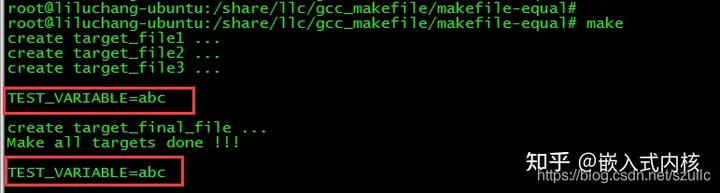

# 工程管理器 --- makefile

>makefile 工程管理器；
>
>帮你管理工程！
>
>**分清依赖和被依赖的关系！！！**
>
>Makefile  M大小写 都可以；

## 语法

 >如果不用 makefile  直接用gcc \*.c  直接生成目标文件！

````makefile
## 语法：
target: dependencies
	command

# 变量的定义和使用；
CC=gcc  
#makefile
# 生成目标 要依赖于那些文件；要执行那些命令；
target:files 
	command
target:files
	$(CC) main.c -c -Wall -g -o mai.o 
````


---

## 实例展示

`````makefile
# eg 1 单文件实例；
test: test.c
    gcc test.c -o test
# make 运行makefile

# eg 2 多文件实例；

`````


## 辅助知识


vscode -- ctrl + tab来切换编程页面！！！


````makefile
# $(TARGET):$(OBJ)
# 	$(CC) $^ -o $@
# %.o: %.c
# 	$(CC) $(CFLAGS) $^ -o $@
 
# Applicable for create executable (without extension) from object .o object file
# $^ matches all the pre-requisites (no duplicates)
# %: %.o
# 	CC $(LINK.o) $^ -o $@
# clean:
# 	rm -rf *.o $(TARGET)
# .PHONY: %.c
# .PHONY: %.c
# clean:
# 	echo "222"
# 	echo $@
# %.c:
# 	echo "111"
# echo "$@"
#	$(CC) $@ -o main
````


## 辅助知识！！！


wildcard 用来明确表示通配符。因为在 Makefile 里，变量实质上就是 C/C++ 中的宏，也就是说，如果一个表达式如 objs = *.o ，则 objs 的值就是 *.o ，而不是表示所有的 .o 文件。若果要使用通配符，那么就要使用 wildcard 来声明 * 这个符号，使 * 符号具有通配符的功能。如下举例：

在当前目录下随意建立两个 *.c 文件，如 hello.c 和 world.c ，现在编写一个 Makefile 如下：

```makefile
src = $(wildcard *.c /usr/src/linux-2.6.24/drivers/char/ip2/*.c)

all:
        @echo $(src)

```

输出结果：

make
hello.c world.c /usr/src/linux-2.6.24/drivers/char/ip2/i2cmd.c /usr/src/linux-2.6.24/drivers/char/ip2/i2ellis.c /usr/src/linux-2.6.24/drivers/char/ip2/i2lib.c /usr/src/linux-2.6.24/drivers/char/ip2/ip2.mod.c /usr/src/linux-2.6.24/drivers/char/ip2/ip2base.c /usr/src/linux-2.6.24/drivers/char/ip2/ip2main.c /usr/src/linux-2.6.24/drivers/char/ip2/ip2main.mod.c
1
上面输出了当前目录下的两个 .c 文件以及/usr/src/linux-2.6.24/drivers/char/ip2/ 目录下所有的 .c 文件。


## makefile 中的赋值运算

https://zhuanlan.zhihu.com/p/486281081

## ***Makefile中的各种赋值运算符号的区别\***

在Makefile的规则写法中，变量的赋值运算，有以下几种方式：

**TEST_VARIABLE = "123"**
**TEST_VARIABLE ?= "456"**
**TEST_VARIABLE += "789"**
**TEST_VARIABLE := "abc"**

我们先给出结论：

= 是延缓赋值，语句执行时，才会运算赋值，比如 **VARIABLE = `ls -al`** ，只有当使用到VARIABLE变量的时候，才会去执行 ls -al命令求得VARIABLE的值。

?= 是判断赋值，即当变量在此之前没有被赋值才会去执行赋值，这个可以防止变量被多次赋值，或变量被覆盖的情况。

+= 是叠加赋值，即变量在执行+=运算后，会保留之前的值，同时会新增新加入的内容，这个常用于对字符串的处理，可以等同于字符串的追加操作。

:= 是立即赋值，即变量会被立即执行，比如 **VARIABLE := `ls -al`** 在第一个出现这个语句的地方，就会被执行ls -la，之后都不会再执行了，而是直接使用VARIABLE的值；它与 = 的最大区别，就是一个是【立即】，一个是【延缓】；适用于不同的应用场景。

以上就是集中赋值运算的对比和区别，下面分析下开头给出的Makefile实践下



这个是因为TEST_VARIABLE变量最后是用:=赋值的，所有它是最后生效的。其他几种赋值的效果，留给读者去验证下吧。


````makefile
# This is a Makefile for learning makefile knowledge !!!
# Knowledge point:
# 1. What's the usage of ".PHONY" ?
# 2. What's the diffirences between "=", ":=", "?=", and "+=" ?
 
TEST_VARIABLE  = "123"
TEST_VARIABLE ?= "456"
TEST_VARIABLE += "789"
# 后执行
all: some_targets
# Simulate to create the lastest target file.
	@touch target_final_file && echo create target_final_file ...
	@echo Make all targets done !!!
	@echo ""
#	@echo "TEST_VARIABLE=$(TEST_VARIABLE)"
	@echo ""
	
TEST_VARIABLE := "abc"
# 先执行
some_targets: 
# Simulate to create some target files.
	@touch target_file1 && echo create target_file1 ...
	@touch target_file2 && echo create target_file2 ...
	@touch target_file3 && echo create target_file3 ...
	@echo ""
#	@echo "TEST_VARIABLE=$(TEST_VARIABLE)"
	@echo ""
	
clean:
	@echo Clean builded project.
	@rm -rf target_file1 target_file2 target_file3 target_final_file
 
#.PHONY: clean some_targets
````


## .PHONY 

><font color=red>**声明一个TARGET 是一个伪的TARGET，不用为生成任何文件，自然不用检查与其同名的文件！！！**</font>

`````makefile
 *#.PHONY 欺骗；*

*#原来Makefile中的TARGET默认是个“文件”，如果不使用.PHONY指定一个TARGET是非文件的话，当有一个与该TARGET同名的文件存在时，执行这个TARGET的编译命令就会报错，如上面的例子，这个TARGET就是clean。*

*#由此可见，.PHONY的作用就是申明一个TARGET是“伪TARGET”，不用为生成任何文件，自然不用检查与其同名的文件。*

*#防止，命令和文件名，一致；下面就是为了防止有 clean 这个文件名；所以要欺骗一下；*

.PHONY: clean
`````


## 
