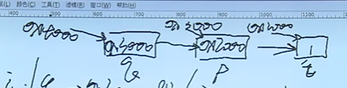

# 多级指针

>指向 和 间接访问的问题；
>
>分别是下面的 p 改变指向；
>
>*p 间接访问的问题；
>
>二级指针；
>
>二级指针保存的值是一级指针的地址；！！！  
>
>一级指针保存的是变量的地址！！！


````c
int i = 1;
int* p = &a;
int** q = &p;

````


// 理解了一个变量有两个属性地址和值 ；这两个概念还是很简单的！！




二级指针 或者 一级指针变量地址；

二级指针指向一级指针的的指针变量；