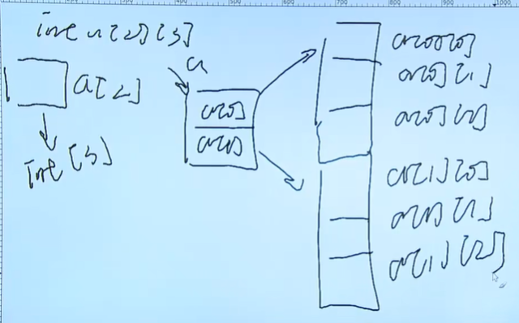

# 指针

>很重要！！！
>
><font color=red>指针等价于地址；</font>

# 所有的变量定义：

就下面的公式：

<font color=red>**TYPE NAME = VALUE；**</font>

TYPE*  指针变量； * 仅仅是标志位；

TYPE 普通变量；

----

## 变量和地址 （包含关系）

> 变量的定义： 把数据存放在某一个内存地址的抽象；抽象概念；
>
>变量名就是地址；
>
>变量值就是数据；
>
>& 取地址符； 获取变量的地址；
>
>\* 解引用； 获取地址指向的值；

`````c
#include <stdio.h>

/**
 * 指针
 * 很重要的一章；
*/

int main() {

    int i = 1;
    // i代表的值；
    // 取单个变量的地址 必须要通过&来获取；
    //或者变量的值；就直接用i来表示就可以？？？  直接获取；  * 获取的是地址的数据；
    //  等号 左边的是 地址 右边的是值；  =   // 没有等号相当于直接是值？？？？
    printf("%d \n", i); // 值
    printf("%d \n", *(&i));  // 值
    // 指针；//地址；
    //%p其实就是 0x 16进制的形式来表示！！！就是地址！！！
    printf("%p \n", &i);
    // 地址；

    return 0;
}
`````


## 指针和指针变量；

>**<font color=red>指针变量 是指变量里面保存的数据是地址； 就叫指针变量； 指针就是地址，是一个变量的成员；</font>**
>
>**<font color=red>指向a，指向b，指针（地址）是一个常量是不会发生改变的，我们平常说的指向a，指向b是指针变量再发生变化； 所以叫指针变量；变量是变动的；</font>**
>
>**<font color=red>注意：前面的数据类型，表示地址指向的数据的类型；并不是指针变量类型；也是为了后面的指针运算，所以必须要知道数据类型；</font>**
>
>**一级指针保存的是变量的地址，但是二级指针保存的是一级指针（指针变量）的地址**

````c
   //指针和指针变量；
    // 指针变量就是保存（指针）地址的变量；

    int* p = &i;  // 变量；int 代表的是int *p 是一个整型；*P 指向的内存块是一个整型int；
  // %p就是 16进制把；
    printf("i == %d \n", i);
    printf("&i == %p \n", &i);
    printf("p == %p \n", p);//这里是地址的10进制；他里面的值就是地址； p  获取的是数据
//tocore //指针变量的地址；&p;
    printf("&p == %p \n", &p); // p这个指针变量的地址；
//tocore //核心部分
// p数据就是地址  *p就是访问地址的内容； 指针变量的用法；
    printf("*p == %d \n", *p); //1 
````


## 直接访问 和间接访问

> 一个变量的两种访问方式：直接访问，或者间接访问；
>
> const

`````c
    /**
     * 直接访问 和间接访问；
    // */
    i = 2;// 直接访问； 
    *p = &i;//间接访问;  或者说是一级间接访问；后面可以多级间接访问；
    printf("%d \n", i);// 3 // 直接访问
	printf("%d \n", *p);//3 间接访问；
    return 0;
`````


## 指针的运算；

>**\*p === 获取当前地址指向的变量；**

 `````c
// * 解引用； *p 获取p地址的指向的变量；
// & 取地址； 

    int** q = &p;
    printf("*q == %p \n", *q); // *(&p) == p
    printf("**q == %p \n", **q); //*(*p) == *(p) == 1 ;
 `````


## 空指针 和野指针；

>空指针，野指针，万能指针！！！；
>
>野指针：没有任何指向的指针；可能指向任意的值，所以这个操作是不合法的；
>
>`````c
>int *p; // 没有任何的指向；//就是没有初始化的指针是一个野指针！！！
>`````
>
>空指针：指针初始化 == NULL；指针指向NULL(0x0000000000000）的地址，内存条的第一个地址；系统为我们保留出来的，当你**访问的时候会报错**！！！起码你可以找到问题，可以使用条件判断指针是否为NULL)；
>
>**空指针可以避免，野指针的产生，但是空指针也不能直接读取或者输入；**
>
>````c
>int *p = NULL;
>
>if (p == NULL) {
>    printnf("p is null");
>}
>
>````
>
>

`````c
//注意这里要用调试文件gdb来运行？？？  为什么runner coder 为什么不出现错误？？/
// 
//segementation fault ;段错误

int a = 1;
int* p1;  // 当 这个指针变量是未知的时候； //随机的地址，我们有可能去修改了已经使用的地址，那么就会出问题；
//tocore
int* p2 = NULL; // 最好用空 代表这个指针不能被修改；
// 这边可以换一个指向；就可以了把// 换一个指向；
//p2 = &a; 
*p2 = 444; //换一个指向，就可以修改了；
*p2 = 333;//segementation fault;  //不能去修改；
*p1 = 222;


`````


## 空类型指针  --- 万能指针！！

>**可以指向任意类型的变量！！！**

`````c
//空类型
int a = 1;
void* p3 = &a;

// void 内存的赋值，并不知道是什么类型；所以使用 void* 空类型的指针；
//eg:man void* memcpy(void* dest, const void *src, size_t n);

// 可以通过强制类型转换来确定数据类型！！！
//void 可以指向任意类型的变量，而不会产生报错！！！！
//万能指针可以自动转换为任意类型的指针；
int a= 2;
void* p = &a;
printf("%d\n", *p);


#include <stdio.h>
#include <stdlib.h>

/**
 * 野指针 空指针 和 万能指针；
 * NULL 修饰空指针的；
*/
#define TESTNULL ((void *)0)
int main() {
    //NULL  
    char a = '\0';//
    printf("%d\n",a);
    printf("%p\n",TESTNULL);// 0x0000000000000000
    //野指针；
    int i = 1;
    int* p;//野指针； 这里是一个随机值；auto 存储类型 auto static extern() register(建议类型)
    *p = 2;// 应该不去修改的！！！！野指针；

    void* q = &i;  //万能指针； 可以指向任意数据类型的变量；//但是输出的时候要转换数据类型！！！！
    int* qint = q; // 需要转换成int 类型指针；
    // 指针的强制类型转换 (int*) 转换成int类型的指针变量！！！
    //强制转换数据类型；
    printf("%d\n", *(int*)q);
    printf("%d\n", *qint);
    return 0;
}

`````


## 指针的运算；


`````c
// & * 关系运算 （比较大小） 算术运算 ++ --

//
`````


## 指针（指针变量）和数组的关系

>**这里的指针就是指针变量；**
>
>**数组在内存中连续存放； 随机访问； 可以使用局部原理来加快访问；**
>
>

### 指针和一维数组

>**<font color=red>一维数组名字就是数组的起始位置；</font>**
>
>一维数组a和p指针变量的区别： 仅仅一个是固定的或者一个并不是固定的区别；
>
>* a是常量并不会变化；a是数组名；a++是错误的；a= a+1； **a是常量就不能出现在等号的左边；**  lvalue required as increment operand  要求左边的数值必须是一个可以自增的操作数； operand；
>* p 是一个指针变量，是可以发生改变的；p++;是可以实现的；


`````c
// a[i] = *(a+i) = *(p+i) = p[i] //toscore
// &a[i] = a+i = p+i = &p[i]
// a = &a[0] 都表示的是首地址；//toscore
// a就是数组的指针变量，指向数组的初始位置；
// 
    int a[3] = {1,2,3};
    int* pa = a;
	// len长度 可以用 sizeof(a)/sizeof(*a);  //*a = *(a+0); 第一个元素；
	// a代表的是整个数组；a[0]就是某一个元素；
    for (i = 0; i< sizeof(a)/sizeof(a[0]); i++) {
        // 地址  + value
        // printf("%p === %p --> %d \n",a+i,&a[i], a[i]);
        printf("%p --> %d \n",pa+i,*(pa+i));
    }
//res
000000b0ee7ffc40 --> 1 
000000b0ee7ffc44 --> 2 
000000b0ee7ffc48 --> 3 
`````

````c
//更加深的一步理解

int a = 1;
int* p = &a;

// a === *(&a);;;
printf("%d\n",*(&a));
````

````c
// 指针变量是一个变量；

    /**
     * //toscore
     * 指针变量是一个变量，数组名是一个常量；
     * 这个常量，肯定是不能被修改的；
    */

    int arr[3];
    int y;
    int* parr = arr;
    printf("%p \n",parr);// 一开始是位置的，随机数字 ；
    //这个地址并不会移动呀； // 这个地址没有问题；
    // for (y = 0; y < 3; y++) {
    //     // scanf("%d", &arr[y]);
    //     scanf("%d", (parr +y));
    // }
    //这个地址会移动；
    for (y =0;y < 3; y++) {
        // p++  ===》 
        scanf("%d", parr++); 
    }
    printf("%p\n",parr);//还是一开始的位置呀；
    // 并不会出问题；
    for (y = 0; y < 3; y++) {
        // *parr++ 就是 
        printf("%d \n", *parr++);
    }
    //重置一下地址；
    //parr 指针超出arr的地址边界了；所以找到的值，并不是arr的值；
    parr = arr;
    //  1 2 3
    for (y = 0; y < 3; y++) {
        // 从0开始
        printf("%d \n", *parr++);
    }
// res
//
000000b9463ff908
1
2
3
000000b9463ff914
3
1178597652
185
1
2
3
````


`````c
   // 和 上面的数组一样是等价的
	// arr[i] === pa[i] 这个代表的是值；
	// &arr[i] == &p5i[i] == p+i  都是地址；
	int* p5 = (int [3]){1,2,3};
    int p5i;
    for (p5i = 0; p5i < 3; p5i++) {
        printf("%p->%d \n", &p5[p5i], p5[p5i]);
    }

`````


----

# 二维数组和指针；

###指针( 指针变量)和二维数组 （这一章节很重要！！！）

>````c
>//a[i][j]   i代表是行数  j代表是列数；
>// 在内存上保存的数据是连续的；
>````
>
>



`````c
//二维数组的定义和打印；
    // 二维数组的定义和打印
    int a[2][3] = {1,2,3,4,5,6};
    int i,j;
    for (i = 0; i < 2;i++) {
        for (j = 0;j < 3;j++) {

            printf("%d ",a[i][j]);
        }
        //没行结束换行
        printf("\n");
    }

//res
[Running] cd "g:\cwebsite\" && gcc pointarr.c -o pointarr && "g:\cwebsite\"pointarr
1 2 3 
4 5 6 
 // 就看成转成列的地址吧 *(a+i) 加*是要转换成列地址吗？ //todo
//C和C++中二维数组中,p[i]和*(p+i)是等价的. 所以*(*(a+i)+j)和(*(a+i))[j],和a[i][j]都是等价的
`````


## 二维数组详解

>**sum： \*(\*(a+i) + j)**
>
>**行指针 ： a ，a+i；**  
>
>**列指针：a[i], \*(a+i);**
>
>**数值:**  
>
>````c
>//a[i][j]数值；  &a[i][j]  取元素的地址；
>int *p =  *a;//代表的是列指针；
>int *p = &a[0][0] // 列指针；
>//连续内存访问；
>````
>
>

`````c
假设
int a[][3]={1,2,3,4,5,6},b;
b=*(*(a+1)+1);
a是个二维数组，表示二维数组a的地址，a[0]、a[1]可看作是2个一维数组，分别是一维数组a[0]、a[1]的地址，a[0]的值为{1,2,3}，a[1]的值为{4,5,6}，也就是a[0][0]的值为1，a[1][0]的值为4，依此类推
a+1是个地址，是二维数组a的第二个元素的地址，也就是a[1]的地址
//toscore//*(a+1)是个值，但也是个地址，其值就是二维数组a的第二个元素的值，也就是a[1]的值，a[1]是个地址，也就是一维数组a[1]的地址  *(a+1)是一个值 其实也是一个地址；说的好；
    
//toscore// 因此a+1和*(a+1)其实都是a[1]的地址值，前者是二维数组的地址，后者是二维数组的值，也即一维数组的地址
*(a+1)+1也就是a[1]+1，即一维数组a[1]的第二个元素，即a[1][1]的地址
*(*(a+1)+1)就是a[1][1]的值，也就是5
a、a[0]、*a都是a[0]的地址，a+1、a[1]、*(a+1)都是a[1]的地址，可用以下语句验证
printf("%d,%d,%d",a,a[0],*a);
printf("%d,%d,%d",a+1,a[1],*(a+1));


//sum 总结：  理解行指针和列指针这两个概念就行，其他的不需要去了解了；
// a[i] = *(a+i) 他是一个值，但是他的值也是一个地址；他是一个指针常量；
//a +i // 代表的是行指针；一下子i个移动3个int；
// *(a+i) 前面的*要转换成列指针 
// *(a+i) +j //就是转换成列指针 +j 就相当于移动了j个int的地址；
//所以 a[i][j] == *(*(a+i) + j) == *(a[i] +j);
//如果直接用  *((a+i)+j) //那么无论i 和j 都会看成行指针，每次移动都是3个int，就会产生歧义；
// toscore // 在二维数组里面，a[0],a[1],a[2] 这些都是列地址 a[i][j] == *(a+i)[j] == *(a[i]+j) ==*(*(a+i) + j) == // 都是一些指针常量；值都是地址；

`````


文章知识点与官方知识档案匹配，可进一步学习相关知识
————————————————
版权声明：本文为CSDN博主「吮指原味张」的原创文章，遵循CC 4.0 BY-SA版权协议，转载请附上原文出处链接及本声明。
原文链接：https://blog.csdn.net/mahoon411/article/details/104292198


## 二维数组和指针

`````c
   // 二维数组的定义和打印
    int a[2][3] = {1,2,3,4,5,6};
    // *(*(a+i) + j)  === a[i][j]
    // *(a+i)// 行指针 取星运算怎么变成列指针的？？？？？ //todo  没搞明白；
    int i,j;
    for (i = 0; i < 2;i++) {
        for (j = 0;j < 3;j++) {

            printf("%d ",a[i][j]);
        }
        //没行结束换行
        printf("\n");
    }
    /**
     * point
     * 行指针和列指针；
     * a+i 代表的是行指针；加*才转变位列指针；
     * a[i] == *(a+i) 列指针；
    */
    // 相等的
    printf("%p \n", a+1);
    printf("%p \n", &a[1][0]);
    // 
    printf("%p \n", *(a+1));//怎么转换成列地址的？？ 不是一个地址嘛？？
    printf("%d \n", *(*(a+1) + 1)); // 5
    printf("%d \n", *(a[1] + 1)); // 5

    // a[1] == *(a+1) == a+1
    printf("%p \n",a[1]); //a[1]的值是地址；
    printf("%p \n",a+1);
    printf("%p \n",*(a+1));

    // a[1] == *(a+1);取的是值(但是这个值也是一个地址；)，a+1 是地址；
    printf("%p \n",a[1]); //a[1]的值是地址；这里保存的是地址；是一个指针常量；
    printf("%p \n",a+1);
    printf("%p \n",*(a+1));

    // 肯定是报错的！！！
    // p 和二维数组的指针的角度是不一样的；
    // p 这里代表是列地址；
    // a 这里代表的是 行地址
    // *a *(a+0) 代表的是列地址；a[0] // 这个代表的就是列地址；
    //int *p = *a; === &a[0][0]进行运行；	
	//toscore
    //利用连续内存来进行遍历 
    // int *p = &a[0][0];  
    int *p = *a; //跟上面一样的结果；
    //在内存上是连续
    for (i = 0; i < 6;i++) {
        //可以打印；
        // printf("%d \n", *p++);
        printf("%d \n", p[i]);
    } 


   /**
     * 数组指针  --- 其实就是一个指针；数组的行指针；又叫做数组指针；
    */
    // 数组指针；  就是行指针
	// q+1  加3个int大小；
    int (*q)[3] = a;
    // 下面的地址是一致的；
    // 所以 a = p 除了a是指针常量意外，和q没什么却别；
    printf("%p---%p\n", q+1, *(q+1));
    printf("%p---%p\n", a+1, *(a+1));
    printf("%d \n",*(*(q+1)+1));

//res
000000136bbff82c---000000136bbff82c
000000136bbff82c---000000136bbff82c
5 

`````


### 字符串指针和字符数组；

````c
//字符数组；

char str[] = "hello";
str = ''
    
    
// 字符串指针；-- 字符串指针，是一个常量，不能对字符串进行修改，但是可以重新指向；
 char  *s = "hello";

    
 
//char[] char *str 的用法！！！//todo
````


### 指针数组和数组指针；

> 数组指针和指针数组；

````c
// toscore  语文：后面的单词代表整个单词的本质；
//数组指针； 本质是一个指针，指向数组的指针； 
//数据类型  (*指针名) [下标] = 值；
// int (*q)[3] ->	type name;->int[3] *p ;这个类型;数组指针！
// 就是数组的行指针，在行内进行移动；
int a[2][3] = {1,2,3,4,5,6}; 
//  地址；q = a; 
int (*q)[3] = a; //数组指针；

// 指针数组  数组的成员由指针变量来组成？？？//todo
int *q[3] = {};
````


## const 与指针！！！

>指针，可以改变：
>
>* **修改指向的变量的值**； \*p = 123;
>* **改变指向**；p = &b;

````c
int a = 1;
int b = 2;

//  const常量；
const int* p = &a;
//
*p = 2;//F，失败的不能修改指针指向的变量的值；不能通过指针来改变；
//但是可以通过 直接赋值来改变；
a = 3;

//但是可以修改指针的指向；
p = &b;


int* const q = &a;

*q = 5;//success
//不能改变指向；
q = &b;//失败的！！！
````


# 辅助知识


## 文档 的一些标志符

TODO:从字面意思也很好理解,该关键字所表达的含义是待实现,目前还没有实现的功能。 

//TODO:wait for interfaceA这种形式注释在 SI 中会自动高亮显示,wait for interfaceA就是对于待实现功能的说明。当然不同的IDE在显示上是略有不同的,但是少不了关键字TODO,同时如何显示,以何种颜色显示也是可以设置的。

FIXME:该关键字表达的含义是此处代码实现有问题,先临时实现,需要后续的修正。

XXX:也是表示后续代码需要修正,更多强调的是对代码进行优化。


*TODO -用来提醒该标识处的代码有待返回继续编写、更新或者添加。该标签通常在注释块的源文件顶部。*

FIXME -该标签用来提醒你代码中存在稍后某个时间需要修改的部分

XXX -需要改进的功能


**自定义任务标记：（如：TODO, DOING, DONE, BUGFIXED TOCORE  sum 总结 很核心的东西；）**


tasks

launch


## 指针和引用的区别？

指针和引用都是在编程中用于操作变量的重要工具，它们之间有以下几个主要区别：

1. 内存使用：指针需要占用额外的内存空间来存储变量的地址，而引用只是一个别名，不需要额外的内存。因此，在处理大型数据结构时，引用通常比指针更有效。
2. 空值（NULL）：指针可以为空（即指向空地址），而引用必须始终指向某个已经存在的变量。
3. 安全性：指针可能会导致程序出现一些安全性问题，例如误操作或者悬挂指针等。**而引用则更加安全，因为它必须始终指向有效的变量。**
4. 用法：指针通常用于C语言、C++等底层编程语言中，而引用通常用于高级编程语言中，如PHP、Python等。

总体来说，指针和引用都是非常有用的编程工具，开发人员可以根据自己的需求选择合适的方法来操作变量。


## 左值和右值

>赋值语句的左边和右边！！！左值和右值！！！
>
>Lvalue；
>
>Rvalue；


```c
const int a = 10;
a = 50;
// 左值是变量，不嗯嫩是常量；

int b = a;

```


## 编译过程

>下面错了吧
>
>reprocess 
>
>预处理：gcc -E hello.c  => hello.i
>
>compile
>
>编译 ： gcc -c hello.i => hello.s
>
>assemble
>
>汇编：gcc - S hello.i => hello.o  生成 hello.o 
>
>链接器：gcc hello.o -> a.exe  生成可执行文件；

 


## NULL


在 C 语言中，NULL 是一个预定义的宏，通常被定义为 (void *)0 或者是一个整数值0。一般定义在 stdio.h 或 stddef.h 头文件中，形如：

```c
#define NULL ((void *)0)
// 就是把0 强制转换为指针的形式，这个指针指向的数据类型可以是任意数据类型；void * 代表可以指向任意的数据类型；
#define NULL ((void*)0)
```

NULL 主要用来表示一个指针变量没有指向任何有效地址，也就是空指针（null pointer）。空指针可以用于条件语句的判断，比如检查一个指针是否已经被赋值：

```c
int *ptr = NULL;
if (ptr == NULL) {
    /* 指针ptr未被赋值,是一个空指针 */
}
```

在实际开发中，程序员可以使用 NULL 作为空指针的初始化值，这样可以避免指针变量在未初始化时不确定的状态。同时，C 语言中的很多函数和库也使用 NULL 来表示一些特定的状态，比如文件结尾、查询失败等。

通常情况下，**将未初始化的指针设置为 NULL，可以避免指针在使用之前指向一个未知的内存位置，从而避免出现访问非法内存地址的情况。**在使用指针之前，可以通过检查指针是否为 NULL，来避免出现悬空指针错误，例如在用malloc()函数动态创建数组时，可以通过返回值是不是NULL来判断空间分配是否成功：

```c
#include <stdio.h>
#include <stdlib.h>

int main() {
    int *ptr = NULL;
    int size = 10;

    ptr = (int*)malloc(size * sizeof(int));
    if (ptr == NULL) {
        printf("malloc failed!\n");
        return 1;
    }

    free(ptr);

    return 0;
}
```
