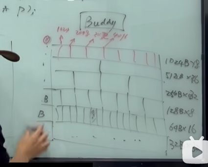
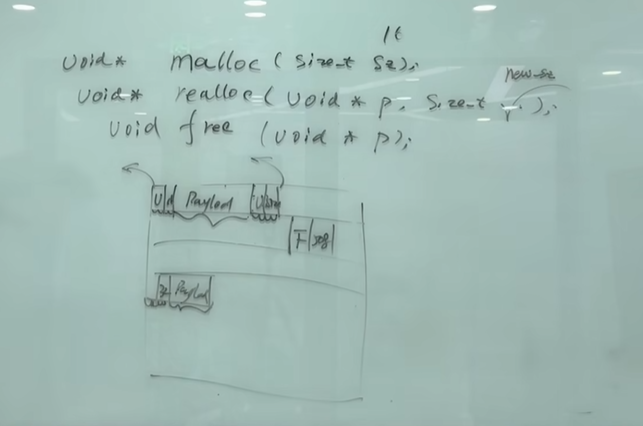
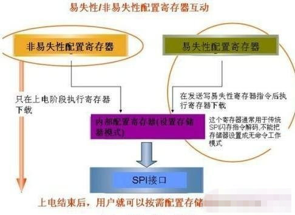

# 分配器

> 磁盘和内存的分配；
>
> 了解一下分配器的两种表现形式：
>
> * 内存分配器；
> * 磁盘分配器；
>
> **内存管理的主要目的:提高内存利用率,减少内存碎片,提高内存分配的速度.**

---

## 两种分配器的表现

* 内存：运行时，存储空间；随机访问，RAM；random access memory 随机访问；

  * **c语言是访问内存就是随机访问的机制来访问，有指针，存在安全问题；栈溢出，越界的问题； 但是性能好（直接接近于硬件）；灵活，直接malloc ，new，想要多个就给多大，多灵活；**

  * 高级语言变成了，间接的访问内存方式；高级语言；比如 php之类的；并没有指针这个概念，不会去直接操作内存；中间会有很多的东西来保证安全性， 所以性能就会比较低；

  

* 类似于文件（磁盘）的内存管理方案；

  * 优点 ： 

   文件：STDIO ：FILE *

  ​		 kernel ： fd （文件描述符 file descriptor） 

  ​		handisk inode

  ​				sector ，sector ，sector ， sector，（FAT 是64位os，这里表示的扇区的大小，可以包含64个扇区？ sector？）

  * 比较出名的几种文件系统： 1，FAT  FAT32   2， ext3 ext4 ext5日志文件系统；

  ​		

---

##  两种分配器的设计思想

*  直接通过随机访问；RAM；

  >指针；

  `````c
  //ram 内存管理的三个接口，malloc realloc free  void* 无类型的指针变量
  
  void *p = 地址// 无类型的地址；
      
  void*  malloc(size_t size); //返回一个指针；
  void* realloc(void* p, size_t new_size); //复制到一个新的位置，size = new_size 
  void free(void* p);//释放内存；
  
  `````

       `````c
       //buddy 算法  伙伴算法；用网格来进行内存管理；
       // 但是比较浪费内存，比如我想申请一个 513字节的内存，我们只能给你 1024这个大小的空间；
       // 优点： 比较简单；
       //缺点很明显：比价浪费空间；
       `````




`````c
//另外一种算法--- 可以解决nei
`````



* 间接访问，语言本身的内存管理 php的内存管理

  >filename/ id（index）/ handle/variablename;


## RAM  and ROM

>

　RAM和ROM的区别，或者说ROM和RAM的区别是什么呢？

**[ROM](https://product.pconline.com.cn/itbk/sjtx/sj/1109/2517782.html)和[RAM](https://product.pconline.com.cn/itbk/sjtx/sj/1109/2517749.html)都是一种存储技术，只是两者原理不同，RAM为随机存储，掉电不会保存数据，而ROM可以在掉电的情况下，依然保存原有的数据。ROM和RAM指的都是半导体存储器。**

本来的含义是：ROM是Read Only Memory的意思，也就是说这种存储器只能读，不能写。而RAM是Random Access Memory的缩写。这个词的由来是因为早期的计算机曾经使用磁鼓作为内存，而磁鼓和磁带都是典型的顺序读写设备。RAM则可以随机读写。

通俗的说，比如在电脑中，大家都知道有内存和硬盘之说，其实内存就是一种RAM技术，而ROM则类似于硬盘技术，两者都是存储器，只是RAM的速度要远远高于ROM的速度，在电脑日常操作中，很多程序都将临时运行的程序命令，存放在内存中，但一旦关机或者停电，内存里原本临时存储的程序信息将全部被清空，也就是内存只能临时存储东西，不能长久保存，而ROM则可以存储，即使掉电后也可以找到之前存储的文件，这也就是硬盘了。

　　在手机中，RAM是指手机内存，对于手机看性能来说，除了看手机处理器就是看内存了，内存越大手机配置越好，目前主流手机均为1G内存(RAM)，比较高端的手机则搭配了2G内存，由于技术限制，目前市场中还没有看到有[4G](https://product.pconline.com.cn/itbk/sjtx/sj/1202/2676047.html)B内存手机。而手机ROM是指手机存储器，比如手机内存SD卡就属于ROM范畴，用来存储手机系统文件、图片、音乐、照片等。ROM越大手机可以存储的东西就越大，目前一般主流手机存储为16GB，更高的有32G、64G，容量越大，一般手机也越贵，很多手机同一型号不同版本都是由ROM容量来划分的。





　**在手机中，RAM是指手机内存，属于手机内部存储器，属于随机存储，速度高于ROM，对于手机配置性能起着重要的决定性，另外掉电后，数据被清空，比如手机运行着QQ与其它软件，重启手机后，软件就没有处于登录状态。**

**而ROM则属于外部存储，比如我们经常可以购买SD卡放入手机里面，则就是手机ROM，手机ROM就是我们通常说的存储卡，也可以简单的理解成手机硬盘吧。用来存储手机系统文件、图片、电影等等，不会随着掉电而丢失数据，ROM越大存储的数据就越多**