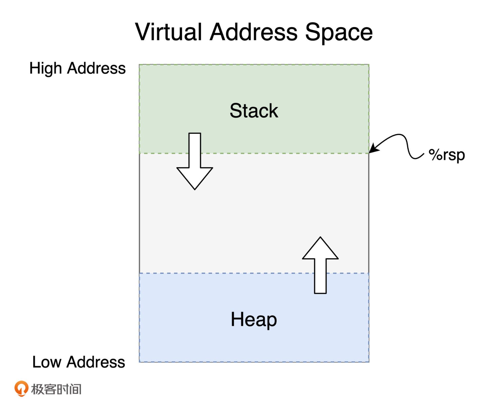
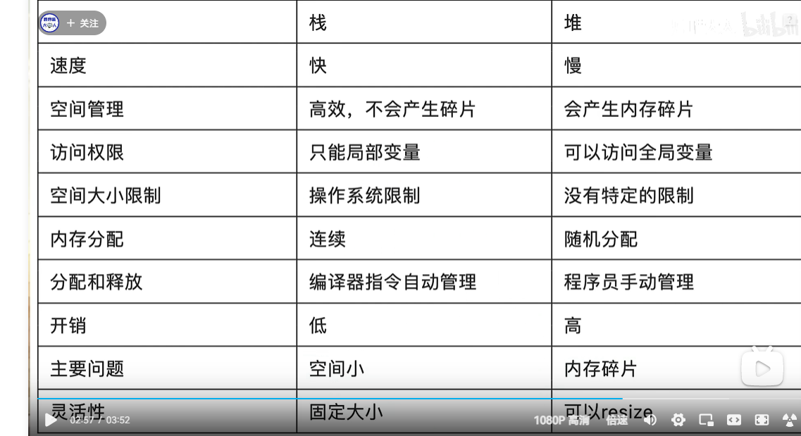
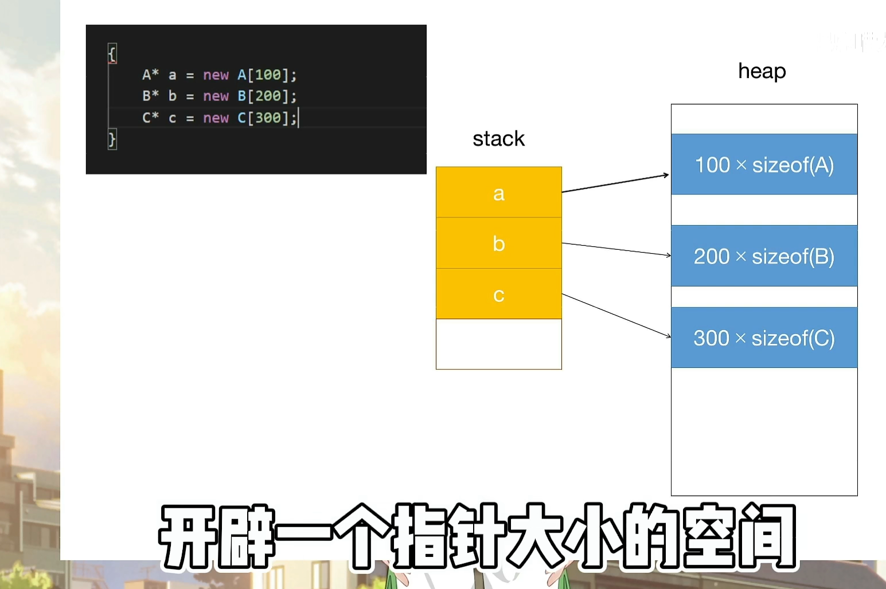

## 内存管理--- 堆

>php 有自己的GC garbage collection 垃圾回收去管理堆；
>
>一般是全局变量和静态变量（static），都是保存到堆中；
>
><font color=red> **栈上存放的数据是静态的，固定大小，固定生命周期；堆上存放的数据是动态的，不固定大小，不固定生命周期。**</font>
>
>static 全局变量 +动态数据 + 生命周期需要很长的数据都是放在堆里；


---

## code

````c
// 全局变量  保存在堆里面可以动态扩容，不会存在stackoverflow的问题；
char cache[1026];
void func(void) {
    // 会存在stackoverflow的问题；
    // 局部变量；
    int i;
    char buffer[100];
    // 静态变量
    static int index;
    func();
}
````


---

### 堆内存的分配和回收？

>需要动态内存大小的内存时，只能使用堆；堆上分配内存时，一般都会预留一些空间，这是最佳实践。比如 php中的字符串，数组，对象之类的；都是保存到堆中的；
>
>比如可变长度的数组、列表、哈希表、字典，它们都分配在堆上。
>
>

* 在c语言中使用malloc和new 分配的内存都是堆内存；
* **堆内存的一大特点就是大小并不固定，可以动态扩容；空间由程序员动态分配，更加灵活；**
* 缺点：会存在碎片化和内存泄露还有线程安全问题；malloc 没有free或者new 之后没有delete就会产生内存泄漏的问题；

*  php内存泄漏 比如循环引用的问题；

* 栈内存线程独立的，堆内存可以被一个进程内所有线程访问；多线程操作就会产生内存安全问题；

* 堆上存储的变量，其生命周期从分配开，一直到释放结束，因此堆上的变量允许在多个调用栈直接引用；




## 栈和堆的比较；

 >堆可以resize；




##  解释一下 这个现象

>a 是一个局部变量；所以肯定保存到栈上的；这里是一个引用；栈上只需要保存一个指针就行了；
>
>但是 new  或者 malloc 都是保存在heap堆上；
>
>注意一下下面的图片；//todo
>
>




##  堆的原理：

> 所以，我们无法把字符串本身放在栈上，只能先将其放在堆上，然后在栈上分配对应的指针，引用堆上的内存。
>
> <font color=red>**除了动态大小的内存需要被分配到堆上外，动态生命周期的内存也需要分配到堆上。**</font>


比如你创建一个列表，并往里添加两个值：

````rust

let mut arr = Vec::new();
arr.push(1);
arr.push(2);
````


这个列表实际预留的大小是 4，并不等于其长度 2。**这是因为堆上内存分配会使用 libc 提供的 malloc() 函数，其内部会请求操作系统的系统调用，来分配内存。系统调用的代价是昂贵的，所以我们要避免频繁地 malloc()。**


对上面的代码来说，如果我们需要多少就分配多少，那列表每次新增值，都要新分配一大块的内存，先拷贝已有数据，再把新的值添加进去，最后释放旧的内存，这样效率很低。**所以在堆内存分配时，预留的空间大小 4 会大于需要的实际大小 2 。**


<font color=red>**除了动态大小的内存需要被分配到堆上外，动态生命周期的内存也需要分配到堆上。**</font>


**上文中我们讲到，栈上的内存在函数调用结束之后，所使用的帧被回收，相关变量对应的内存也都被回收待用**。

<font color=red>**所以栈上内存的生命周期是不受开发者控制的，并且局限在当前调用栈。**</font>

而堆上分配出来的每一块内存需要显式地释放，这就使堆上内存有更加灵活的生命周期，可以在不同的调用栈之间共享数据。


## 堆上的问题；

然而，堆内存的这种灵活性也给内存管理带来很多挑战

#### 内存泄漏

**如果手工管理堆内存的话，堆上内存分配后忘记释放，就会造成内存泄漏。**

**一旦有内存泄漏，程序运行得越久，就越吃内存，最终会因为占满内存而被操作系统终止运行 内存泄漏多了会导致内存溢出的问题；**


#### 线程安全

**如果堆上内存被多个线程的调用栈引用，该内存的改动要特别小心，需要加锁以独占访问，来避免潜在的问题**。比如说，一个线程在遍历列表，而另一个线程在释放列表中的某一项，就可能访问野指针，导致堆越界（heap out of bounds）。而堆越界是第一大内存安全问题。

#### 

**如果堆上内存被释放，但栈上指向堆上内存的相应指针没有被清空，就有可能发生使用已释放内存（use after free）的情况，程序轻则崩溃，重则隐含安全隐患**


## static 的问题！！

>静态变量

