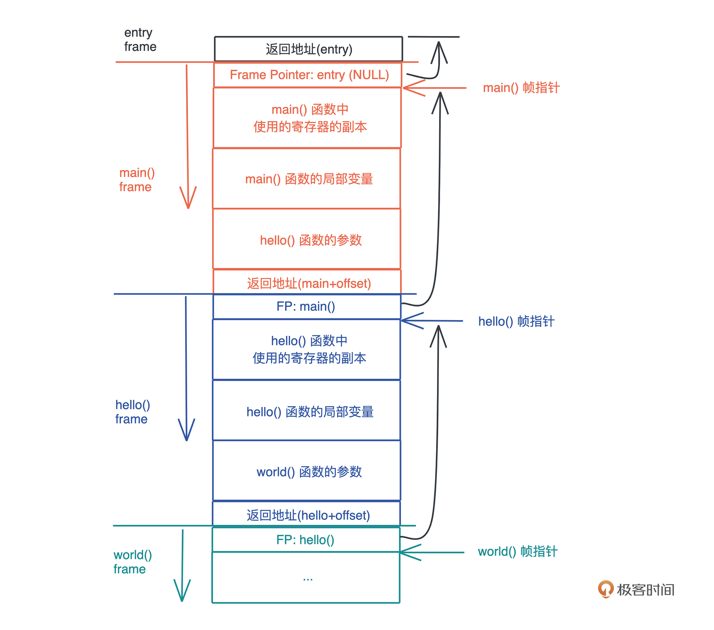

##  内存管理---栈

>q:
>
>* stackoverflow 栈溢出问题
>* 嵌套循环太深，尤其是递归问题；栈空间比较小；
>
>---
>
>理解一下 stckoverflow的意思？？
>
>栈溢出（又称缓冲区溢出）攻击是最常用的黑客技术之一。我们知道，UNIX本身以及其上的许多应用程序都是用C语言编写的，C语言不检查缓冲区的边界。在某些情况下，如果用户输入的数据长度超过应用程序给定的缓冲区，就会覆盖其他数据区。这称作“堆栈溢出或缓冲溢出”。
>
>----
>
>**局部变量保存在栈中，每次函数调用都会创建一个栈帧；数据和要返回地址都保存在栈帧中；**

---

## 栈内存分配和回收的特点？

> 总结：
>
> 优点： 高效，只需要移动stack pointer就可以实现，固定大小（但是空间比较小），线程安全，系统控制，不会产生碎片化问题，不会产生内存泄漏；
>
> 缺点：但是需要注意stackoverflow的问题，调用栈太小，很容易从出现栈溢出的问题； 不能申请动态大小的内存；
>
> 

* 大小固定并不会发生改变，堆会发生动态扩容

* 分配：栈内存是为线程留出的临时空间；每一个线程都会又自己的栈空间；而且栈空间存储的数据只能被当前线程访问；所以是线程安全的；
* 栈空间的分配和回收都是由操作系统来做的；不需要手动控制；
* 当一个函数调用的时候，系统为这个函数调用分配栈空间；当函数返回之后系统会自动回收栈空间；
* <font color=red>栈上存储的变量生命周期在当前调用栈的作用域内，无法跨调用栈引用。生命周期在调用栈内；</font> 

-----

**栈帧也ss会记录，程序运行完return的地址；**

栈是静态的，当你需要多少栈就给你分配多少的栈内存； **也就是局部变量**

``````c
int func() {
    int i;
    char buffer[1024];
}

func(); // 会记录这个地址到栈帧，函数运行完之后会跳转到这里；
//上面的函数，调用，仅仅使用1024+4个字节的栈内存；
//栈帧记录函数运行完之后返回的地址；
``````


## 栈的原理

>**<font color=red>这下我们就明白了：在编译时，一切无法确定大小或者大小可以改变的数据，都无法安全地放在栈上，最好放在堆上。比如一个函数，参数是字符串</font>**
>
>**<font color=red>所以，我们无法把字符串本身放在栈上，只能先将其放在堆上，然后在栈上分配对应的指针，引用堆上的内存。</font>**

**栈是程序运行的基础。每当一个函数被调用时，一块连续的内存就会在栈顶被分配出来，这块内存被称为帧（frame）。**

**我们知道，栈是自顶向下增长的，一个程序的调用栈最底部，除去入口帧（entry frame），就是 main() 函数对应的帧，而随着 main() 函数一层层调用，栈会一层层扩展；调用结束，栈又会一层层回溯，把内存释放回去。**

在调用的过程中，一个新的帧会分配足够的空间存储寄存器的上下文。在函数里使用到的通用寄存器会在栈保存一个副本，当这个函数调用结束，通过副本，可以恢复出原本的寄存器的上下文，就像什么都没有经历一样。此外，函数所需要使用到的局部变量，也都会在帧分配的时候被预留出来。

整个过程你可以再看看这张图辅助理解：





那一个函数运行时，怎么确定究竟需要多大的帧呢？


这要归功于编译器。在编译并优化代码的时候，一个函数就是一个最小的编译单元。


<font color=red>**在这个函数里，编译器得知道要用到哪些寄存器、栈上要放哪些局部变量，而这些都要在编译时确定。所以编译器就需要明确每个局部变量的大小，以便于预留空间。**</font>


**<font color=red>这下我们就明白了：在编译时，一切无法确定大小或者大小可以改变的数据，都无法安全地放在栈上，最好放在堆上。比如一个函数，参数是字符串</font>**


`````rust

fn say_name(name: String) {}

// 调用
say_name("Lindsey".to_string());
say_name("Rosie".to_string());
`````

字符串的数据结构，在编译时大小不确定，运行时执行到具体的代码才知道大小。比如上面的代码，“Lindsey” 和 “Rosie” 的长度不一样，say_name() 函数只有在运行的时候，才知道参数的具体的长度。


**<font color=red>所以，我们无法把字符串本身放在栈上，只能先将其放在堆上，然后在栈上分配对应的指针，引用堆上的内存。</font>**


## 栈存在的问题：

 > 调用栈太小，会存在stack overflow的问题；
 >
 >不能申请动态内存；

从刚才的图中你也可以直观看到，栈上的内存分配是非常高效的。

**只需要改动栈指针（stack pointer），就可以预留相应的空间；把栈指针改动回来，预留的空间又会被释放掉。预留和释放只是动动寄存器，不涉及额外计算、不涉及系统调用，因而效率很高。**


那为什么在实际工作中，我们又要避免把大量的数据分配在栈上呢？


<font color=red>**这主要是考虑到调用栈的大小，避免栈溢出（stack overflow）。一旦当前程序的调用栈超出了系统允许的最大栈空间，无法创建新的帧，来运行下一个要执行的函数，就会发生栈溢出，这时程序会被系统终止，产生崩溃信息。**</font>

