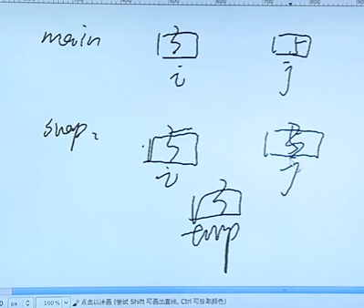
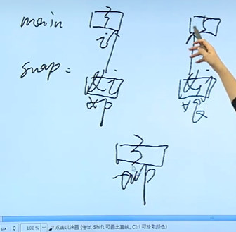
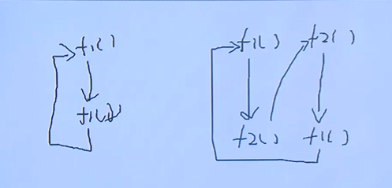

# 函数

>**函数名就是一个合法的标识符！！**
>
>
>
>函数的传参方式
>
>* 值传参
>* 地址传参！！
>
>函数定义；
>
>```c
>//数据类型 函数名([数据类型 形参名1，数据类型 形参名2....]) {
>
>//}
>```
>

>函数的调用；
>
>函数与数组；
>
>函数与指针；

---


## 函数定义

 >main.c 参数的说明；
 >
 >* int argc  参数个数；
 >* char* argv[]  字符指针数组；
 >
 >---
 >
 >**被调函数要在主调函数的上方！！！**
 >
 >或者声明在主调函数的上方！！！
 >
 >也可以放在下方，但是需要在上面去声明；
 >
 >注意声明函数的返回值和参数的数据类型要一致，不然会被当成不一个函数！！！
 >
 >// 没有声明，但是会出这个警告！！隐式声明了 print_hello
 >
 >**: warning: implicit declaration of function 'print_hello'**  

````c
#include <stdio.h>

/**
 * main 函数
*/

// main 是有参数的，但是可以默认不写！！！
/**
 *int argc 参数的个数； argument count 参数个数；
 * 
* char* argv[] 字符指针数组的起始位置！！ argument vector 参数向量，具体参数； 
*/

//声明
void print_hello(void);
int main(int argc, char* argv[]) {
    // 参数的个数；
    printf("%d \n", argc);
    int i;
    // 0 就是 文件名； 后面接参数
    for (i = 0;i < argc; i++) {
        printf("%s\n",argv[i]);
    }

    //最后一个补NULL；
    for (i = 0; argv[i] != NULL; i++) {
        printf("%s\n", argv[i]);
        // printf("%d\n",argv[1]); //是结束为NULL == 0  == \0
    }

    //主调函数 被调函数
    //声明；
    // 数据类型 和 参数的数据类型一定要写成一致的，不然会有问题！！
    print_hello();
}

//函数的定义；
void  print_hello(void) {
    printf("hello word!!!");
}
````


## 函数传参

>值传递；
>
>地址传递；
>
>全局变量； 作用域的范围，全局有效；直到程序结束，只要没有相同的名字，那么就可以访问到；
>

```c
	//
```

### 值传递；

> 值，传递，并不会影响到实参数；




### 传地址；  

>**改变传递的实参的值；就需要传地址；**

````c
//code ---c

void swap(int *i, int *j) {
    int tmp;
    tmp = *i;
    *i = *j;
    *j = tmp;
}
int main() {
    int i = 3,j = 5;
    swap(&j,&j);
    retrun 0;
}
````





## 函数的调用

>**函数的嵌套调用；**
>
>**函数的递归；**

---

`````c
//嵌套调用

// 一定模块化；所有的模块都可以使用！！
int max(int a,int b,int c) {
    return (a > (b > c ? b : c) ? a : (b > c ? b : c));
}
int min(int a, int b, int c) {
    return (a < (b < c ? b : c) ? a : (b < c ? b : c));
}

int dist(int a, int b, int c)
{
    return max(a, b, c) - min(a, b, c);
}
int main() {
    int a = 3, b = 4, c = 5;
    int res;
    res = dist(a,b,c);
    printf("%d\n",res); //2
    return 0;
}

//递归调用 自己调用自己！！！！//函数直接或者间接的嵌套自身！！
// 递归，代码简练，简洁;
//抽象出来一个公式！！！ n与n-1之间的关系！！！

//递归函数的执行，都是在一个调用栈里面实现的！！！
//三个条件  --- recursion
//1. 结束条件；已知条件，作为递归的退出条件！
//2. 一层层递进或者调用的条件！
//toscore // S3. 我们还需要判断当前条件 是否成立，就是检测这个模块？？？ //tood 这是个啥！！！！ //就是满足某一个条件就直接跳出，直接返回，不需要递归到地；

// 一个大模块，可以分割为多个具有下相同类型的小模块；解决方案相同的小模块！！！
//code  ---- 这块代码的原理一定要搞明白！！！


#include <stdio.h>


/** 
 * 递归和嵌套的执行顺序--- 栈
*/
void d() {
    printf("[%s]begin!\n",__FUNCTION__);
    printf("[%s]end!\n",__FUNCTION__);
}

void c() {
    printf("[%s]begin!\n",__FUNCTION__);
    printf("[%s]call d()!\n",__FUNCTION__);
    d();
    printf("[%s]d() returned!\n",__FUNCTION__);
    printf("[%s]end!\n",__FUNCTION__);
}

void b() {
    printf("[%s]begin!\n",__FUNCTION__);
    printf("[%s]call c()!\n",__FUNCTION__);
    c();
    printf("[%s]c() returned!\n",__FUNCTION__);
    printf("[%s]end!\n",__FUNCTION__);
}


void a() {
    printf("[%s]begin!\n",__FUNCTION__);
    printf("[%s]call b()!\n",__FUNCTION__);
    b();
    printf("[%s]b() returned!\n",__FUNCTION__);
    printf("[%s]end!\n",__FUNCTION__);
}

int main() {
    printf("[%s]begin!\n",__FUNCTION__);
    printf("[%s]call a()!\n",__FUNCTION__);
    a();
    printf("[%s]a() returned!\n",__FUNCTION__);
    printf("[%s]end!\n",__FUNCTION__);
    return 0;
}

//result 
[main]begin!
[main]call a()!
[a]begin!
[a]call b()!
[b]begin!
[b]call c()!
[c]begin!
[c]call d()!
[d]begin!
[d]end!
[c]d() returned!
[c]end!
[b]c() returned!
[b]end!
[a]b() returned!
[a]end!
[main]a() returned!
[main]end!
    
 //实战！！
 //阶乘！
 // n*(n-1)!
long long factorial(int i){
    if ( i < 0) return -1;
    if (i == 0 || i == 1) return 1;
    return factorial(i - 1) * i;
}

//fibonacci 斐波那契数列！！！

long long fibonacci(int i ) {
    if ( i == 1 || i == 2) return 1;
    return fibonacci(i - 1) + fibonacci(i + 1);
}

/**
 * 阶乘！！！
 * (n-1)! *n 
 *寻找  n 和 (n-1)之间的关系！！1
 * 后序递归！！！
*/
//注意负数的问题；
int factorial(int i) {
    if (i < 0 ) return -1;
    if (i == 0 || i ==1) {
        return 1;
    }
    //前序业务逻辑的地方，不需要前面函数的返回数据！！！
    int res = factorial(i - 1);
    //后序递归，需要对返回结果来做处理！！
    return res * i;
}


/**
 * 阶乘！！！
 * (n-1)! *n 
 *寻找  n 和 (n-1)之间的关系！！1
 * 后序递归！！！
*/
//注意负数的问题；
int factorial(int i) {
    if (i < 0 ) return -1;
    if (i == 0 || i ==1) {
        return 1;
    }
    // 还有 这个传参方式并不会对本函数内的i产生影响；
    i = i - 1;
    int res = factorial(i);
    i = i + 1;
    //后序递归，需要对返回结果来做处理！！
    return res * i;
}


// 斐波那契数列！ 

/**
 * fibonacci
 * 每一个数 都等于这个数前面两个数相加！
 *  1,1,2,3,5,8
 *  n = (n-1) + (n-2)
 *  n = 1    //n = 1,n = 2;
 * 后序递归;
*/

long long fibnacci(unsigned int i) {
    if (i  < 1) 
        return - 1;
        //终止条件；--已知条件！
    if ( i == 1 || i == 2) return 1;
    //for --  
    return fibnacci(i - 1) + fibnacci(i - 2);
}
`````

### 

### 递归

>* **前序递归**
>* **后序递归**

`````c
//code
//前序;
//如果不需要后序函数的返回值，做处理，那么逻辑处理代码需要写在前序！
    
//后序;
//如果需要后序函数的返回值，做处理，那么逻辑处理代码需要写在后序！
`````


### 间接和直接调用，也是一个递归！！

> 一个函数可以直接或者间接的调用自己！

````c
//code
//直接调用！！
void ceshi() 
{
	ceshi();    
}

//间接调用！！
void ceshi2() {
    ceshi1();
}
void ceshi1() {
    ceshi2();
}
````




### 递归和嵌套的关系！！

> 递归：调用自己！！
>
>嵌套：调用别的函数！！


## 栈运行完之后是怎么回收的？？

函数执行 入栈，执行完，出栈，参数变量被销毁！！

函数执行完 里面的变量会被销毁！！！！

## 辅助知识！！

  >\* 可以去查找这个单词； 
  >
  >等于 \word  查询这个单词
  >
  >使用 space enter 回车 来结束这个hlsearch 高亮查询！！！！
