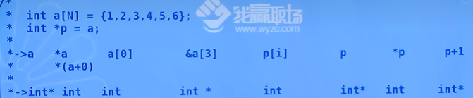

# 函数维数组

>​	**函数传参数，传值就用变量(int)来接收，传普通变量地址就用指针(int* )来接收；很容易理解！！ 当然也有可能传的地址是一级指针的地址，那么只能用二级指针来接收！！1**
>
>* 函数与一维数组；
>
>* 函数与二维数组；
>
>  

----

## 函数与一维数组！！

>注意在参数中 *和 [] 是等价的；可以替换的；

`````c
//funcarr.c
#include <stdio.h>  
#include <stdlib.h>
/**
 * 函数与数组
*/

/**
 *一维数组
 * 一位数组，传的数组名，仅仅是一个地址；
 * 相当于是地址传递！！！
*/
//获取一个指针？？
//但是不知道他的宽度；咋办； 是不是应该也传递长度；
//要传数组的大小；
//传的是指针，那么数组改变，那么也会影响到实参数组！！！传的是指针！1
//也可以这么写  int  *a === int p[]  本质都是一样的，也是一个指针！！！！
//在形参位置，一个[] 等价于一个*
//
// 所以 int main(int argc, char **argv);  ==== char *argv[]
// void print_arr(int *a, int len) {

void print_arr(int a[], int len)
{
    printf("[%s]:%d \n", __FUNCTION__, sizeof(a));
    a[1] = 111;
    int i;
    for (i = 0; i < len; i++) {
        printf("%d ", a[i]);
    }
}
//数组的逆序；
// n是数组的长度
void reverse(int* p, int n)
{
    int i = 0, j, m, tmp;
    //偶数 和 奇数 需要讨论！！
    //无论奇数还是偶数都是取昨天的那个数！！！ 
    // n = 5; i = 2；那个数；
    // n  = 6, 2 
    m = (n - 1) / 2;
    for (;i <=m ; i++) {
        j = n - 1 - i;
        tmp = p[i];
        p[i] = p[j];
        p[j] = tmp;
    }
}
int main()
{
    int a[] = { 1,2,3,4 };
    int i;
    printf("[%s]:%d \n", __FUNCTION__, sizeof(a));
    // print_arr(a,sizeof(a)/sizeof(*a));
    for (i = 0; i < sizeof(a) / sizeof(*a); i++) 
        printf("%d ", a[i]);
    printf("\n");
    reverse(a, sizeof(a) / sizeof(*a));
    for (i = 0; i < sizeof(a) / sizeof(*a); i++) {
        printf("%d ", a[i]);
    }
    printf("\n");
    return 0;
}
`````




---


## 函数与二维数组；


```c
// funcarr2.c
//code

#include <stdio.h>  

/**
 * 函数与二维数组的关系！！！
*/

#define M 2
#define N 3
/**
 * 二维数组在内存中是连续排序的；只要找到他的首（列）地址 就行了；
*/
void print_arr2(int *a, int n) {
    int i;
    for (i = 0; i < n; i++) {
        // a[i] = *(a+i)
        printf("%d ",*(a+i));
    }
    printf("\n");
}

// void print_arr1(int (*p)[N], int m, int n)
//多长的一维数组，一定要定义p[][N]
// * 等价于 [] 在形式 参数中；
void print_arr1(int p[][N], int m, int n)
{
    //一级指针; 比较特殊 指向的是数组；
    printf("sizeof(a) = %d\n",sizeof(p));//8
    int i,j;
    for (i = 0; i < M; i++) {
        for (j = 0; j < N; j++) {
            printf("%4d", *(*(p+i) + j));
            // printf("%4d", p[i][j]);
        }
        printf("\n");
    }
}
//所有数据的平均值！！！  不需要分行列；所以只需要在内存里面是连续的，内存中的一维数组就行！！
float avg_score(int *p, int n) 
{
    int i;
    float sum;
    for (i = 0; i < n; i++){
        sum += p[i];
    }
    return sum/n;
}

//打印二维数组 第几号的数据
void print_num(int (*p)[N],int num) 
{
    int i;
    for (i = 0;i < N;i++)
        printf("%d ",*(*(p + num) + i));
    printf("\n");
}
/****
 *  int a[M][N] = {......};
 * //列指针；
 *  int *p = *a;
 * //行指针；
 *  int (*q)[N] = a; 
 *  
 * ->传的数据  a[i][j]  *(a+i)+j   a[i]+j   p[i]   *p  q[i][j]  *q  q   p+3 q+2
 * 
 * 
 *->形参的接收 int     int*        int*     int    int  int    int* int (*p)[N]  int*  int (*p)[N]
 */
int main()
{

    int i, j;
    int a[M][N] = { {1,2,3},{4,5,6} };

    for (i = 0; i < M; i++) {
        for (j = 0; j < N; j++) {
            printf("%4d", a[i][j]);
        }
        printf("\n");
    }

    // print_arr2(&a[0][0],M*N);
    //列地址 ， 
    // *(a + 0) = a[0] = &a[0][0] = 注意这里是一个值；a[0][0]
    //二维数组的数组名；
    // printf("sizeof(a) = %d\n", sizeof(a));//24
    // print_arr2(a[0],M*N);

    // 数组指针
    // print_arr1(a,M,N);

    // 数组中的平均数
    float res;
    res = avg_score(*a, N*M);
    printf("%f\n",res);

    int num = 1;
    print_num(a, num);
    return 0;
}

```


---

## 函数与字符数组；


````c
#include <stdio.h>
#include <stdlib.h>

/**
 * 函数与字符数组 传参
*/
//const char *src  不能去改变*src的值；
char *my_strcpy(char *dest, const char *src) 
{
    //error: assignment of read-only location '*src'
    // *src = "hello";
    //*dst++ = *serc++  
    // 这里是变量，所以要保存，一下不然会发生变化；
    char *det = dest;
    if (dest != NULL && src !=NULL) {
        //*dst++ 先使用再加； //  
        while((*dest++ = *src++) != '\0');
    }
    //返回一个指针！！！
    return det;
}

int main() 
{
    char str1[] = "helloworld";
    char str2[128];
    int n;
    //这里是常量！！！str2
    my_strcpy(str2,str1);//dst src
    //copy n 个字符;
    // my_strncpy(str2, str1,n);
    puts(str2);
    return 0;
}


//code

#include <stdio.h>
#include <stdlib.h>

/**
 * 函数与字符数组 传参
*/
//const char *src  不能去改变*src的值；
char *my_strcpy(char *dest, const char *src) 
{
    //error: assignment of read-only location '*src'
    // *src = "hello";
    //*dst++ = *serc++  
    // 这里是变量，所以要保存，一下不然会发生变化；
    char *det = dest;
    if (dest != NULL && src !=NULL) {
        while((*dest++ = *src++) != '\0');
    }
    //返回一个指针！！！
    return det;
}

char *my_strncpy(char *dest, const char *src, int n) {
    int i;
    //因为要加尾0
    //i从0开始；
    for (i = 0; i < n && src[i] != '\0';i++)
        dest[i] = src[i];
    //必须要加尾0；
    // 这个意思是需要补很多个 \0
    //n大于 i的时候，大于元素个数的时候；
    // 不够的时候，机会补很多\0
    for (;i < n;i++) {
        dest[i] = '\0';
    }
    return dest;
}

int main() 
{
    char str1[] = "helloworld";
    char str2[128];
    int n;
    //这里是常量！！！str2
    // my_strcpy(str2,str1);//dst src
    //copy n 个字符;
    n = 5;
    // 不需要接收返回值！！！
    my_strncpy(str2, str1,n);
    puts(str2);
    return 0;
}
````


## 传递参数

```c
  int main(int argc, char *argv[]) {
	//参数的多少；
    printf("%d\n",argc);
    int vi = 0;
    //传入的参数是一个指针数组；
    for (;vi < argc;vi++) {
        puts(argv[vi]);
    }
  }

 //2
int main(int argc, char argv[][]) {
    
}
// ./hello ceshi ceshi ceshi ;
```

