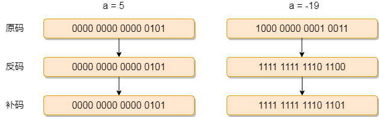

# 共用体 (union)


>**计算机都是存储补码的！！！**
>
>**共用体的特点：成员公用！！！ 节约内存！** 
>
>**zval 只有一种数据类型！！**
>
>多种情况存在，实际，你只能选择一种情况存在；
>
>
>
>1. 产生及意义
>
>2. 类型描述
>
>3. 嵌套定义
>
>  **共用体和结构体可以相互嵌套的？？？**
>
>4. 定义变量（变量，数组，指针），初始化，及成员引用
>
>5. 占用空间大小；
>
>  **成员占用内存是成员属性占用内存最大的哪一个！！**
>
>6. 函数传参问题；值传递，和地址传递，更加推荐地址传参数；
>
>7. 位域！！！！面试有人会问！！！

---

## 定义

>

````c
//定义
union 共用体名
{
   	数据类型 成员名1;
    数据类型 成员名2;
    ......
};

//嵌套定义 和  结构体差不多


//初始化和成员引用
//1. 变量名.成员名
//2. 指针名->成员名


//函数的传递 传输的肯定是地址；


````


## 位域  数据类型可以定位到位；

````c
//code
//duplicate 复制，重复的！！！

//  补码，符号的存储特点！！！

#include <stdio.h>

/**
 *位域
*/
//
union
{
    struct
    {
        //位域; 4位;
        char a : 1;
        char b : 2;
        char c : 1;
    } x;
    char y; //一个字节；
} w;

void func(const char *p) {
    //不能修改传进来的值；
    char *q = "hahah";
    // *p = "test change code"; //false
    //通过修改指向来修改值！！！
    p = q;
    printf("%s\n",p);
}
int main() {
    w.y = 6;
    //%d是有符号的存储，
    //%u是无符号的存储，
    //00000100 // 保存的是补码！！ // 10 => -2; -2的一次方到0到1；-2 -1 0 1
    // 6 00001110 // w.x.b = -1
    printf("%d\n", w.x.b); // -2 就是补码

    char * p = "test code";
    func(p);
    return 0;
}

````


---

## 实战


````c

//code
#include <stdio.h>
#include <stdint.h>

//union  struct 来实现的高位和地位！！！
union
{
    struct 
    {
        uint16_t i;
        uint16_t j;
    } x;
    uint32_t y;
} b;

int main() {
    //32位操作系统，高16位和低16位的和；
    //就是数据总线一次取的高16位和低16位
    uint32_t a = 0x11223344;
    //%x输出的是
    printf("%x\n", (a >> 16) + (a & 0xFFFF));
    b.y = 0x11223344;
    printf("%x\n",b.x.i+b.x.j);
    return 0;
}
````


# 辅助知识


## 负数的补码

> 首先计算机内存都是保存的是补码；
>
>正数的补码等于 = 正数本身！！！
>
>**负数的补码，等于(绝对值的二进制形式取反加+1)的形式！！！**
>
>````c
>// -1 => 0001 => 1110+1 => 1111  => -1 => 1111; 
>// 
>//还原回来加负号是什么意思？？？
>````
>
>

## 补码的简介

>简介！！
>
>**<font color=red>计算机全部都是补码</font>**

人类在制造出晶体管后，利用晶体管制造出了[与非门](https://so.csdn.net/so/search?q=与非门&spm=1001.2101.3001.7020)，然后又利用与非门制造出了加法器。加法器解决了加法运算问题。只有加法器是不够的，还需要解决减法的计算问题，但是与加法器相比，设计减法器硬件更为复杂，增加了计算的时间，能不能用加法器实现减法器的功能？这个实现的过程就用到了补码。

<font color=red>计算机为什么使用[补码](https://so.csdn.net/so/search?q=补码&spm=1001.2101.3001.7020)？**采用补码可以简化计算机硬件电路设计的复杂度**。</font>

**对于有符号数，内存要区分符号位和数值位，要是能把符号位和数值位等同起来，让它们一起参与运算，不再加以区分，只用加法器就可以同时实现加法和减法运算，这样硬件电路就变得简单了。**

**8 - 3 等价于 8 + (-3)，12 - (-9) 等价于 10 + 9。**

**简化硬件电路的代价就是有符号数在存储和读取时都要进行转化。这个转换过程就涉及到我们熟悉的原码、反码、补码。**


----


## 原码

将一个整数转换成二进制形式，就是其原码。例如short a = 5;，a 的原码就是0000 0000 0000 0101；更改 a 的值a = -19;，此时 a 的原码就是1000 0000 0001 0011。

通俗的理解，原码就是一个整数本来的二进制形式。

## 反码

**正数与负数的反码不一样。**

对于正数，它的反码就是其原码（原码和反码相同）；**负数的反码是将原码中除符号位以外的所有位（数值位）取反**，也就是 0 变成 1，1 变成 0。例如 short a = 5;，a 的原码和反码都是 0000 0000 0000 0101；更改 a 的值 a = -19;，此时 a 的反码是 1111 1111 1110 1100。

为什么需要反码，**反码的作用就相当于数学中的负数，有了负数，才可以实现减法与加法运算统一成加法运算**。

## 补码  ---- 

### 有了反码为什么还需要补码

因为 “0” 这个特殊数字的存在。

**将减法运算按加法运算处理，负数需要用反码表示，那么用 8 位二进制反码表示的正数范围：+0 —— +127；负数范围：-127 —— -0。但是，其中有两个特殊的编码会出现：**

<font color=red>**这里很重要！！！！**</font>

**[0_0000000]=+0 （反码）**

**[1_1111111]=-0 （反码）**

+0 和 -0 代表的都是 0。这样一来，“0” 这个数字在计算机中的编码就不是唯一的了。对于计算机来说，这是绝对不行的，因为任何数字都只能有 1 个编码。

**我们知道 0 既不是正数也不是负数，为了解决这个编码不唯一的问题，把 0 当成正数，也即 +0，这样 0 的编码就变成：0_0000000。那 8 位二进制表示的正数范围仍然是：+0 —— +127。**

**负数整体向后“挪动1位”，反码 +1，{1_1111111}编码就不再ff表示 -0，而变成了 -1。顺着推，最小的编码{1_0000000}就是 -128，8 位二进制表示的负数范围从：-127 —— -0 变成：-128 —— -1，就能成功解决问题。**

**<font color=red>这里的+1操作是不包含符号位的+1操作，所以实际是做了 -1 操作才会实现 -1 ->-128 </font>**

这种操作好像是在反码上打了“补丁”，进行了一下修正,所以称之为补码,补码定义如下：

1.正数的补码保持原码不变：5 = 0_000 0000 0000 0101

2.负数先求反码，然后再加1：-19 = 1_111 1111 1110 1100 + 1 = 1_111 1111 1110 1101



5 - 19 的计算过程:

0_000 0000 0000 0101 + 1_111 1111 1110 1101 = 1_111 1111 1111 0010;

**将补码转换为原码也很简单：先减去 1，再将数值位取反即可。**

1_111 1111 1111 0010 逆向转换原码是：1000 0000 0000 1110 = -14

<font color=red>**采用补码成功解决了数字 0 在计算机中非唯一编码的问题，也实现了减法变加法**。</font>


## 总结

补码是为了解决负数在计算机中的表示问题，最终是为了解决计算机的减法运算问题。计算机中采用了补码的根本原因是，"设计硬件简单！"

- 不浪费编码个数;
- 省去计算机判断符号位或者说判断+/-运算的麻烦。
- 有了补码，对加减运算，硬件上，只有一种加法器就行了;
- 有了加减运算，用程序就可以实现乘除运算，不用额外增加硬件;
- 有了加减乘除运算，用程序就可以实现"所有"算术运算了，不用额外增加硬件。


`````c
//是怎么运算的呢？？
//加法是怎么样运算的呢？？//todo

//如果有符号！！！%dt
//1位bit
// 0 ==> 0;
// 1 ==> -1;

//2位bit
//  00 ==> 0
// 01 ==> 1
// 10 ==> -2  
// 11 ==> -1 //就是取反+1 

// 3位bit
//000 ==> 0
//001 ==> 1
//010 => 2
//011 ==> 3
//100 ==> -8


//两个特里;
// 1111  = -1;
// 1000 = 2^3 = -8;
// 0111 + 1= 1000 = 8;
// 8421 =  所有的低位 + 1 = 最高位！！！
`````


## 重点！！！ 补码的计算！！！

>**补码的计算！！！**
>
>原码和补码的转换；
>
>原码转换成补码 === >取反 + 1；
>
>补码转换成原码 ===> -1 取反；

````c
//-2 的补码计算，由十进制转换为补码，计算机保存的也是补码
// 取反 + 1
10000010 ==> -2  =>  11111110   //补码
   
//怎么由补码来计算数值！！！
//计算原码， -1 取反
11111111   = > 11111110 => 10000001  -1;
````

