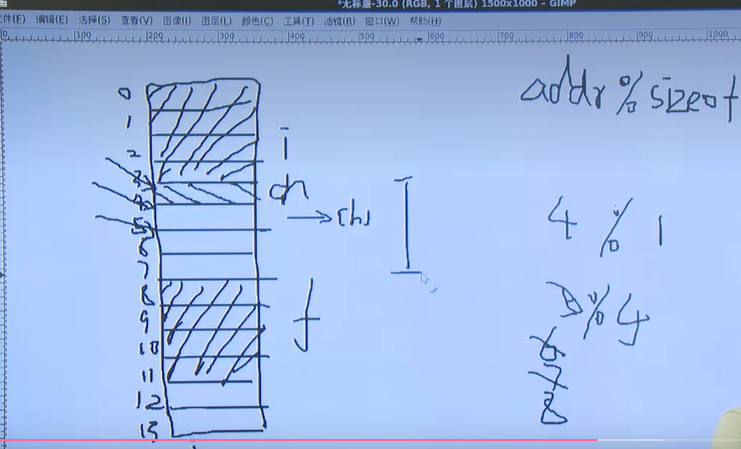

# 构造类型

>构造类型；就是复杂数据类型；复杂数据类型！！
>
>union  共用体
>
>struct 结构体
>
>enum 枚举   enumeration  [美 /ɪˌnjuməˈreʃən/](cmd://Speak/_us_/enumeration)


----

## struct

>**最大的特点：成员共存！！！**
>
>1. 产生以及意义
>
> 存放不同数据类型，存储在连续的内存空间！
>
>2. 类型描述
>
> `````c
> // 结构体 仅仅 是一种描述！！！
> struct 结构体的名字
> {
>     //结构体 数据类型描述不占据存储空间！，所以不能直接初始化，不占用空间，所以没有空间去存放！！
>     数据类型 成员1;
>     数据类型 成员2;
>     ........
>
> }; //;是重点 不能丢！！！
>
> `````
>
>
>
>3. 嵌套定义
>
>  `````c
>  //只有在定义的时候进行初始化，其他的时候都不能进行批量初始化；
>  //类似于 php对象new __construct(); 构造方法，会对变量进行初始化！！！ 只有在new的时候才会做初始化！！！
>  `````
>
>
>
>4. 定义变量(变量，数组，指针)，初始化以及成员引用！！！4
>
> `````c
> // 成员引用 
> //变量名.成员名
> //指针->成员名 指针才会使用箭头去访问；用指针来访问！！！
> //*(指针) == 变量名 
> //*(指针).成员名
>
> // 注意嵌套的写法！！
> `````
>
>
>
>5. 结构体占用的内存空间大小！！！
>6. 函数传参，(值传递和地址传递！！)；


`````c
//struct 结构体！！！
//


#include <stdio.h>
#define NAMESIZE 32

struct simple_st
{
    int i;
    float f;
    char ch;
};

struct Birthday_st
{
    int year;   
    int month;
    int day;
};

struct Student_st
{
    int id;
    char name[NAMESIZE];
    float score; 
    //类型 + 变量名
    struct Birthday_st Birth;
    int chinese;
};

#if 0
//可以这么写 更加直观一些！！！
struct Student_st
{
    int id;
    char name[NAMESIZE];
    float score; 
    //类型 + 变量名
    struct Birthday_st
    {
        int year;   
        int month;
        int day;
    }birth;
    int chinese;
};
#endif

void func(struct Student_st stu1) {

}
int main() {

    struct simple_st a = {123,2.222,'a'};
    /**
     *成员引用;
     *变量名.成员名;
    */
    a.i = 111;
    printf("%d %f %c\n", a.i,a.f,a.ch);
    //嵌套初始化！！
    struct Student_st stu1 = {1011,"Alan",1.222,{2011,11,11},1};
    //部分赋值！！
    // struct Student_st stu2 = {.score = 98,.chinese = 22};
    //stu1 是一个变量名；和普通的变量名 没什么区别！！！
    struct Student_st *p = &stu1;
    //birth是变量名  所以用.来访问
    //p是指针名 ，所以用->来访问；
    printf("%d %d \n",p->id, p->Birth.day);

    //数组的定义 数组结构体的定义！！！
    //struct Student_st arr[2] = {{},{}}; 
    //p = arr;
    //p = &arr[0];
    int i;
    for (i = 0;i < 2; i++) {
        p[i].id;
        p[i].name;
        (p+i)->name;
    }
    //函数的传递 
    func(stu1);
    return 0;

}
`````

### 结构体占用的内存大小！！！

>结构体对齐；
>
>为什么要对齐？？？硬件存储方面要求！！！
>
>**软件角度解释一下：**
>
>**公式 :**
>
><font color=red>**addr%sizeof(数据类型)  不等于整数那么将会继续往下找！！！**</font>
>
>**结构体类型的类型数据传输的过程中，传给其他的系统，一定不要做对齐，因为你也不会，他们系统是怎么对齐的，**
>
>**比如socket 来传输数据的时候一定不要做结构体对齐；**

````c
// 结构体对齐；是为了方便硬件的存储！！！内存的存储！！！
struct simple_st
{
    int i;
    float f;
    char ch;
};
struct simple_st a;
// 这个数据类型的指针！！！
struct simple_st *p = &a;
printf("sizeof(p)= %d\n", sizeof(p)); // 8个字节；
printf("sizeof(a) = %d\n", sizeof(a));  //12

struct simp_st
{
    int i;
    char ch;
    float f;
}__attribute__((packed)); // 不做结构体对齐；
printf("sizeof(a) = %d\n", sizeof(a));  //9
````




### 函数传参 

`````c

void func(struct simp_st b) {
    //成员引用 b.i ,成员引用！！！
    printf("%d\n", sizeof(b));
}
viud func1(struct simp_st *p) {
    //成员引用
    // p->i;
    printf("%d\n",sizeof(p));  // 8个字节；
}
int main() {
    struct simp_st a;
    struct simp_st *p =  &a;
    //值传递
    func(a); // 12个字节； 传参的开销非常大； 
    
    // 地址传递； 不管结构体多大，传参的开销都是8个字节，是一种间接引用的方式！！
    //推荐使用的方式！！！
    func1(&a);  // 8个字节！！
}
`````


### typedef

`````c
//匿名结构体  因为没有名字，所以不能直接定义；
struct
{
    int i;
    char ch;
    floaat f;
}a = {}，b={},c,*p,*q;
//只能在声明的时候把变量定义好；

//typedef  的用法；
`````


## 实战

>注意一下下面的两种赋值方式的区别？？？

`````c
#include <stdio.h>
#include <string.h>
#include <string.h>
/**
 * 结构体 赋值 测试
*/
#define NAMESIZE 32
typedef struct 
{
    int id;
    char *name;
    int chinese;
    int math;
} restu_st;

struct stu_st
{
    int id;
    char name[NAMESIZE];
    int chinese;
    int math;
};

/**
 * 下面这个是对的；
*/
void set_stu(struct stu_st *p,struct stu_st *q) {
    // 
    // strcpy(p->name,"sss");
    // p->name = "aaaa";
    p->chinese = q->chinese;
    p->id = q->id;
    p->math = q->math;
    // 这么写是报错的？？？ 这里的赋值 应该是通过，strcpy来实现的吗？
    // p->name = q->name;
    strcpy(p->name,q->name);
}

void set_restu(restu_st *p, restu_st *q) {
    // *p = *q; 
    //这边直接赋值 就行 对不对，用一个指着变量，来接收另外一个指针变量，没问题呀；
    //指针变量也是一个变量，变量 = 变量，没问题呀；
    p->id = q->id;
    p->chinese = q->chinese;
    p->math = q->math;
    //这是一个指针变量；
    p->name = q->name;//p->name 会保存q->name的地址；
}
 
void set_restuq(restu_st *p, restu_st *q) {
    p->id = q->id;
    p->chinese = q->chinese;
    p->math = q->math;
    //是复制内容，并不是复制地址；
    //上面的是复制地址； p->name = q->name;
    //p->name的地址并不会发生变化；但是p->name指向的字符串发生了变化；
    p->name = malloc(strlen(q->name) + 1);
    if (p->name == NULL) {
        exit(-1);
    }
    strcpy(p->name,q->name);
}

int main() {
    //stu1 stu2代表的是一个变量，所以可以进行赋值；
    struct stu_st stu1 = {1,"alan",90,91};
    struct stu_st stu2 = {2,"blan",93,92};
    //
    set_stu(&stu1,&stu2);
    //stu2.name是一个地址，需要用strcpy来赋值；
    // strcpy(stu2.name,"clan");

    printf("%d %s %d %d\n",stu1.id,stu1.name,stu1.chinese,stu1.math);


    /**
     *test2 带引用的结构体 赋值；
    */
    restu_st stu3 = {1,"dlan",89,89};
    restu_st stu4 = {5,"elan",8,9};
    printf("%p---->%s\n",stu3.name,stu3.name);
    printf("%p---->%s\n",stu4.name,stu4.name);
    // set_restu(&stu3,&stu4);
    set_restuq(&stu3,&stu4);
    //内容发生了改变；
    printf("%p---->%s\n",stu3.name,stu3.name);
    printf("%p---->%s\n",stu4.name,stu4.name);
    //改变的是指向，所以，
    stu4.name = "flan"; //就是重新指向一个常量，原先的常量地址并没有改变
    printf("%p---->%s\n",stu3.name,stu3.name);
    printf("%p---->%s\n",stu4.name,stu4.name);
    //elan
    printf("%d %s %d %d\n",stu3.id,stu3.name,stu3.chinese,stu3.math);

    return 0;
}


//字符串初始化赋值问题；
// 上述问题还是这个问题;
char arr[] = "abc";
strcpy(arr,"asss"); // 赋值；

char *p = "abcd";
p = "ksksk"; //改变指向就可以了；

char *q = "eee";
strcpy(p,q);//todo ？？？ 这个地方为什么会发生错误？？？
//但是可以用 p = q;来赋值；
`````

``````c
#include <stdio.h>
#include <stdlib.h>
#include <string.h>


/**
 * 字符串测试
*/

int main() {
    char str[] = "ceshi";
    //改变赋值 ，只能使用strcpy;
    char str1[] = "aaa";
    // strcpy(str,"ssss");
    strcpy(str,str1);//这个也是可以赋值的；
    printf("%s\n",str);
    //字符常量；
    char *p = "bbb";
    printf("%p---->%s\n",p,p);
    char *q = "ddd";
    printf("%p---->%s\n",q,q);
    // p = q; //改变指向；
    // printf("%p---->%s\n",p,p);
    
    //内容的复制；不成立，因为是一个常量，所以不能进行修改；
    strcpy(p,q);//???常量 不能改变 值的内容吧！！！如果用malloc 来实现的，就是一个变量了吧？？？？不能改变常量的内容，
    printf("%p---->%s\n",p,p);
    return 0;

}
``````


## vim的替换

`````shell
#将当前行第一个a替换为b

:s/a/b/

 

#将当前行的所有a替换为b

:s/a/b/g  *****

 

#将每行第一个a替换为b

:%s/a/b

 

#将整个文件的所有a替换为b

:%s/a/b/g  *****

#将1至3行的第一个a替换为b 

:1,3s/a/b/

#将1至3行的所有a替换为b

:1,3s/a/b/g

#上面是一些常用的替换,但是我们日常碰到的问题不止这么简单,这就要涉及到一些较为高级的替换操作,会涉及到转义,正则表达式相关的知识,下面是一些例子:

#使用#作为分隔符,此时中间出现的/不会作为分隔符,如:将当前行的字符串"a/"替换为"b/"

:s#a/#b/#

#找到包含字母a的行并删除
:g/a/d

#删除所有空行

:g/^$/d

 #多个空格替换为一个空格
:s/ \+/ /g

#在正则表达式中使用和和符号括起正则表达式,即可在后面使用\1,\2等变量来访问和和中的内容,如下

将data1 data2修改为data2 data1
:s/\w\+\w\+\s\+\w\+\w\+/\2\t\1

# 歧义的问题  把 \替换成/
## 可以用 #来实现
:s#/#\#g
`````


