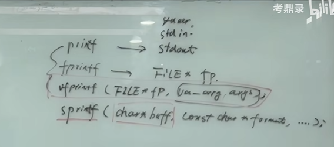

# I/O接口的实现

>都可以通过门面抽象出四种方法；
>
>write  read seek eof；

----

## 实现

> **fprintf  + stdin == printf**



---


seek 调整位置；就是读或者写的位置！！

eof 文件的结束；

write 写；

eof；文件的结束；


----

## code 

>针对内存和针对文件的，格式化输出和输入；

`````php
#  伪代码
method :
	weite 
     read
     seek
 property:属性
     eof 
     position 
     
# 文件对象 FILE* fp  各种形式：
  internal(内部的) data:
		buffer.size
         缓冲区（内存）：是一个抽象的文件对象；
   File ：
        fd：就是文件的索引；
    output：
            stdin  0 
            stdout 1
            stderr 2 
`````


## 缓冲机制  

>输出 先输出到缓冲区；并不是直接输出；缓冲区满了然后再输出；这样效率会很高；
>
>不能每一个字符都要去进行系统调用，这样效率太低了，所以必须要存在缓冲区；
>
>line buffer
>
>block buffer
>
>no buffer 

`````c
 int main(void) 
 {
     //并不会输出，要加\n会输出；
     // \n 代表结束；
     printf('i am shuaib');
     return 0;
 }

//fprintf(stderr, 'i am shuaib'); // 直接输出 没有缓存；

`````


### 几种缓冲形式

* linebuffer  ---> stdin, stdout;

  每次回车的时候进行一次，系统调用 输出； 

* block buffer----->文件的输出和输入，满一个块一般是4k的时候，输出或者输入；

* no buffer  ----> stderr标准错误，没有缓冲区；

  

  `````php
  # write ---->buffer缓冲区----->fsync----->落盘
  `````
  
  
  
  
  
  