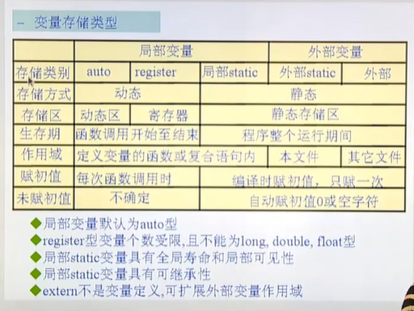

# 变量

>在程序运行过程中，值会发生变化的一个量！
>
>全局变量，自动初始化为0；
>
>auto 随机值；
>
>static 自动初始化为0；

### 定义

````c
// [存储类型]  数据类型 标识符 = 值；
//			 type  name = value;
````


标识符：

* 由数字字符下划线组成，不能以数字开头的标识序列；
* 意义： 就是给一个内存空间起了一个名字；方便程序员记忆和使用；
* 尽量做到，见名生义；

数据类型：

* 基本数据类型 + 构造类型 

存储类型：

* **auto static （这两个都是定义型）  register（建议型）（extern(说明型)**

* auto：默认，自动分配，自动回收空间，默认是局部变量类型；

* register：寄存器类型，寄存器，速度快，资源少，直接声明变量放在寄存器中，那么肯定很快；（建议性的关键字，很少会用到！！！） 和 inline的差不多一样？ 内联函数？？ 

    `````c
    // 这个数据经常使用，可以放在寄存器中，而不是放在了栈中；
    // 当然放不放在寄存器中，由gcc来决定；
    register int i = 1;
    
    // 几个条件
    //1. 只能定义局部变量；不能定义全局变量；
    //2. 只能定义32位大小的数据类型；如果是double就不可以了 double 是64位；
    //3. 寄存器没有地址，所以一个寄存器类型的变量无法打印出地址查看或者使用；
    `````

* static： 静态，自动初始化为0值或空值，值的变量的值是有继承性的；static 不仅仅可以修改局部变量，还可以修饰全局变量和函数！！！

    `````c
    // 限制的全局变量  static；
    //static 修饰全局变量，当前修饰的变量，只能在当前文件的范围内用；别的文件引用不到；防止，不同的人定义相同的全局变量的冲突问题；
    //static 修饰局部变量，具有继承性，php好像也只有这一个作用！
    //static 修饰函数，防止函数，对外扩展，就是改函数只能在当前文件使用，不能再其他文件使用；// 类似于php的访问修饰符 public private 只能自己访问，别人是访问不了的；
    `````

    

* extern： 说明型(声明型)，意味着不能改变被说明的值或类型；

   ````c
   //todo 
   // 声明类型！！使用的外部的变量！
   // 并且不能改变说明的 类型和值；
   extern int i; 
   // 扩展外部变量，但是不能改变，说明的值和 类型；
   //extern 不是变量的定义，可扩展外部变量作用域？？//todo 
   //可以写在 test.h 头文件里面，然后直接引入就行了；也可以直接写；
   ````


值：

* 匹配就行； 丢失精度问题；值和数据类型要匹配；

## 

````c
//static 代表每个文件 自己用自己的；
//extern 就是 多个文件共享一个全局变量！！！ 
extern int i;
// extern 声明的不能进行修改，只能使用；

````


## 全局变量  和 局部变量

> 生命周期和作用范围！！
>
>Q：
>
>* 全局变量和局部变量的生命周期和作用范围？
>* 局部变量和局部变量的区别？
>* 参考图片？


````c
// 全局变量  就近原则，内部的屏蔽外部的变量；
//函数的变量传递就是形参；

````

`````c
//from var1.c
#include <stdio.h>

/**
 * 全局变量和 局部变量  
 * 局部变量和局部变量
*/
int i = 100;
func(int i) {
    printf("%d \n", i);// 1
}
int main() {
    int i = 1;
    func(i);
    {
        int i = 5;
        printf("%d \n", i); // 5
    }

    return 0;
}
`````


### 全局变量

 > 作用范围：从定义的开始，直到当前程序结束；
 >
 ><font color=red> **会有一个或者多个模块来共用这个数值！！ 因为一个模块去改变了这个值，也许会影响到其他模块的使用！！ **</font>
 >
 >php有没有这样的全局变量嘛？ 好像没有的吧？？？  或者在入口public 的入口进行配置；一个请求就是一个进程，请求结束销毁全部的全局变量，和静态变量； 但是这个模块初始化并不会被销毁；还会处理下一个请求，不过下一个请求，需要重新创建全局变量；；；；
 >
 >

### 局部变量；

>作用范围：从定义开始，到块结束（{} 大括号结束）；就是函数结束；
>
>


````c
//全局变量会产生的问题；

/**
 * 全局变量产生的一些问题
*/

int i = 0;

void print_stars(void) {
    for (i = 0; i < 5; i++) 
        printf("*");
    printf("\n");
    printf("[%s]i = %d \n",__FUNCTION__, i);// i = 5;
}

int main() {
    for (i = 0; i < 5; i++) {
        print_stars();
    }
    printf("[%s]i = %d \n",__FUNCTION__, i);// i = 6;

    return 0;
}
//res  ***** 因为共享一个变量i，所以指挥打印一行就结束了！
````


### eg:

`````c
// man 3 fopen 
//RETURN VALUE
//       Upon  successful completion fopen(), fdopen() and freopen() return a FILE pointer.  Otherwise, NULL is returned and errno is set to indicate the error.

// 很久以前 errno 也是一个全局变量，那么就会存在一个问题，全局变量的错误，你要尽快拿出来，不然很容易会被其他的模块冲掉；
//后面做了优化，属于一个私有值，属于这个模块的私有值，防止被其他的模块冲掉！！
`````


# 辅助知识；

````c
//[] 代表可以省略！！！
````


##图片简介；




## 问题！！！

Q1:？？？？ 存在一个问题 直接只定义一个全局变量不就可以了嘛？

An1: 因为别的文件内，也需要这个变量，如果没有这个全局变量，会出现错误；  

 ````c
 //static 代表每个文件 自己用自己的；
 //extern 就是 多个文件共享一个全局变量！！！ 
 extern int i;
 // extern 声明的不能进行修改，只能使用；
 ````


在php中也会有在多个文件传递的超全局变量，我们都是用 超全局变量\$GLOBALS 来定义；是跨文件的； 

确实 是跨文件的，例如\$_SESSION 当你创建一个session 你在任意一个文件都可以访问到他！！


## 变量的使用

````c
#include <stdio.h>
int main() {
    // int a = 1; 就是在修改a的值；a设置为1；a 代表的是内存空间， &a代表的是a的地址； 获取地址；
	int a = 1;
    // 0
    int *p = &a; // p这里是a的地址； *p就是a的值；
   	// 
    *p = 2; //  修改了a的值；解引用；
    printf("%d\n", a); // 2 
}
````

