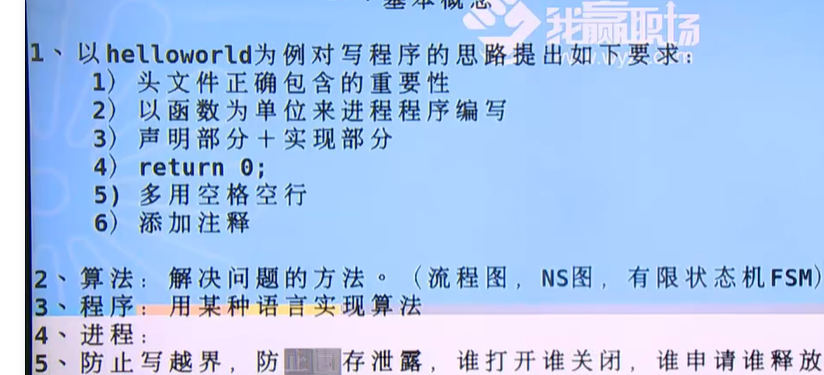

# 基础c语言

>学习 之前必看的东西；GCC；

````c
#include <stdio.h>
#include <stdlib.h>
// main 作为程序运行的入口和出口；
int main() {
    //exit(0);
    return 0;
}
````


## man 的使用

>1. shell命令；
>
>2. 系统调用；
>
>3. c语言库函数；
>
>   5 . 配置格式；
>
>   9 kernel 有关；

 ````shell
 G:\website\docker-lnmp
 $ docker run -tid --name centos7 --restart=always centos:7
 00f0325894a748285cc19450c0297567db5a207fd32e9a355a9e07cc01b1bf43
 ````


## C语言执行的几个步骤：

hello.c-> 可执行文件的几个步骤：

编译器：gcc；man gcc；

c源文件->预处理->编译->汇编->链接->执行可执行文件；

* 预处理

  gcc -E hello.c > hello.i 查看预处理部分内容；

  \# 开头的都是在预处理解决掉的；

* 编译

  gcc -S hello.i   生成hello.s 编译文件

* 汇编  生成complier 汇编；

  gcc -c  hello.i > hello.o

* 链接 

  gcc hello.o -o hello  生成目标文件；

`````c
// 直接用 gcc 就行  
// -o output
// -g gdb 调试；
gcc -g hello.c -o hello 
 
// gcc 说话比较圆滑，会在意你的感觉 所以很多warning 不会显示？？？其实他已经是一个error ？？？？\
//debug 方面 调试方面的问题；
    
// void * malloc(size_t size);
#include <stdio.h>
#include <stdlib.h>

/**
 * gcc hello.c -Wall -o hello 
 * -Wall warning all 所有的警告；c语言中有一些警告，也会导致错误；
 * -o 输出的执行文件；output；
*/

int main() {
    int *p = NULL;
    int i;

    p = malloc(sizeof(int));
    if (p == NULL) {
        return -1;
    }
    printf("hello word!");
    return 0;
}

`````


## 注释

>比较常用的几种注释；

`````c
#include <stdio.h>
/**
 * 注释
*/
// 注释 范围注释；
#if 0
func() {

}
#endif

int main() {
    //

    printf("ceshi \n");
    return 0;
}
`````


## 
