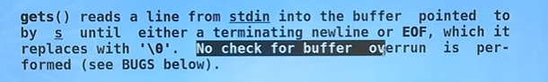

# 字符数组 

>字符数组；
>
>定义，初始化，存储特点；
>
>输入和输出  gets(); puts();
>
>常用函数


## 基础

### 定义和初始化；

````c
// 定义！！！


//[存储类型] 数据类型 标识符[下标]...
    
// 初始化！！！
//1.单个字符初始化；
//如果花括号中提供的字符个数大于数组长度，则按语法错误处理；若小于数组长度，则只将这些字符数组中前面那些元素，其余的元素自动定为空字符（即'\0' )。
//2.字符串常量初始化；
char str[] = {'a','b','c'};  //单个字符初始化？ 不需要尾0吧； sizeof(str) = 3; 不需要尾0； 不会自动加\0;
//说明：字符数组并不要求它的最后一个字符为'\0'，甚至可以不包含'\0'；也就是ascii码中的NULL；
//这样写是完全合法的。
char str1[] = "hello"; // 字符串;hello  sizeof(str1) = 6; 自动加\0;

//存储特点： 连续存储！！！！


//两种初始化方式！！！！！  字符数组 和 字符串的初始化方式！！！
    /**
     * 字符数组
     * //因为这里要求的是字符数组；并不是字符串；字符串肯定会自动加\0;
     * 并不是自动加上 \0;
    */
    //部分初始化； 补\0
    // 是一个字符串，以\0结束
    char name[10] = { 'a' };
    //没有以\0为结尾，所以会一直往下找，所以会出问题！！！
    char str[5] = { 'a','b','c','d','e' };
    //这里肯定是一个字符数组；我们要求的是字符；肯定不会自动给你加\0; 是一个字符数组；
    char str2[] = {'a'};//sizeof(str2) = 1;只有一个字符数组；
    int i;
    for (i = 0; i < sizeof(name) / sizeof(*name); i++) {
        printf("%d ", name[i]);
    }
    printf("\n");
    puts(str);//会存在问题；因为没有 \0;所以打印的内容和你期望的有很多差距；
    /**
     * 字符串的另外一种字符串初始方法；
     * 会自动加 \0,但是要注意，要全部存的下！
     * 不然会存在越界问题；
     *
    */
   // 5个也是正确的，因为他不知道你是要，字符串还是字符数组；
   // 需要字符数组的话，就不需要加\0;
    char str2[5] = "maye6";  //五个的时候，就没有 \0了，就看成了字符数组,不再是字符串，因为没有\0尾0,但是再加一位，就会越界就会报错！！
	//sizeof(str1) = 6; strlen(str1) 5; 不包含\0;
    char str1[] = "hello";//因为是一个字符串 所以会给你\0;
    puts(str1);
    
    /**
     *  第一个定义的字符串是常量，是不能修改的； 
     * c++,需要用,前面加 const；
    */
    char* chp = "hello word"; //常量； 字符常量；
    // 数组的字符串数组，是变量，是可以修改的；
    char chstr[20] = "hello word"; //变量
    chp[0] = 'A';
    chstr[0] = 'A';

    return 0;


````

### 存储中的尾0 \0；

 **表示这是一个字符串，以\0,尾0结束！！！**


## 输入和输出 gets(); puts();

**gets();is dangerous and should not be used;**

  

**gets() reads a 11ne from stdin into the buffer poln e by S until either a terminating newline or EOF, which it rrun is per- replaces with . o check for buffer ouz formed (see BUGS below) .l**


gets（） 将一行从 stdin 读入 S 指向的缓冲区，直到终止  换行符（回车才算字符串的结束！！！）或 EOF (end of file)，它 会给加上\0保存到真正的内存 。不检查缓冲区是否形成溢出问题；<font color=red>会存在越界的问题！！！</font>

puts();  // **从 某个首地址开始输出，直到\0,尾0结束；这个是字符串的输出** 


scanf("%s",str);  // 字符串！！！不能带有分隔符！！！

<font color=red>注意： 带有分隔符的串，scanf 不能获取， **分隔符包含 空格和逗号和回车！！！！！**</font>

printf("%s",str);


## 字符串的函数

`````c
//字符串赋值；

char str[N] = {1,2,3};

/* FALSE */str = "hello";

//----------------------------------------------------------------
//strlen & sizeof  strlen，是代表字符串的有效部分，是不包含\0,尾0的；
//strcpy str

//strlen  not include \0; 有效的内容！！
//strlen  是以\0 为结束标记来判断串的大小； "hello\0abc" strlen() = 5;
// sizeof 是包含\0的；


//------------------------------------------------
//strcpy  & strcpy 
// 指针常量 后面了解一下吧；
//strcpy 会存在越界问题；
//char *strcpy(char *dest, const char *src);
//char *strncpy(char *dest, const char *src, size_t n);

    /**
     * 字符串函数，是字符串函数吗？？  
     * strlen() & sizeof(); strlen(不包含\0) ,sizeof
     * strncpy() & strcpy();//字符串的赋值；
     * str = "aaaa";很明显是错误的，str是一个地址！！！
    */
   char strtest[STRSIZE];
   // /* FALSE*/strtest = "sssslla";
   strcpy(strtest, "ssssss");//但是会存在溢出的问题；
   strncpy(strtest, "assssaa",STRSIZE);
   printf("%s\n",strtest); //输出字符串，也是，因为是有结束的！！ \0;


//--------------------------------------------------------
//strcat & strncat 连接字符串；还是越界问题！！
//append ，追求到后面；覆盖\0;最后还要加上\0;
strcat(strtest, "aaa");//两个串的连接；  //strtest是地址；
strncat(strtest, "abcdef",); 
//
//char *strcat(char *dest, const char *src);
//char *strncat(char *dest, const char *src, size_t n);  n是新添加的字节数！！！
   //
    strcat(strtest, " ");
    strcat(strtest, "word!");
    printf("%s\n", strtest); //输出字符串，也是，因为是有结束的！！ \0;

    strncat(strtest, " ", STRSIZE);
    strncat(strtest, "word!", STRSIZE);

    printf("%s\n", strtest); //输出字符串，也是，因为是有结束的


//strcmp 字符串的比较！！！
//return  > 0 = 0 < 0;分别代表大于小于等于！！
//     int strcmp(const char *s1, const char *s2);
//       int strncmp(const char *s1, const char *s2, size_t n);

   //strcmp
    //strncmp 仅仅比较前n位！！！比较前n位！！
    char strcmp1[STRSIZE] = "hello";
    char strcmp2[STRSIZE] = "world";
    printf("%d\n",strcmp(strcmp1,strcmp2));

// 字符串 通过名字，字符串地址，没办法来比较大小和赋值！！所以有一套函数来操作字符串！！！


//练习题！！！

//字符数组 ，单词计数！！！

count_word() {
    
}

`````


# 辅助知识


## char  在以前也当一个字节的整数来使用；

>**char 经常当一个 字节的整数来使用！！！会节约很多空间；**

`````c
    char ch  = 10;
    printf("%d \n",ch);  // 10  是可以成立的；  // 10
	int a[10] = {0};  // 这个数组 占用的字节数是sizeof(a) = 40;
	char b[10] = {0};  // 这个数组的占用的字节数sizeof(b) = 10;
    return 0;
`````


## 字符数组 初始化

>两种初始化方式；
>
>char a[3] = {1,2,3};sizeof(a) = 3;
>
>char b[3] = '123'; sizeof(b) = 4;  因为会补0；

一、字符数组不包含‘\0’,输出结果为3

\#include<stdio.h>
\#include<iostream>
using namespace std;
void main()
{
 char a[]={'1','2','3'};
 cout<<sizeof(a)/sizeof(char);
}

**输出结果为3，说明字符数组a的包含3个字符，不需要以‘\0’结尾**

 

二、字符数组包含‘\0',输出结果为4，原因是“123”就是一个字符串常量，字符串必须以以’\0‘结尾

\#include<stdio.h>
\#include<iostream>
using namespace std;
void main()
{
 　char a[]="123";
 　cout<<sizeof(a)/sizeof(char);
}

三、输出结果为11，为什么？

\#include<stdio.h>
\#include<iostream>
\#include<string.h>
using namespace std;
void main()
{
 //char a[]="123";
 char a[]={'1','2','3'};

 printf("%d",strlen(a));

// 这里是否进行了自动扩容，或者[] 默认就是11个字符的长度？？

 cout<<strlen(a)/sizeof(char);
}

 

总结：char a[]的初始化最好是以 char a[]={'1','2','3','\0'}或char a[]="123"的形式，这样字符数组就能以'\0'结尾;而char a[]={'1','2','3'}的形式不能自动以'\0'结尾的，这点请看上述代码


## 字符串和字符数组；

>注意，这两个的区别和关系！
>
>字符用''来表示；
>
>字符串用""来表示！！！

字符：ascii码来表示的字符；转义字符也是字符；\0 就是NULL ascii码就是0；

字符串：由一个个字符'组成的串，由\0来结尾，如果说没有\0结尾，那么肯定不是字符串！！！


`````c
char ch = 'y';
//c语言中是没有字符串类型的；
//那为什么还可以存储字符串呢？？？
// 这个是字符数组！！！不是字符串！ 部分初始化，自动补充为\0;没有越界是有\0的;
char str[10] = {'a','b','c','d'}; //是字符串！！没有超过数组的最大存储数量，所以后面的元素自动初始化为\0,就有了尾0；

char name[5] = {'a','b','c','d','e'}; // 全部初始化，所以没有\0;所以这个不是字符串！！！
`````


## ascii表


````c
// sapce NULL \0 有区别吗？ 是一个ascii码吗？  \0 代表字符串的结束！！！
// \0 == NULL;
//space === ' ' // 这才是空格； \0 != \0;
	

/**
 * ascii 几个特殊字符 
 * 需要记忆一下
 * 所以 
 * \0 == NULL
 * ' ' != space  == 32;
*/

int main() {
    
    char ch1 = '\0';//0
    char ch2 = NULL;//0 // 只有指针才可以赋值为NULL；
    char ch3 = '\t';//9 
    char ch4 = '\n';//10
    char ch5 = 'a'; // 97
    char ch6 = 'A'; // 65
    char ch7 = '0'; // 48
    char ch8 = ' ';//space == ' ' 空字符  32；
    printf("%d %d %d %d %d %d %d %d\n", ch1,ch2,ch3,ch4,ch5,ch6,ch7,ch8);
    return 0;
}

````


