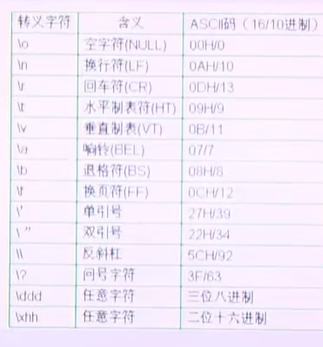

# 常量 和变量

>**常量：在程序执行过程中，值并不会发生量；就是常量；**
>
>````c
>float f = 3.14;
>````
>
>
>
>变量:用来保存一些特定的值，在程序的执行过程中，值随时发生变化的量；
>
>const 在c语言中仅仅是只读，并不不是常量，所以并不会保存到静态区，#defined 才是真正的常量，保存到静态区；；
>
>````php
>define("ARGS","abcdef");
>echo ARGS;
>defined();// 
>const //仅仅是只读；
>````
>
>

​	 常量的一些特例：

* 整型常量；


* 实型常量 小数常量  小数形式和科学计数法；

  

* 符号常量  

  `````c
  const char ch = 'A';  //只能是单个字符；  不能使用中文；？？？//
  
  //test //
  const char chz = '中文'; // 显示的是乱码！！因为这类是ASCII码编码！！！
  `````

  

* 标志常量； 其实就是宏  #define PI 3.14

* 字符串常量；

  >注意没有字符串这种数据类型，我们只能使用字符数组和指针来表示！！！

  ````c
  "abcdef"; // 双引号  可以表表示中文！！！
  // 字符串需要在后面加\0 尾0；
  ````

  

## 常量

> 常量的分类：
>
> * 整型常量； int;
>
> * 实型常量；  3.14; float ,double;
>
>  * 字符常量；是单引号，是一个字符；
>
>  **由单引号，引起来的字符或者转义字符，如：'a','\n'** ,'\t'
>
> * 字符串常量； 字符串 是双引号，是一个字符数组；
>
>  由双引号引起来的一个或者多个字符组成的序列；叫做字符串常量；
>
>  如："abc","abc\n",""空串 （只有尾\0，占用一个字节的空间）；
>
>  <font color=red>//todo   "abc\n\021\018"怎么去处理？？？ 怎么对待！！！</font>
>
> * **标识常量； 一改全改；不会校验是否正确；**
>
>  <font color=red>\#define </font>

### #define 的基本用法；

````c
//#define的基本用法； 其实就是一个替换；
//优点就是一改全改：
//缺点并不会检查语法；


#include <stdio.h>
#include <stdlib.h>
#include <math.h>

/**
 * #define的基本用法
*/
// 预处理就解决的问题；
#define PI 3.14

int main() {

    int a,b,c;
    a * PI;
    b + PI;
    c / PI;
    return 0;
}
// 查看一下预处理
// -E   Preprocess only; do not compile, assemble(assemble language n. 汇编语言)
//gcc -E define.c -o define 
// cat define 
# 11 "define.c"
int main() {

    int a,b,c;
    a * 3.14;
    b + 3.14;
    c / 3.14;
    return 0;
}

//如果 #define PI 3.14abc 不检查，还是做替换，但是运算过程中可能会出错；

````


````c
//define1.c

#include <stdio.h>

//#define ADD 2+3  // 所以一定要加括号，作为一个整体来出现的；
#define ADD (2+3)  // printf 25的形式；

int main() {
    // 就是完全的替换，不会做检查；
    printf("%d \n", ADD*ADD); // 11 2+3*2+3 = 11;
    return 0;
}


// section 2 

#include <stdio.h>

#define PI 3.14
#define ADD 2+3
//表达式 可以带参数
#define MAX(a,b) a > b : a ?b

int main() {
    // 就是完全的替换，不会做检查；
    printf("%d \n", ADD*ADD);
    return 0;
}
````


## const 常量；

>程序运行过程中，不变的量（不变的数据）！！！比如：一个太阳，PI = 3.14,一周有七天

`````c
//常量定义
//整型常量

1;
2;
112222;
//二进制；0b开头； 内存都是二进制，还要存二进制干嘛！！！ 所以没必要！！！！
0b10101010;
// 8进制 0开头
0272222
// 16进制   0x 开头！！
1233333L; long int
1212222222LL; long long int;

// 小数形式常量！！！
//小数形式; 2.2233
//指数形式; 2.sse22  e = 10;

//字符常量；单引号！
'a' ,'b','c'

//字符串常量！！ 双引号！
"asncnncnc";

char *strp = "shshs"; //字符常量 是不能去修改的；// 因为并不是字符数组； 所以不能去修改？？？？  是一个字符串常量？？
//todo 为什那么是一个字符串常量！！！

char *p = "sss"; //代表的是一个常数？

int *p = 123; // 是一个整型常量吗？
`````


````c
#include <stdio.h>
#include <stdlib.h>


void print_arr(int *p, int n) {
    int i;
    for (i = 0; i < n; i++) {
        printf("%d ", *(p + i));
    }
    printf("\n");
}
int main() 
{
    int i = 1;
    int a[] = {1,2,3,4};
    print_arr(a,sizeof(a)/sizeof(*a));
    //数组名 是一个地址常量 不能去改变；
    // a = 333;//不能改变他的指向 但是可以改变指向他的数据；
    //指向可以改变；
    *a = 44444;
    print_arr(a,sizeof(a)/sizeof(*a));
    //所以数组名就是一个 指针常量；
    // 不能初始化为NULL int * const p = &i; 必须要做初始化，常量；
    int * const p = &i;//指针常量；
    // p = &i;
    *p =  222;
    printf("%d\n",*p);
    // exit(0);
    return 0;
}
````


## 宏的概念

宏（英语：Macro）是一种批量处理的称谓。

macro,就是巨大的意思；

[计算机科学](https://baike.baidu.com/item/计算机科学/9132?fromModule=lemma_inlink)里的宏是一种抽象（Abstraction），它根据一系列预[定义的规则](https://baike.baidu.com/item/定义的规则/22611364?fromModule=lemma_inlink)替换一定的[文本模式](https://baike.baidu.com/item/文本模式/7355156?fromModule=lemma_inlink)。[解释器](https://baike.baidu.com/item/解释器/10418965?fromModule=lemma_inlink)或[编译器](https://baike.baidu.com/item/编译器/8853067?fromModule=lemma_inlink)在遇到宏时会自动进行这一模式替换。对于[编译语言](https://baike.baidu.com/item/编译语言/7680026?fromModule=lemma_inlink)，宏展开在[编译时](https://baike.baidu.com/item/编译时/53705444?fromModule=lemma_inlink)发生，进行宏展开的工具常被称为宏展开器。

宏这一术语也常常被用于许多类似的环境中，它们是源自宏展开的概念，这包括键盘宏和[宏语言](https://baike.baidu.com/item/宏语言/21500677?fromModule=lemma_inlink)。绝大多数情况下，**“宏”这个词的使用暗示着将小命令或动作转化为一系列指令。**


**宏**是一种计算机程序设计语言的特性，**用于定义和使用代码片段。宏由预处理器处理，以便在编译阶段之前被替换为实际的代码。**

>和函数类似，也是一个代码段，区别就是，宏在预处理阶段做了替换，所以会提高程序的运行效率；
>
>如果使用函数，那么会产生调用栈，创建销毁等等一系列的问题，运行速度会比较慢！！

宏允许程序员将常用的代码模式抽象为可重用的代码片段，从而提高代码的可读性和可维护性。宏通常用于创建简单的函数或执行重复性操作的代码块。

在C和C++中，可以使用`#define`指令定义宏。例如：

```c
#define PI 3.14159c
```

这将把`PI`定义为`3.14159`的缩写。在程序中使用`PI`时，预处理器会将其替换为`3.14159`。

宏还可以接受参数，因此可以根据需要动态生成代码。例如，在C中，可以使用以下方式定义一个带有参数的宏：

```c
#define SQUARE(x) ((x) * (x))
```

这个宏将接受一个参数，并返回该参数的平方。在程序中使用时，宏将被展开为相应的代码，例如：

```c
int x = 5;
int y = SQUARE(x); // y的值将为25
```

但是，在使用宏时，需要注意可能出现的副作用和意外行为。由于宏只是通过文本替换来工作，因此无法进行类型检查或错误检测。此外，宏的展开可能会导致代码行数增加并且难以调试。因此，在使用宏时，需要谨慎考虑其适用性和安全性。


## 转义字符

>\n换行； shell mac
>
>\r\n 回车换行；windows 
>
>转义字符本意上还是一个字符，所以用单引号，如果是字符串肯定就是 双引号了 ；
>
>'\018'  三位八进制；
>
>

**注意下面的这种：**

****

'\018',转义字符；八进制，不能有8，所以这个转义肯定是错误的；error；

'\x88'  两位16进制；


## 字符串常量引起的思考！！！