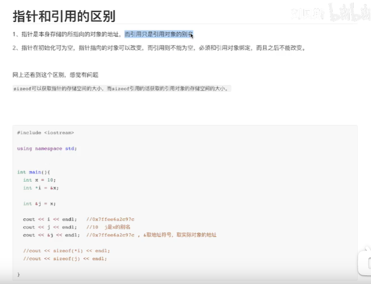

# 引用和指针的区别？

>区别：
>
>引用不能为空；不能引用不存在的变量；
>
>实质都是内存的共享；





## 引用和对象绑定之后 不可以改变吗？

`````php
//php 引用和对象绑定之后 可以改变引用对象呀；

//引用和对象绑定之后 不可以解绑 这是真的吗？
//实质都是内存共享，共享一个内存；
//
$a = 123;
$b = 234;
//改变引用 
$c = &$a;
$c = &$b;//改变引用；

echo $a,$b,$c; // 123 234 234
`````

