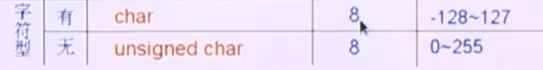

# 数据类型

>主要分为简单数据类型和构造数据类型；
>
>基本数据类型就是 整型 浮点 字符类型；

## 参考图片


## 基本数据类型

> 所占的字节数；
>
>存储区别：
>
>**都是存储的补码？ 正数的补码是本身，但是负数的补码是取绝对值取反+1；**
>
>不同类型的数据的转换；
>
>特殊性
>
>下面是32位机器；
>
>进制问题，10进制是不包含10的；多少进制就不包含多少；
>
>8进制用 8421法，每三位为一组来进行计算；
>
>16进制 0x ，就是每四位为一组来进行计算；
>
>254 
>
>B11111110  二进制 B；
>
>0376； 八进制；前面是0
>
>0xFE；  0x十六进制；
>
>signed int 有符号的；
>
>unsigned int；无符号的；


## 整型

存储主要是补码的形式；

**正数的补码就是本身，负数的补码就是绝对值取反+1；**

## 浮点类型

浮点类型的存储方式： 就是科学计数法来计算；

float：32位；

精确位 + 指数位 + 符号位

23  + 8 + 1

double ： 64位；

精确位 + 指数位+符号位

52 + 11+ 1


## char 字符类型 ASCII 表；

>0-127; 常见的字符；
>
>128 - 256 是后面添加补充的字符，主要是用来画图的一些字符，这个程序员不需要去了解了；
>
>https://jisuan5.com/ascii/

### 0-31

>主要是一些功能性的符号或者控制类的字符，你能看到效果或者看不到效果的都是算的；回车，空格，tab；
>
>**隐式字符也是包含在0-31内的；所以这部分数据要做过滤的；**
>
>**注意： 0  NULL；  代表的式空字符；  野指针的依赖情况，可以设置成空； 字符串的\0 尾0的标志也是由这个空字符来实现；**
>
>**line feed 换行的ascii码是10；**
>
>// windows 是一下子两个字符； mac 就一个换行！！ \r\n;
>
>**换行符的ASCII码值为10，十六进制表示为0x0A**
>
>**回车符的ASCII码值为13，十六进制表示为0x0D**
>
>**空格符的ASCII码值为32，十六进制表示为0x20**

### 


### 32- 127

>十进制的一些
>
>**数字0的字符 ： 48；**
>
>**字符A:65**
>
>**字符a：97；**
>
>A和a并不是连续的；

### 

历史遗留问题，c语言中的char，是未定义符号位的；

以前会用char 来保存数据，节约内存，因为只需要占用一个字节；




## 数据类型的转换

><font color=red>**注意：大的容器，向小的容器转换的时候，会存在精度丢失问题；精度只会丢失，并不会四舍五入**</font>
>
>类型转换主要分为两种：
>
>* 隐式数据类型转换；
>
>  <font color=red>自动靠拢，向精度比较高的数据类型转换；</font>
>
>  ````c
>  // 
>  int main() {
>      int i;
>      float f;
>      char ch;
>      double d;
>      // 向高精度的去靠拢；
>      // int  - double 
>      //(i + d) - (d-f)结果的数据类型肯定是double类型；
>      return 0;
>  }
>  ````
>
>  
>
>  主要存在于，数据的运算；
>
>* 显示数据类型转换；
>
>  **强制类型转换运算符；**


````c
#include <stdio.h>
#include <stdlib.h>

/**
 *数据类型
*/
int main() {
    float a = 3.9;
    int b = a;
    printf("%d \n", b);  //3 
    return 0;
}

````


## 特殊性：

>bool 布尔型上面没有提到过；
>
>逻辑数据类型；
>
>true ，false,分别默认代表的是  1，0；

* **float 类型 并不是一个精确的数值，仅仅是一个近似于等于小数的值；**，小数运算失真的问题；所以这边最好使用精确运算；decimal； 精确运算；

 `````c
 // 小数是一个不精确的数字；没有等于的概念；
 // 你不能在不精确的数字上，定义一个等于概念；
 // 在数学上 1/3 * 3 = 1；
 // 在计算机上 1/3 * 3 = 0.99999999999 != 1; // 注意这一点；
 // 在计算机上  0.000000000011 != 0 的，但是我们会把 0.00000000011 当成0； 注意这个概念；
 //code 
 
 //code 1 
 #include <stdio.h>
 #include <stdlib.h>
 
 int func(float f) {
     if (f < 0) 
         return -1;
         // error 代码有问题，
     else if (f == 0) 
         return -2;
     else  // f > 0;
         return 1;
     
 }
 //声明；
 int func(float f);
 
 int main() {
     float f = 1.2;
     int res = func(f);
 	
     printf("%d \n", res);
       
     float f1 = 1.5; // 1 + 1/2 1 + 2^-1 = 1.5 是可以精确表示的；
     // 这个就是精确表示；
     if (f1 == 1.5) 
         return 4;// 相等的，主要还是看，能不能被小数精确表示，当可以被二进制精确表示的时候，就可以相等；
         else 
         return 5;
     return 0;
 }
 `````

* **char型是否有符号是未定义的；**

* <font color=red>**不同形式的0值；//todo 待做**</font>

  `````c
  //todo 
  // 0,'0' "0" '\0'
  `````

* **数据类型与后序代码中所使用的输入输出要匹配；(防止自相矛盾)**

  ````c
  #include <stdio.h>
  #include <math.h>
  /**
   * 符号位的问题
  */
  // int  = 4 个字节；// 32位 
  int main() {
      // 无符号；i
      // 2^32 - 2
      unsigned int a = 4294967294;
      //signed 有符号
      //这个是溢出了； 2^31 直接溢出；
      // int b =  pow(2,31) + 100;
  
      // %d 对应的是有符号的；
      // %u 不带符号的十进制；
      printf("%d \n", a);// -2 输出是-2 肯定是有问题的；// 数据类型没有对应上；
      printf("%u \n", a);// %u unsigned int  不带符号的int；
      return 0;
  }
  ````
  
  
