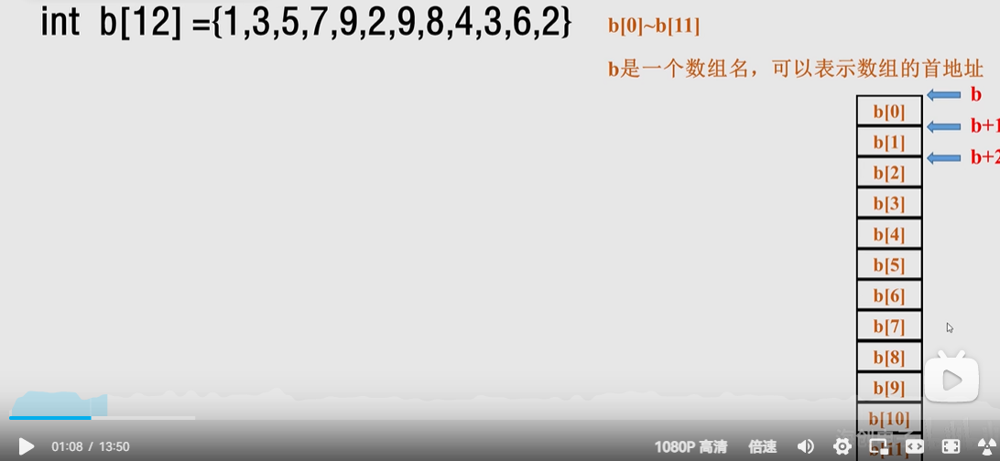
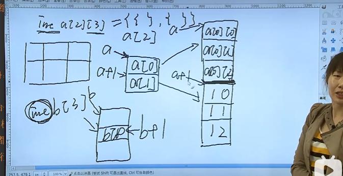

# 数组

>一维数组和二维数组；
>
>构造类型数据结构！！数组属于构造类型；
>
>数组来解决，批量，大量数据的问题；
>
>连续内存，相同数据类型的空间；支持随机访问；加快访问速度，局部访问！！
>
>

## 一位数组数组名 数组的其实位置；是一个常量；不可以出现在赋值的左边！！！ （定义的时候除外！）

>5. 数组越界

### 定义

`````c
//定义！！！
//[存储类型]数据类型 标识符[下标int(常量)] 

// 初始化！！！
// auto 不初始化 不会初始化为0或者特殊值； 就是随机值！！
// 数组变长！！ 
// 初始化； 数组的初始化；  可以不初始化，还可以全部初始化，还可以部分初始化！！！
int b[3] = {1,2,3};
int a[3] = {1}; //部分初始化；没有初始化到的设置为0；
static int c[3]; //static 全部初始化为0；
// b就是这个一位数组的地址；


// 数组的引用 ！！！
b[1]   &b[1]
*(b+1)   b + 1
    

//数组名 就是首地址！！ 数组的首地址；并且是一个常量！！！
 printf("%p\n",a);
//手动初始化； 
for (int i = 0; i < M; i++){
    scanf("%d",&a[i]);
}
arr = {3,4,5}; // 这种写法是错误的；  常量不能放在赋值的左边！！！


// 数组的越界问题； --- 并不会报错，其实就是指针偏移问题！！！  
// 数组的越界问题，只能自己来解决，不能由编译器来解决！因为是合法的！！！
//数组越界的产生其实就是指针偏移问题；
// a[3] = *(a+3) 其实就是指针的访问！！！ 
a[3] = 10;// 越界并不会报错；
printf("%d\n",a[3]);// 10；


//
`````





## 二维数组

>1. 定义，初始化；
>2. 元素引用；
>3. 存储形式；
>4. 二维数组的深入理解；

`````c
//二维数组，是多个行列； 就是一个二维数组；
// 一列仅仅是一位数组；

//定义： [存储类型] 数据类型 标识符 [行下标][列下标]   // 几行 几列；

//初始化： {}   {{}，{}} // 建议用后面的一种，和php比较类似；比较好理解！！
// 用{}初始化的方式，必须要有 row and column 行和列；
//全部初始化  
//部分初始化，不初始化的全部赋值为0；
//默认是 auto，是随机值；
//static  初始化，都是0；
//toscore *** 不写行号的初始化，行号 可以省略，列号，不可以省略；只给列号，肯定是不行的！！ a[M][]不行，a[][N]可以；

//元素的引用；
//a[0][0]->a[M-1][N-1]
//数组名[行标][列标]  

// 存储形式：在内存中也是连续的； *(*(a +i) + j)
// 按照行来存储的；先存第一行 然后第二行；

// 二维数组中的深入理解；
int a[2][3] = {{1,2,3},{4,5,6}};
//在内存中是连续存储的；
//a+i  // 行指针
//*(a+i) // 列地址；

//二维数组 就是两个一维数组；
//a是数组，行指针的首地址；
// a+i,被称为行指针；a[i] 也是列地址；；；
//*(a+i) //列指针；指针的指针吗？？ 是这个意思吗？ 多重指针？？？
// *(a+i) +j   === &(a[i][j])  
// *(*(a+i)+j) = a[i][j]  ====> 这个写法就是二级z
// 就是一个二级指针；
// a就是一个二级指针 里面存放的是a[i][0]的地址；


// 多去看一下下面的图；二维数组的图；
// a[0] a[1]都是列指针常量；===>指向的是a[0][0],a[1][0]的地址；
//所以地址是，*(a[0] + 0),*(a[1] + 0) ==  a[0][0]，a[1][0]的值；  
// 还是没有全部理解，还是要好好看一下！！！//todo//

// 注意：
// a[0] = 代表的是列指针；并不是行指针吧； a[0] = *(a+0)代表的是列指针；


`````



二维数组省略的全部是0；不初始化是随机值，就是全部是垃圾值；


## 字符数组

