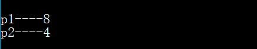
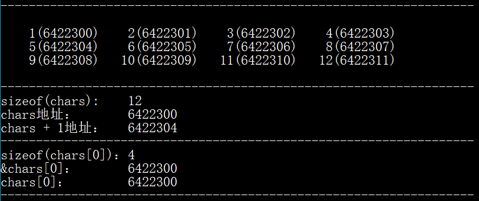

#指针数组


# [C语言中的 *p[2\] 与 (*p)[2] 的截然不同](https://www.cnblogs.com/xinglichao/p/9210132.html)

------

C语言运算符优先级表（由上至下， 优先级依次递减）

| 运算符                        | 结合性   |
| ----------------------------- | -------- |
| () [] -> .                    | 自左向右 |
| ! ~ ++ -- - (type) * & sizeof | 自右至左 |
| * / %                         | 自左向右 |
| + -                           | 自左向右 |
| << >>                         | 自左向右 |
| < <= > >=                     | 自左向右 |
| == !=                         | 自左向右 |
| &                             | 自左向右 |
| ^                             | 自左向右 |
| \|                            | 自左向右 |
| &&                            | 自左向右 |
| \|\|                          | 自左向右 |
| ?:                            | 自右至左 |
| assignments                   | 自右至左 |
| ,                             | 自左向右 |

 （来自C陷阱与缺陷）

---


------

 

对于( ) 或者 [ ] 的优先级是最高的

于是对于 *p[2] 结合的方式应该是  \*(p[2])  

对于 (\*p)[2] 显然结合方式是括号中的 *p 优先于 [2]

***具体\***：

##定义一个指针数组

>注意：数组指针指针数组的区别？？？

**char *p[2] 表示p是一个存储指向char类型数据的指针的数组**

**char (*p)[2] 则表示*p是一个拥有两个char类型元素的数组，那么p则表示指向这个数组的指针**


```
void test(){
    char *p1[2];
    char (*p2)[2];
    printf("p1----%d\n", sizeof(p1));
    printf("p2----%d\n", sizeof(p2));
    return;
}
```

得到的结果是



可以看到p1表示的是一个拥有两个(char *)类型的数组，一个指针占有4个字节，俩个当然是8个字节

而p2仅仅就只是一个指针，只占有4个字节

***常用用途***：

- ------

  对于 *p[]

在main函数的参数中有使用到，其中的 char *argv[]的argv就是一个指针数组，用来存储函数调用时传进来可变个数的参数

（详细：[利用 gdb 探究main(int argc, char *argv[\]){} 中的char *argv[]](https://www.cnblogs.com/xinglichao/p/9048244.html)）

```
int main(int argc, char *argv[])
{
    something you want to do;
    return 0;
}
```

比如可以这样

```
char *pp[2] = {"hello", "world",};
```

pp[0]存储字符串"hello"的第一个字符的地址，pp[1] 存储字符串"world"的第一个字符的地址

```
printf("%s\n", pp[0]);
```

将会打印出 hello

- ------

  对于 (*p)[]

无疑就是可以作为二维数组的引用

其实二维数组的本质也是一维数组，那么当我们定义一个二维数组的时候为什么不可以使用像引用一维数组的那样的指针来引用二维数组呢？

错误样例

```
void arrays(){
    int nums[3][4] = {0};
    int *pn = nums;
}
```

原因就是二维数组其实就是一个成员是一维数组的一维数组，所以它的类型是应该是数组类型

而这里的pn所指的类型是int，就会出现类型不匹配的问题

正确的方式是

```
void arrays(){
    int nums[3][4] = {0};
    int (*p_nums)[4] = nums;
}
```

这样的p_num是指向类型为数组的指针，与nums的类型相匹配

------

***补充***：

二维数组在内存中的存储问题

示例代码

[](javascript:void(0);)

```c
#include <stdio.h>
#include <stdlib.h>

int main()
{
    /*定义char类型便于观察地址，因为char只占一个byte*/
    char chars[3][4] = {{1, 2, 3, 4}, {5, 6, 7, 8}, {9, 10, 11, 12},};
    printf("-------------------------------------------------------------------\n\n");

    for(int i = 0; i < 3; ++i){
        for(int j = 0; j < 4; ++j){
            printf("%5d(%d)", chars[i][j], (int)&chars[i][j]);
        }
        printf("\n");
    }

    printf("\n-------------------------------------------------------------------\n");

    printf("%d\n", sizeof(chars));
    printf("%d\n", (int)chars);
    printf("%d\n", (int)(chars + 1));/*移动了4个元素，行移动*/

    printf("-------------------------------------------------------------------\n");

    printf("%d\n", sizeof(chars[0]));
    /*可以看作是一维数组的第一个元素的地址 形如 一维数组中的 &array[0]*/
    printf("%d\n", (int)&chars[0]);
    /*可以看作就是一维数组里的第一个元素是数组，它相当于一个数组名表示数组地址  形如  array*/
    printf("%d\n", (int)chars[0]);

    printf("-------------------------------------------------------------------\n");

    return 0;
}
```


输出



得到的结果以及代码注释已经可以说明一些问题了，就不再重复

------

本节完...... 