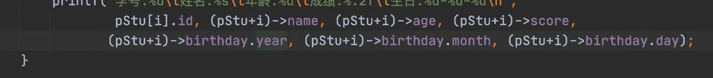

# 结构体

>结构体：struct


```c
// 结构数据类型；
struct Student {
    // 结构体成员；
    int id;
    // 静态数组；去分配；
    // char name[100]; // 这样比较占用栈空间；静态数据会保存到栈中，这里保存到堆中会更加简单一些；
    char *name;
    int age;
    float score;
};

```


```c
#include <stdio.h>
/**
 * 结构体 部分的内容；
*/
//short(2个字节；) int long char float double
// 首字母要大写；
struct Student {
    int id;
    char *name;
    int age;
    float score;
};
//生日的结构体 支持结构体的嵌套；
typedef struct Birthday
{
    int year;
    int month;
    int day;
} Birthday;

//空结构体
struct Emptystruct {

};
// 匿名结构体，只能使用几次,使用的比较少；
struct {
    int id;
    char *name;
    int age;
    float score;
}stu1, stu2;

// 类型定义 定义一个新的数据类型；取别名；typedef  类型定义  定义一个新的数据类型；
typedef struct Student stu;
/**
 *  更简便的方式去实现；  定义数据类型；
 *  一般会用这种方式去实现；
*/
typedef struct {
    int id; //4
    char* name; // 8 
    int age; // 4
    float score; // 4
    //结构体的嵌套；
    Birthday birthday; //12 
    //包含声明；
}Colleague, col2;

// 打印 学生信息；  这里通过值传递来访问，就要用.来访问；
void printColleagueInfo(Colleague col) {

    printf("学号：%d\t姓名：%s\tage:%d\tscore:%.2f\t生日：%d-%d-%d\n",col.id,col.name,col.age, col.score, col.birthday.year, col.birthday.month, col.birthday.day);
}

//指针的形式传递结构体  指针形式的访问呢要用箭头；
void printColleagueInfop(Colleague *pcol) {
    //当结构体是指着访问的时候 要是用箭头；
    //vim 替换  :s/\./->/g  替换不然仅仅会替换第一个；当前行 所有的
    // 
    printf("学号：%d\t姓名：%s\tage:%d\tscore:%.2f\t生日：%d-%d-%d\n",pcol->id,pcol->name,pcol->age, pcol->score, pcol->birthday.year, pcol->birthday.month, pcol->birthday.day);
}
/**
 * 定义变量的方式  数据类型 + 变量名；  int a; float b; char c;
*/
int main() {
    //这个就是一个实例；
    stu student1;
    // 这种数据类型；定义一个变量；// 这个定义太麻烦了，所以一般都会用 typedef；
    struct Student stu3;
    Colleague col1;
    //结构体的访问 . 来实现；
    //多层的访问
    col1.birthday.day;

    // 声明方式有很多哟；
    Colleague col2, col3;
    
    // 结构体 成员赋值；// 结构体赋值；
    Colleague col5 = {102, "qsw", 12, 1.2,{1, 2, 3}};
    //访问 成员变量 使用.
    // printf("学号：%d\t姓名：%s\tage:%d\tscore:%.2f\t生日：%d-%d-%d\n",col5.id,col5.name,col5.age, col5.score, col5.birthday.year, col5.birthday.month, col5.birthday.day);
    printColleagueInfo(col5);

    // 声明结构体指针；
    Colleague* p = &col5;
    printColleagueInfop(p);

    //结构体内存的计算；sizeof();  数据类型；数据类型的长度计算sizeof()
    printf("int占用字节数目：%d \n", sizeof(int));// long 跟操作系统有关；
    printf("生日结构体的计算 %d \n", sizeof(Birthday));// 12 // 3个int；
    printf("同事结构体占用的字节数目：%d \n", sizeof(Colleague)); //28 
    //指针为什么仅仅占有 4个字节；
    printf ("指针占用的字节数：%d \n", sizeof(p));
    return 0;
}
//
```


## 结构体内存计算和结构体对齐

`````c
#include <stdio.h>

typedef struct
{
    int a;
    char c;
    char d[3];
} test;

int main() {

    printf("%d", sizeof(test));// 8  这里就是内存对齐的问题； //都是8个字节；要和第一个成员字节数对齐；
    return 0;
}
`````


## 位域


## 结构体数组



`````c
#include <stdio.h>
/**
 * 结构体数组的问题
*/

typedef struct Student
{
    int id;
    char* name;
    int age;
    float score;
} Stu;

void printStuInfo(Stu *pStu, int len) {
    for (int i = 0; i < len; i++) {
            printf("学号：%d\t姓名：%s\tage:%d\tscore:%.2f\n",(pStu+i)->id,(pStu+i)->name,(pStu+i)->age, (pStu+i)->score);
    }
}

int main() {

    // 产生多个结构体；
    //定义一个数组  int 类型的数组;
    //数组包含数据类型int 和数组的长度；
    int a[10];
    // 定义一个结构体数组
    Stu stuarr[] = {
        //字符串 不能用单引号？？ //  注意一下这里；
        {1, "a", 3, 1.2},
        {1, "b", 3, 1.2}
    };

    //数组名字就是 指针，也就是地址；
    // printStuInfo(stuarr, 2);
    //len compute
    printStuInfo(stuarr, sizeof(stuarr)/sizeof(stuarr[0]));
    //
    // 数组的访问方式；
    int b[] = {1,2,3,4};
    // 两种访问方式；
    // b[1] === *(b+1)  或者的是值；地址指向的数据； 或者地址指向的数据；
    printf("%d--%d--%p--%p",b[1], *(b+1), b, (b+1));
    return 0;
}
`````


##  color theme

 vscode 主题：


## 跟操作系统有关的数据类型


1.在表示网络传输速度中与表示存储单位的不同：

表示存储单位时：1kB=1024B，但在网络中表示传输速度是1KB=1000B

2.下面介绍表示存储单位时的关系及其与操作系统位数的关系：

1B=8bit

字是指计算机cpu一次可处理的二进制数，32位操作系统字长位32bit（4B），64位系统字长64bit（8B）;

3.不同操作系统中数据类型的表示范围

与其说数据类型与操作系统位数有关，不如说与编译器编译有关。一般的，数据类型的字节数是由编辑器决定的。64位系统中编译器可以采用32位和64位两种编译方式。两种编译方式中除了*与long会与编译器采用的32位编译或64位编译而有不同，其他的都固定不变。具体表示范围如下：

| 数据类型       | 说明           | 32位字节数 | 64位字节数 | 取值范围                             |
| -------------- | -------------- | ---------- | ---------- | ------------------------------------ |
| bool           | 布尔型         | 1          | 1          | true，false                          |
| char           | 字符型         | 1          | 1          | -128~127                             |
| unsigned char  | 无符号字符型   | 1          | 1          | 0~255                                |
| short          | 短整型         | 2          | 2          | -32768~32767                         |
| unsigned short | 无符号短整型   | 2          | 2          | 0~65535                              |
| int            | 整型           | 4          | 4          | -2147483648~2147483647               |
| unsigned int   | 无符号整型     | 4          | 4          | 0~4294967295                         |
| long           | 长整型         | 4          | 8          | –                                    |
| unsigned long  | 无符号长整型   | 4          | 8          | –                                    |
| long long      | 长整型         | 8          | 8          | -2^64~2^64-1                         |
| float          | 单精度浮点数   | 4          | 4          | 范围-2^128~2^128 精度为6~7位有效数字 |
| double         | 双精度浮点数   | 8          | 8          | 范围-2^1024~2^1024 精度为15~16位     |
| long double    | 扩展精度浮点数 | 8          | 8          | 范围-2^1024~2^1024 精度为15~16位     |
| *              | 地址           | 4          | 8          | –                                    |

> <font color=red>注意：long   和指针是随着操作系统变化而变化的；多注意一下这两个数据类型；</font>
>
> <font color=red>long long 长整型，并不随着操作系统的变化而变化；</font>

