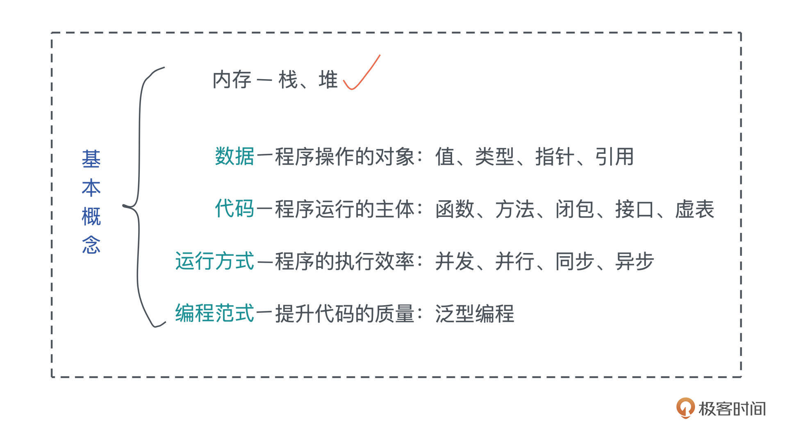

# 编程基础概念

>**栈上存放的数据是静态的，固定大小，固定生命周期；堆上存放的数据是动态的，不固定大小，不固定生命周期。**
>
>

---




------


##  数据 data

>值，类型，引用，指针；
>
>变量就是 一个值被储存到内存中某个位置的抽象；  所以 一个变量很明显的包括几部分： 值（数据），类型（长度）地址（位置）；

### 值和类型

严谨地说，类型是对值的区分，它包含了值在内存中的长度、对齐以及值可以进行的操作等信息


### 引用和指针

>**指针是变量，指针是一种用来存储地址的变量！在这里我再强调一遍“指针变量也是变量”，这意味着，你之前对于“变量”这个概念的认识，都可以放到指针变量的理解上。**
>
>**取地址 “&” 与解引用 “*” 运算符吗？通过使用这两个运算符，我们便能够完成对指针的最基本，也是最重要的两个操作，即取值与赋值。**

在内存中，一个值被存储到内存中的某个位置，这个位置对应一个内存地址。而指针是一个持有内存地址的值，可以通过解引用（dereference）来访问它指向的内存地址，理论上可以解引用到任意数据类型。

引用（reference）和指针非常类似，不同的是，引用的解引用访问是受限的，它只能解引用到它引用数据的类型，不能用作它用。比如，指向 42u8 这个值的一个引用，它解引用的时候只能使用 u8 数据类型。

**所以，指针的使用限制更少，但也会带来更多的危害。如果没有用正确的类型解引用一个指针，那么会引发各种各样的内存问题，造成系统崩溃或者潜在的安全漏洞。**


## 代码 code

>函数，方法，闭包，接口，虚表；

###函数

**函数是编程语言的基本要素，它是对完成某个功能的一组相关语句和表达式的封装。提高代码的复用性**

**函数也是对代码中重复行为的抽象。**

在现代编程语言中，函数往往是一等公民，这意味着函数可以作为参数传递，或者作为返回值返回，也可以作为复合类型中的一个组成部分。

### 方法

**方法是对象内部定义的函数；**

在面向对象的编程语言中，在类或者对象中定义的函数，被称为方法（method）。方法往往和对象的指针发生关系，比如 Python 对象的 self 引用，或者 Java 对象的 this 引用。

###闭包

而闭包是一种特殊的函数，它会捕获函数体内使用到的上下文中的自由变量，作为闭包成员的一部分。

``````php
#php闭包的应用；


``````


### 接口 

实现调用者和实现者的隔离，我们应该依赖于抽象，不应该依赖于具体的实现；

<font color=red>**作为一个抽象层，接口将使用方和实现方隔离开来，使两者不直接有依赖关系，大大提高了复用性和扩展性。**</font>

### 虚表

>//todo 以搞吧；

虚表你可以理解成一张指向若干个函数地址的表。这样在运行时，可以通过这张表找出要执行的函数，进而执行。比如 w.write()，如果 w 是一个类型被抹去的引用，指向了一块地址，此时 w 如何能够执行到 write() 方法？只能通过运行时构造的虚表来解决

**面向接口编程可以让系统变得灵活，当使用接口去引用具体的类型时，我们就需要虚表来辅助运行时代码的执行。有了虚表，我们可以很方便地进行动态分派，它是运行时多态的基础。**


##  运行方式

>并发并行，同步异步，promise/async/await
>
>**程序在加载后，代码以何种方式运行，往往决定着程序的执行效率**


### 并发和并行

并发（concurrency）与并行（parallel）

并发和并行是软件开发中经常遇到的概念。

`````php
# 并发：可以看成cpu一核，运行多个任务，可以先运行1，然后切换运行2，然后切换运行1；
# 并行: 可以看成cpu4核，运行4个任务，可以同时进行；
`````


<font color=red>**并发是同时与多件事情打交道的能力**</font>，比如系统可以在任务 1 做到一定程度后，保存该任务的上下文，挂起并切换到任务 2，然后过段时间再切换回任务 1。

<font color=red>并行是同时处理多件事情的手段。</font>也就是说，任务 1 和任务 2 可以在同一个时间片下工作，无需上下文切换。下图很好地阐释了二者的区别：


<font color=red>**并发是一种能力，而并行是一种手段。当我们的系统拥有了并发的能力后，代码如果跑在多个 CPU core 上，就可以并行运行。所以我们平时都谈论高并发处理，而不会说高并行处理。**</font>

很多拥有高并发处理能力的编程语言，会在用户程序中嵌入一个 M:N 的调度器，把 M 个并发任务，合理地分配在 N 个 CPU core 上并行运行，让程序的吞吐量达到最大。


### 同步和异步

>游戏一般都是单核的，一般都会有很明显的因果关系，比如开枪，子弹轨迹，命中敌人，掉血；会有很明显的因果关系；所以只能是同步的；所以并不需要异步去优化；  具有很强的因果关系；
>
>一般需要cpu多核的一般是视频剪辑这些东西；

#### 同步：

同步是指一个任务开始执行后，后续的操作会阻塞，直到这个任务结束。在软件中，我们大部分的代码都是同步操作，比如 CPU，只有流水线中的前一条指令执行完成，才会执行下一条指令。一个函数 A 先后调用函数 B 和 C，也会执行完 B 之后才执行 C。

**同步执行保证了代码的因果关系（causality），是程序正确性的保证。**

多个任务有很明显的因果关系；就用同步；

####异步：

>一个任务开始执行之后，与其他的任务没有因果关系；不必等前一个任务结束，就可以执行；

**异步是指一个任务开始执行后，与它没有因果关系的其它任务可以正常执行，不必等待前一个任务结束。**


### async/await   //todo

## 编程方式

>泛型编程； //todo


## 额外：

作者回复: 可以看我之前的回复。强类型弱类型的定义并不算太明确，我接受的定义是类型是否会在使用过程中发生隐式转换，比如 char 如果和 int 相加被转换成 int，和 string 相加被转换成 string。这样的转换往往会超出开发者的预期，导致逻辑bug。Rust 甚至不允许 u8 + u32 这样的操作，而是需要你使用显式的类型转换统一类型后再处理，所以是强类型。