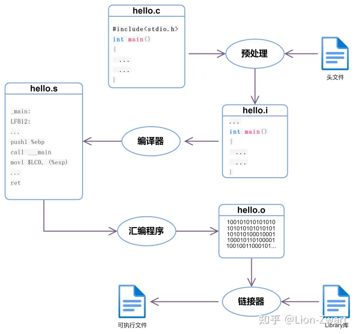

# 编译的四个过程

 >预处理，编译，汇编，连接；
 >
 >https://zhuanlan.zhihu.com/p/558783902?utm_id=0

# 总结

- C中的编译过程也称为将人类可理解代码（*C程序*）转换为机器可理解代码（*二进制代码）的过程。*
- C语言的编译过程包括四个步骤：**预处理、编译、汇编和链接。**
- 预处理器执行**删除注释、宏扩展、文件包含**。这些命令在编译过程的第一步执行。
- 编译器可以提高程序的性能，**并将中间文件转换为汇编文件**。
- 汇编程序有助于将汇编文件转换为包含机器代码的对象文件。
- **链接器用于将库文件与对象文件链接。**这是编译中生成可执行文件的最后一步。

