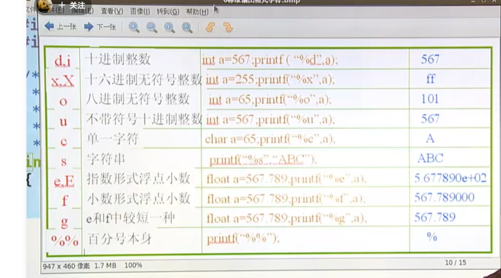
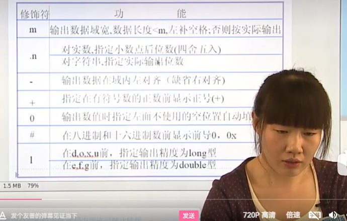
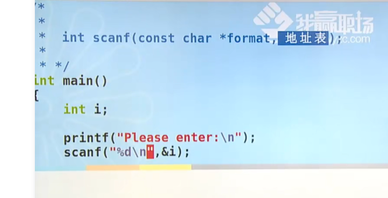
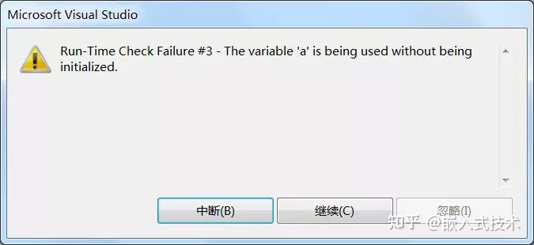
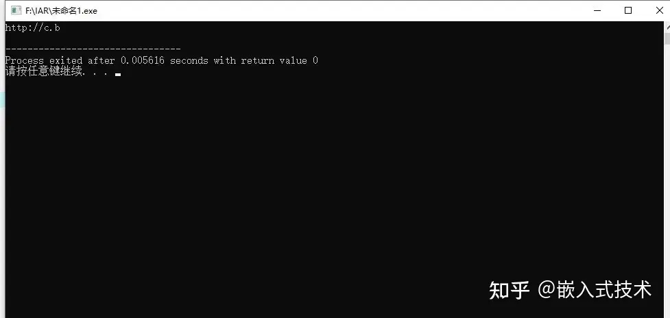

# 输入和输出

>input  & output ->I/O  (标准IO，文件IO)；

##  format

 >**format格式：**
 >
 ><font color=red>**format:"% [修饰符] 格式字符"**</font>
 >
 >
 >
 >最常用的几个：
 >
 >><font color=red>默认是有符号的！！</font>
 >
 >%d  十进制整数；decimal；
 >
 >%s 字符串； string  **// 就是字符数组；**
 >
 >%c 字符，一个字符的输出；char
 >
 >%p 指针
 >
 >%.2f 小数 float；  小数形式；
 >
 >%lf  代表的是double类型； 
 >
 >%ld 代表的是long类型的数据； 8个字节；
 >
 >**%u  unsigned int  不带符号十进制 ；format；**
 >
 >**%o  无符号八进制  octal** 
 >
 >**%x 无符号十六进制；hex**
 >
 >``````c
 >//注意c语言的进制的赋值 
 >int b = 0b101010;//二进制赋值；
 >int d = 123；// 默认是十进制；
 >int o = 0123; //这个是八进制；
 >int h = 0x123; // 这个是16进制；
 >``````
 >
 >
 >
 >%e 指数形式浮点数；  **exponent**  [ /ɪkˈspəʊnənt/](cmd://Speak/_us_/exponent)
 >
 >%g e，f 那个最短用那个； 小数和科学计数法两种表现类型中最短的那一种给；
 >
 >%是输出标记！
 >
 >%% 代表输出一个 %； 类似于转义的问题；

### 格式字符图片；



### 修饰字符

><font color=red>位置：放在%后面格式字符前面；</font>
>
>**修饰符：**
>
>* **m代表数据域宽，< m,左边补空格；否则按照实际输出**
>* **.n**
>  * **对于浮点型，是小数后面的位数；**
>  * **对于字符串，代表实际输出的位数；输出的时候不显示，并没有改变变量的值；**
>* \-   左对齐（默认，左对齐，就是左边带空格），不带代表右对齐； 
>* \+ 有**符号的正数**前面加符号+；
>* 0  补0不再补空格；
>* \#  在8进制或者16进制面前显示 0，0x；
>* **l （long） 在d o x u，前加l代表的是long类型，在f，e面前加l，代表的是double类型；**




`````c
//
`````


## 格式化输出和输出函数，printf()，scanf       f= format 格式化输出

><font color=red>**printf("%[修饰符]格式字符",[输出表项])**</font>

### printf

>**printf 输出一个字符串（字符数组），就是从首地址开始，到\0结束，因为是一个字符数组，所以是连续内存；**


````c
//int
#include <stdio.h>
/**
 * output
 * 输出
*/

int main() {
    int b = 0b1100;
    printf("%d \n", b); // 12 
    char ch = 65;
    printf("%c \n", ch); //A一般用整型来代替；
    return 0;
}

// 输出格式，和变量不对应的时候的问题！！！
 	int a = 567;
    float f = 123.456;
    // printf("%d %e \n",a ,f);
    // prntf 参数不对应的情况；
    
    printf("%d %e \n", a);  // %e 输入的是压栈的上面的一个数值；
    printf("%d %e\n", a, f, ch); //正常输出，会省略最后一个没有的参数；


//变参函数来实现的，详情去看函数章节！！！//todo
// 不知道有几个参数 只有在实际调用过程中，才会发现问题，或者运行的时候才会直到有几个参数？？？？？//todo
       int open(const char *pathname, int flags);
       int open(const char *pathname, int flags, mode_t mode);

       int creat(const char *pathname, mode_t mode);
````


### scanf

>int scanf (const char * format ,地址表)； 后面要加地址；
>
>**这个一般是终端的输入；** 
>
>
>
>**format 不要加任何格式，当需要输入多个变量的时候，我们可以用 默认的space and 逗号，回车，来做分隔符；**
>
>循环scanf 存在的问题；
>
>scanf 会存在越界的情况下，但是并不会报错！！！
>
>**%s的使用是比较危险的，因为不知道存储空间的大小；**
>
>
>
>scanf 输入字符串存在的问题：
>
>* 字符串多输入的问题；
>
>---
>
>

````c
//int sacnf(const char* format, 地址表)；  &i 地址；  后面的一定是地址！！
// format 不要加 \n; 加\n你的客户端也要加\n;
//输入一定要按照格式来输入，格式是什么样子，就规定写什么样子！！！ 
//间隔什么都不加，输入可以添加 空格 回车  逗号 都是可以的！！！


//scanf %s 格式是一种很危险的现象，space 回车是一种结束；
// scanf 会存在越界的形式；多注意下；但是并不会报错！！！；

#include <stdio.h>  

int main() {
    int i; 
    int* p = &i;
    printf("please enter for i[int]:\n");
    // scanf("%d",&i); //不能加\n要用户自己加；
    scanf("%d",p);//和上面起到的效果是一样的；// 值不就是地址吗？  一样的！！！ 
    printf("i=%d\n", i);
    return 0;
}


// 输入多个 变量的时候，format 不要加人任何格式！！

    scanf("%d%f", &i, &f);//可以加空格 逗号 或者 回车隔开？？？
    printf("%d -- %f\n", i ,f);

//res ------------------------------------------------------------------------------------------------------------
G:\cwebsite 
$ .\input.exe
Please enter fot i[int]:0 
12
12
12 -- 12.000000

G:\cwebsite 
$ .\input.exe 
Please enter fot i[int]:0 
12,12
12 -- 0.000000

G:\cwebsite 
$ .\input.exe 
Please enter fot i[int]:0 
12 12
12 -- 12.000000

    
// 字符串输入 scanf 空格会截断；  --- 会存在越界的问题；

    scanf("%s",str);//字符串输入 不能加空格，
    printf("%s\n", str);    

G:\cwebsite 
$ .\input.exe
Please enter fot i[int]:sss
sss

G:\cwebsite 
$ .\input.exe
Please enter fot i[int]:jjj 99
jjj

G:\cwebsite 
$ .\input.exe
Please enter fot i[int]:jjj,sss
jjj,sss
    
// 循环 + scanf 的问题；
  // while + scanf 的问题；
    while (1) {
        int res = scanf("%d", &i);
        if (res !=  1) {
            printf("Error Enter!\n");
            break;
        }
        printf("%d\n", i);
    }


//多个scanf输入的问题；

    //多个字符输入问题；
    scanf("%d", &i);
    // getchar(); //可以吃掉回车；也就是10；
    scanf("%c", &ch);
    // char 用 %d来输入 表示的是ascii码；
    printf("i = %d,ch = %d\n", i, ch);

//res 
G:\cwebsite 
$ .\input.exe
Please enter fot i[int]:11
i = 11,ch = 10

    
//res + getchar() 吃掉回车 
G:\cwebsite 
$ .\input.exe
Please enter fot i[int]:11
11
i = 11,ch = 49
````


### scanf   不知道存储空间大小，%s产生的危害；

>**不知道存储空间的大小，会存在越界的问题；后面添加的局部变量会覆盖，原先的字符串内存，当\0被覆盖的时候就会出现很出现bug；**
>
>

`````c
#include <stdio.h>
#include <string.h>
/**
 * 字符数组
*/
#define N 3
// 函数这是一个栈；
int main() {
    //会检查越界的问题
    // warning: initializer-string for array of 'char' is too long 
    // 会自动保存 一个\0 尾0字符，所以只能保存N-1个字符；
    // char str[N] = "abc";
    // printf("%s", str);
    char ch, str[N];
    ch = 10;
    // printf("%d \n",ch);

    scanf("%s", str);  //input ：abcdef;

    // for (int i = 0; i < sizeof(str)/sizeof(*str);i++) {
    //     printf("%p --- %c \n",(str +i),*(str + i));
    // }
    printf("%p\n", str);
    // int i  = 0;
    // printf("%d\n", sizeof(str)/sizeof(*str));
    // for (;i < sizeof(str)/sizeof(*str);i++) {
    //     //地址到值；

    //     printf("%p---%c\n", &str[i], str[i]);
    // }
    // printf("%c\n", *(str + 5));// 确实是连续内存；也会保存到内存里去；  
    // printf("%s\n", str);
    printf("%d\n", strlen(str));
    char cha = 10;// 这边会覆盖掉了\0????// 是不是这个原因呢？？？ 
    printf("%p\n", &ch);

    printf("%d\n", strlen(str)); //这边还是6吗？？？ 上面的赋值，把str+4这个地址  换成了回车 ，所以会变成下面的结果；

#if 0
    G:\cwebsite
        $ .\strarr.exe
        abcdef
        000000e620fff79b
        6
        000000e620fff79e
        6
        abcd
        f
#endif
        // 因为没有 \0 所以出现了下面的错误；
        printf("%s\n", str); // 
    return 0;
}
`````


`````c
// \0被覆盖之后，产生的问题；

        *(str + 6) = 'b'; //自动加 b???
        printf("%d \n",*(str+7));  //0 就是\0 ASCII码中的0号位； //会自动加0；
        // 因为没有 \0 所以出现了下面的错误；
        printf("%s\n", str); // 


//res 
#if 0

    G:\cwebsite
        $ .\strarr.exe
        abcdef
        000000e9f99ff63b
        6
        000000e9f99ff63e
        6
        0
        abcd
        fb
#endif

`````




## 字符输入和输出函数 getchar putchar;

>字符的输入和输出函数；
>
>int getchar(void); 默认从标准输入流来拿东西；
>
>int putchar(int c);
>
>int getchar(void);  注意这两个函数的返回值 是int类型；就是用ASCII码来接收的！！！
>
>

##字符串输入输出函数 gets(),puts();

>**char \*gets(char \*s);**  not check for overrun   不检查超过实现；
>
>**gets解决scanf接收字符串不能有空格，逗号，和回车的问题！！！**
>
>**puts();  //输出字符串 这个还是比较常用的；**

````c

// code
  char str[N];
	gets(str);
	puts(str);
//res
123
123
//overrun 越界的问题；
123444
123444

//------------------------------------------------------------
//document

BUGS
       Never  use  gets().   Because  it  is impossible to tell
       without knowing the data in advance how many  characters  
       gets()  will  read,  and because gets() will continue to  
       store characters past the  end  of  the  buffer,  it  is  
       extremely  dangerous  to use.  It has been used to break  
       computer security.  Use fgets() instead.
    
       gets() reads a line from stdin into the  buffer  pointed  
       to by s until either a terminating newline or EOF（end of file 文件结束）, which  
       it replaces with a null byte ('\0').  No check for  buf-  
       fer overrun(不检查，超出限制) is performed (see BUGS below).

       fgets()  reads  in at most one less than size characters  
       from stream and stores them into the buffer  pointed  to  
       by  s.   Reading  stops after an EOF or a newline.  If a
       newline is read, it is stored into the buffer.  A termi-  
       nating null byte ('\0') is stored after the last charac-  
       ter in the buffer.
    
         char *fgets(char *s, int size, FILE *stream); // 可以从文件里面读取； 可以限制读取的文件的大小；

		char *gets(char *s);

   		gets()  and  fgets()  return  s  on success, and NULL on  
       	error or when end of file  occurs  while  no  characters  
       	have been read.
    
````


## 缓冲区的问题

  >**行缓冲区 什么时候刷新？？**
  >
  >**缓冲区满了，一些函数自带刷新缓冲区exit(0),程序结束之前的工作，要刷新IOliu，用\n 来进行强制刷新！！！**

stdout stdin  都是行缓存，输入和输出要使用\n 来强制刷新缓冲区；

````c
 printf("%s:%d brfore while.", __FUNCTION__, __LINE__);
 while(1);
//sleep(5);
printf("%s:%d after while.", __FUNCTION__, __LINE__)
    
 // 上面没有任何的输出，需要\n来强制刷新缓冲区，然后才会有输出！！！
   printf("%s:%d brfore while.", __FUNCTION__, __LINE__);
    // while(1);
    sleep(5); // php 可以测试一下这个缓冲区问题；
    printf("%s:%d after while.", __FUNCTION__, __LINE__);

//res 程序结束之前，会刷新IO流，所以这两个函数会一起输出；
````


`````c
//while + scanf // 输入缓冲区，有错误的值，但是一直取不出来的问题；
// 需要校验，scanf的返回值；是否正确；
//scanf  需要去输入缓冲区取值，但是值是错误的，和数据类型不对应，会返回0；
//如果你还是循环，那么会再次去输入缓冲区取值，那么就会一直循环下去； 死循环；

while(1) {
    int a;
    int res = scanf("%d",&a);
    if (res != 1) {
        //结束循环条件
        printf("Enter Error!");
        break;
	}
    printf("%d\n",a);
}
`````


# 辅助知识！！


`````c
//没有单位的数据在计算机的世界里面也是没有意义的！！！
//防止溢出的问题；

//5LL * 1024LL * 1024LL * 1024LL;

#define SEC_YEAR (60LL*60LL*24LL*365LL) //防止溢出问题；
//long 是根据操作系统来计算位数的，long long肯定是64位的；


func (*FILE file,long long a) {
    
}

int main() {
    FILE *f = ...
     func(*f, 12LL);//说明传递的数据的数据类型；
}
`````


## 指数基础的知识

>在科学计数法中，为了使公式简便，可以用带 “*E*” 的格式表示。例如 1.03乘10的8次方，可简写为 “1.03*E*+08” 的形式，其中 ”*E*“ 是 *e*xpon*e*nt(*指数*) 的缩写;
>
>**<font color=red>double ：那么 科学计数法表示为：(-1)^S * 1.F* 2^(E - 1023);</font>**
>
>**<font color=red>指数部分可能是负数，也有可能是正数；</font>**
>
>***double 可以表示 整型，*double*只是可以输入有小数点数而已，但是结果可能有小数点，就是譬如9.000这样**
>
>**但是double的精确值是 2^54，相比long long 类型的2^61小很多； double类型表示整型，可能会存在失真的问题；**
>
>

****

  ````c
  C中在库函数里有指数的定义。具体用法：
  在预处理命令处包含：#include <math.h>（math头文件）。
  例如：10的n次方，其中n为指数：
  //int n,result;
  //scanf("%d",n);
  //result=pow(10,n);
  //1e8是指数形式，在别的语言中可以，但在C语言中不行，即使你包含了math头文件
  ````


## EOF；

>**EOF 一般是 -1 ，但是也有可能是其他的值，这里比较的时候，使用 EOF就行，不要使用-1；**

 fputc(), putc() and putchar() return the character writ-  S
       ten as an unsigned char cast to an int or EOF on error. 


## 越界问题

>数组和字符数组的越界问题；

数组越界C语言数组是静态的，不能自动扩容，当下标小于零或大于等于数组长度时，就发生了越界（Out Of Bounds），访问到数组以外的内存。如果下标小于零，就会发生下限越界（Off Normal Lower）；如果下标大于等于数组长度，就会发生上限越界（Off Normal Upper）。

C语言为了提高效率，保证操作的灵活性，并不会对越界行为进行检查，即使越界了，也能够正常编译，只有在运行期间才可能会发生问题。请看下面的代码：

\#include <stdio.h>

int main()

{

int a[3] = {10, 20, 30}, i;

for(i=-2; i<=4; i++){

printf("a[%d]=%d\n", i, a[i]);

}

return 0;

}

运行结果：a[-2]=-858993460a[-1]=-858993460a[0]=10a[1]=20a[2]=30a[3]=-858993460a[4]=-858993460

越界访问的数组元素的值都是不确定的，没有实际的含义，因为数组之外的内存我们并不知道是什么，可能是其它变量的值，可能是函数参数，可能是一个地址，这些都是不可控的。

由于C语言的”放任“，我们访问数组时必须非常小心，要确保不会发生越界。每个C语言程序员的生涯中都遇到过越界错误，因为越界错误有时候不容易发现，也不容易复现。

当发生数组越界时，如果我们对该内存有使用权限，那么程序将正常运行，但会出现不可控的结果（如上例所示）；如果我们对该内存没有使用权限，或者该内存压根就没有被分配，那么程序将会崩溃。请看下面的例子：

\#include <stdio.h>

int main()

{

int a[3];

printf("%d", a[10000]);

return 0;

}

在 VS2010 下运行，会出现运行时错误：



在 C-Free 5.0 下运行，会弹出程序停止工作的对话框：

每个程序能使用的内存都是有限的，该程序要访问 4*10000 字节处的内存，显然太远了，超出了程序的访问范围。这个地方的内存可能没有被分配，可能是系统本身占用的内存，可能是其它数据的内存，如果放任这种行为，将带来非常危险的后果，操作系统只能让程序停止运行。

数组溢出当赋予数组的元素个数超过数组长度时，就会发生溢出（Overflow）。如下所示：int a[3] = {1, 2, 3, 4, 5};数组长度为3，初始化时却赋予5个元素，超出了数组容量，所以只能保存前3个元素，后面的元素被丢弃。

GCC、LLVM/Clang、低版本的 VS（例如 VS2010）发现数组溢出只会给出警告，并不会报错。但是高版本的 VS（例如 VS2015、VS2017）发现数组溢出时会报错，禁止编译通过，微软终于聪明了一次。

一般情况下数组溢出不会有什么问题，顶多是丢失多余的元素。但是当以字符串的形式输出字符数组时，就会产生不可控的情况，请看下面的代码：

\#include <stdio.h>

int main()

{

char str[10] = "[C语言中文网：C语言程序设计门户网站(入门教程、编程软件)](https://link.zhihu.com/?target=http%3A//c.biancheng.net)";

puts(str);

return 0;

}

在 DEV下的运行结果：



字符串的长度大于数组长度，数组只能容纳字符串的前面一部分，也就是"[http://c.b](https://link.zhihu.com/?target=http%3A//c.b)"，即使编译器在最后添加了'\0'，它也保存不到数组里面，所以 printf() 扫描数组时不会遇到结束符'\0'，只能继续向后扫描。而后面内存中的数据我们不知道是什么，字符能否识别，何时遇到'\0'，这些都是不确定的。当字符无法识别时，就会出现乱码，显示奇怪的字符。

由此可见，在用字符串给字符数组赋值时，要保证数组长度大于字符串长度，以容纳结束符'\0'。

总结：能够理解数组越界和数组溢出的原因，并且在编程中注意避免。
