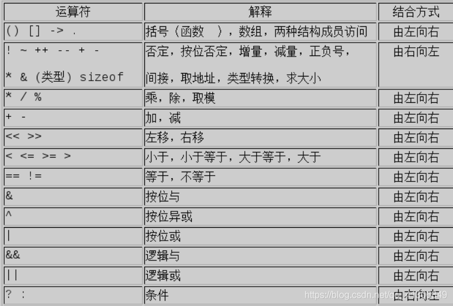
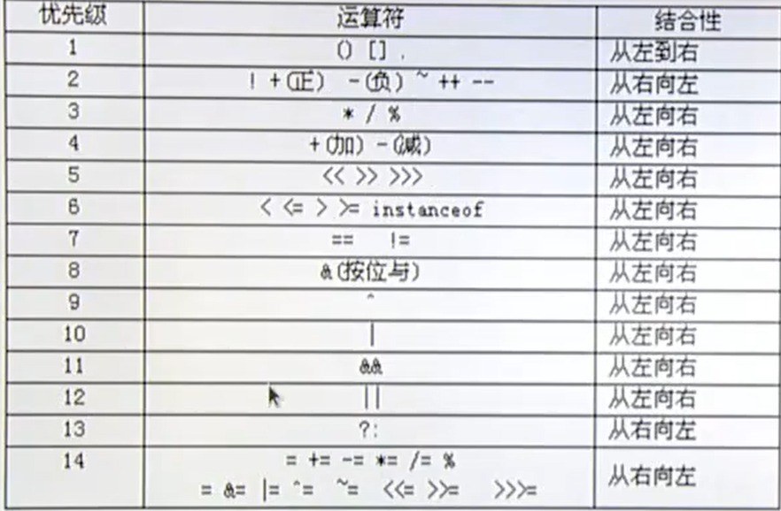

# 运算符

>

## 运算符 和表达式

>表达式和语句的区别：就是加不加分号；
>
>````c
>i = 1 //表达式
>i = 1; //语句；
>````


## 运算符 （operator)

>1. 每个运算符所需要参与运算的操作数个数
>2. 结合性；
>3. 优先级；
>4. 运算的特殊用法；
>   1. **%要求两边数字都必须是整数；求余；**
>5. 位运算的重要意义；


## ++i  和 i++

>运算符在前，先进性计算，然后再取变量值使用；
>
>变量在前，先取值使用，然后再进行计算；
>
>**无论如何 ++i ，和i++ 都要做加1操作的；只要运行了本身自己的结果就会发生变化；变化的时机，并不一样，在使用后，或者再使用前，发生变化；** 

```c
  /**
     * i++  和 ++i
     * 不要去研究，同一个变量的变化关系，会容易产生歧义，说不定会因为不同的编译器，而产生不同的效果；
     * value = i++ + ++i + i-- - --i；
    */

    int i = 1, j = 11;
    // int value = i++ + ++j;   // 1+12 = 13
    /*
        i;
        j = j+1;
        value = i+j;
        i = i+1; 
    */

   int value = --i + j++;  // 11+0 = 11;
   /*
        i = i -1;
        value = i + j;
        j = j+1;
   */
    printf("%d \n", value);
    printf("%d \n", i);
    printf("%d \n", j);
```


## <font color=red>运算符的特殊用法：</font>

>**很重要的部分;//toscore;**

* **% 必须两边都是整数；**
* **= 代表赋值 == 代表关系；=== 也是关系，全等，数据类型也要相等；**
*  **注意 if语句的非0为真！！！**
* **逻辑运算符（&& 和 ||）的短路特性；&& 只要左边条件是假的，右边不再判断真假，|| 必须两边全部判断完才会判断真假；**

`````c
    /**
     * 逻辑运算符的短路特性
     * && || 的短路特性；
    */

   int a = 1, b = 2;
   int c = 3, d = 4;
   int n,m;
//    if ((n = a > b) && (m = d > c)); //只运行 第一个 第二个不在运行， // 0 0
   if ((n = a > b) || (m = d > c)); // 两个都需要判断； // 0 1
   printf("%d\n", n);
   printf("%d\n", m);
    return 0;
`````

* sizeof()是一个运算符；

`````c
//语法格式 sizeof 有三种语法形式
//1) 用于数据类型
sizeof( type_name ); // sizeof( 类型 );
//2) 用于变量
sizeof ( object ); // sizeof( 对象 );
sizeof object; // sizeof 对象；
//3) 构造类型； -- 也是一种特殊的数据类型；复合的数据类型；

    /**
     * sizeof(); 计算数据类型 或者 变量所占用的字节数；
    */
   printf("%d \n", sizeof(int));
   printf("%d \n", sizeof(double))
`````


* 赋值语句运算符；

``````c
  //右结合性；
   int a = 6; 
   int val = a -= a *= a+= 3;
   printf("%d \n", val);  //res  0;
``````

* 强制类型转换

`````c
//隐式转换是向字节数比较宽的靠拢；
//强制类型转换；
    /**
     * 强制类型转换； ()
    */

    int a;
    float f = 2.9;
    a = (int)f; // 使用int 来做一个类型的对应；不需要隐式的转换；当然如果不加(int)他也会隐式的转换；

    printf("%d \n", a);
    printf("%f \n", f);
`````

## 位运算

````c
// >> << & | ^ ~   // 五种位运算！！！ ~ 按位取反！ 按位与或； 异或！ 相同为0，不同为1；

// 注意下面的n位，是从0位置来计算的；
//将操作数中的第n位置1，其他位不变； num = num |  1 << n; //1  左移动n位； 然后用| 或 置1；按位或；

//将操作数的第n位清0，其他位不变； num  = num | ~(1 << n); // 0 用& 来置0；按位与;

//测试第n位：if (num & 1 << n)  == 1 判断第n位是1或者0； 如果是1，那么往下操作，是0那么不往下操作； << 优先级 会高于&；

//从一个指定宽度的数中取出起中的几位？？？？


// 异或的用法；
// 取反？？？
   	sint f = 1;
    int  n = 1; // 注意这个n是从计算的；
    //异或取反；
    printf("%d \n", f ^= 1); 
    printf("%d \n", f ^= 1); 
    printf("%d \n", f ^= 1); 
    printf("%d \n", f ^= 1);

    /**
     * 位运算
    */

    int a = 12;
    printf("%d \n", a >> 1);// 6
    int b = 012;
    int c = 0x12;
    int d = 12; //B1100；
    int e = 12;
    int  n = 1; // 注意这个n是从计算的；

    d = d | 1 << n;//把第n位置1；
    e = e & ~(1 << 2);//把第n位置0；

    printf("%d \n", d); // 1110 = 14;
    printf("%d \n", e); // 1000 = 8;
    printf("%d \n", b); //  8 + 2;
    printf("%d \n", c); // 16 + 2 = 18;
````


## 优先级

>1. （） [] -> . 这三个优先级是最高的！！！
>2. 单目；  php查看数据类型的函数,gettype();  sizeof();获取字节数，c语言中是获取字节数；
>3. 算术； 
>4. 位运算；
>5. 关系运算；
>6. 逻辑运算； &&  || ！ 与或非 不存在异或！！！
>7. 三目运算符；
>9. 赋值运算符；赋值是在最后的； **i+=1; 也是赋值语句；**
>
>**逻辑运算，没有异或的原因， != 不等于就行了，就是异或！**
>
>*//  关系运算符优先级会高于逻辑运算符；*
>
> 位运算的左移和右移，相当于乘以2和除以2，所以优先级会高于关系运算；


。0




# 辅助知识！

>**vscode 格式化代码的快捷键： shift + alt + f；**
>
>进制数，开始为0代表的是八进制，0x代表的是16进制数；


## 进制方面的基础知识

计算机常见进制
**十进制（Decimal）**
十进制标志为D，如(1250)D
下标表示，如(1250)10

**二进制（Binary）**
二进制标志为B，如(10010101)B
下标表示，如(10010101)2

**八进制（Octal）**
二进制标志为O或Q，如(4603)O或(4603)Q
下标表示，如(4603)8
<font color=red>**一个数要指明它是八进制，必须在前面加一个0，如123是十进制数，0123则表示为八进制数**</font>

**十六进制（Hexadecilmal）**
十六进制标志为H，如(63AB)H
下标表示，如(63AB)16
**<font color=red>一个数要指明它是十六进制，必须在前面加一个0x，如123是十进制数，0x123则表示为十六进制数</font>**

###进制间的换算用 8421码就行！！！；

----


##  \*p++ \*++p的区别

> <font color=red>**运算符*和++都属于单目运算符，两者的优先级是一样的，结合性的方向是从右到左。**</font>

**首先，关于++运算符的特性，我们需要了解一下。**

> <font color=red>**先计算还是先使用的问题；**</font>
>
> ++在前，则变量先自身加1，然后参与所在表达式的其它运算；
> ++在后，则变量首先参与所在表达式的运算，然后在当前语句最后结束前（以分号作为结束标志）自身加1。
> 见下例：

```c
//code 1
int p=5;
int i;
i=p++;//此处，i的值为5，p的值还是5
printf("i=%d,p=%d\n",i,p);//此处，i的值为5，p的值已经变为6
/代码2
int p=5;
int i;
i=++p;//此处，p的值首先加1变为6，然后赋值给i
printf("i=%d,p=%d\n",i,p);//此处，i的值为6，p的值为6
```

10
然后我们分析一下几种情况：

1、*p++

> \*(p++)这种写法尽量不要这样写，容易引起歧义，编译器实际上还是按照\*p++来处理。*
>
> ----
>
> 1
> 因为文章开头提过，运算符*和++都属于单目运算符，两者的优先级是一样的，结合性的方向是从右到左。
> 然后有些人会认为这个表达式的运算顺序是：p先自身+1，然后进行解引用。其实这种想法是错误的。
> 正确的运算顺序应该是首先解引用指针变量p，然后p在自身加1。
> 之所以不按照从右向左的结合性，是因为++自身的特性引起的，我们在前面已经讲过。

例1：

```c
//code 2
#include <stdio.h>

int main(void)
{
	int a[3]={1,2,3};
	int *p=a;
	int t;
printf("*p=%d\n",*p);//指向数组a的a[0]元素

t=*p++;
    
printf("t=%d\n",t);//t的值等于a[0]的值

printf("*p=%d\n",*p);//指向数组a的a[1]元素
c
return 0; 
}
```


2、\*++p
\*++p的运算顺序就是首先p自身加1，然后对p进行解引用。

例2
```c
//code 3
#include <stdio.h>
int main(void)
{
	int a[3]={1,2,3};
	int *p=a;
	int t;
printf("*p=%d\n",*p);
c
t=*++p;
printf("t=%d\n",t);

printf("*p=%d\n",*p);

return 0; 
}
```
