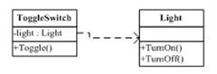

# IOC  and  DIP

关于IoC的的概念提出来已经很多年了，其被用于一种面象对像的设计。我在这里再简单的回顾一下这个概念。我先谈技术，再说管理。

话说，我们有一个开关要控制一个灯的开和关这两个动作，最常见也是最没有技术含量的实现会是这个样子：

然后，有一天，我们发现需要对灯泡扩展一下，于是我们做了个抽象类：

但是，如果有一天，我们发现这个开关可能还要控制别的不单单是灯泡的东西，我们就发现这个开关耦合了灯泡这种类别，非常不利于我们的扩展，于是反转控制出现了。

就像现实世界一样，造开关的工厂根本不关心要控制的东西是什么，它只做一个开关应该做好的事，就是把电接通，把电断开（不管是手动的，还是声控的，还是光控，还是遥控的），而我们的造各种各样的灯泡（不管是日关灯，白炽灯）的工厂也不关心你用什么样的开关，反正我只管把灯的电源接口给做出来，然后，开关厂和电灯厂依赖于一个标准的通电和断电的接口。于是产生了IoC控制反转，如下图：

**所谓控制反转的意思是，开关从以前的设备的专用开关，转变到了控制电源的开关，而以前的设备要反过来依赖于开关厂声明的电源连接接口。只要符合开关厂定义的电源连接的接口，这个开关可以控制所有符合这个电源连接接口的设备。也就是说，开关从依赖设备这种情况，变成了，设备反过来依赖于开关所定义的接口。**