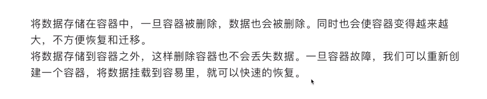
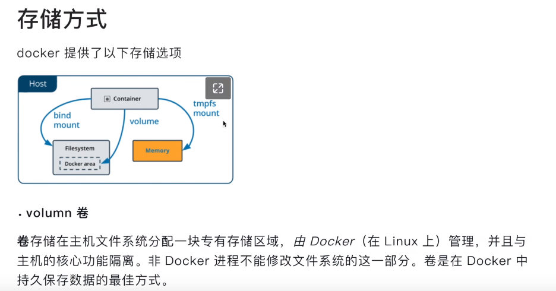
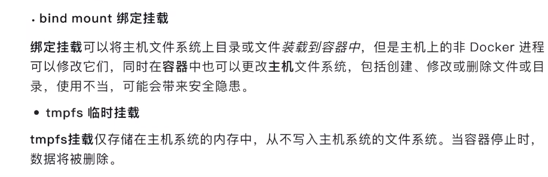
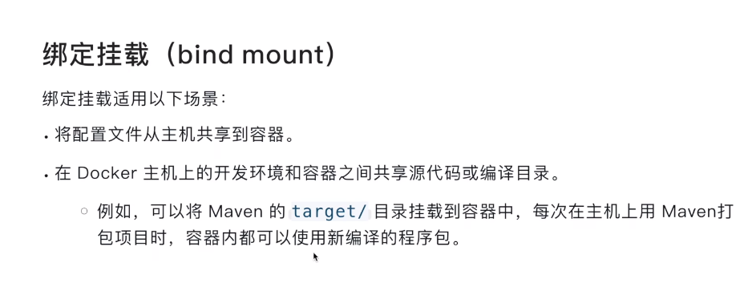
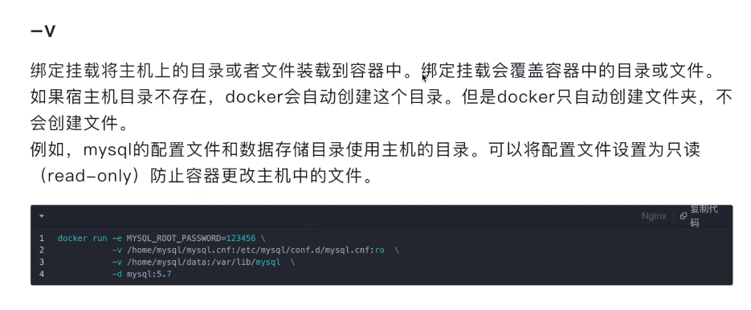
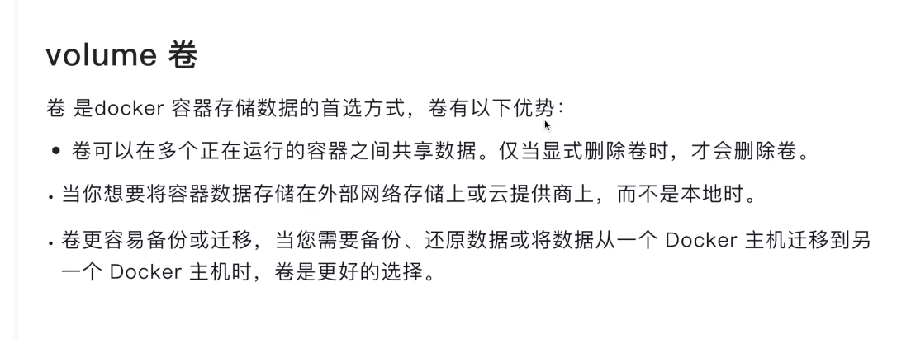
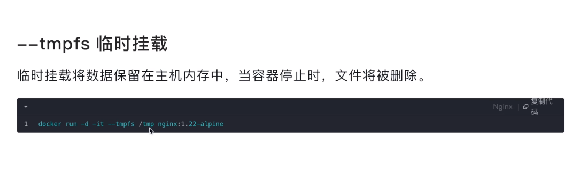

# docker 存储的几种方式

---

## 存储方式；

---

##  绑定挂载

>主机需要区修改；

* 配置文件从主机到容器的共享
* 源代码的共享；

>:ro 宿主机  可以修改 容器不能修改；
>
>当不存在目录，宿主机会帮你创建，但是并不会创建文件； 注意

##  卷 volume

> docker volume ls 
>
> docker  volume inspect 
>
> docker rm  
>
> docker volume prune 删除用不到的数据卷；
>
> 一般都是删除 容器的时候删除数据卷就可以
> docker rm -v  // 删除容器并且删除数据卷；
>
> ---
>
> 一般用在：
>
> * log 日志； docker logs 读取的数据也是从里面读取的；
> * 数据，比如mysql的数据；数据库数据都是这样保存的；

**所以 这里这个问题就解决了，数据也是存储在容器里面吗？**

**肯定不是的呀，存在容器里面 容器gg 那么数据就没有了；**

---

## 临时挂载

> 基本用不到的；

---

##  为什么不建议docker部署MySQL

我记得k8s官网好像就不建议部署有状态的应用，然后举例了MySQL

确实，有状态就代表了扩容成本高昂

---

## docker 容器是资源共享 还是资源隔离？  还是kubernetes支持资源隔离？？ 
