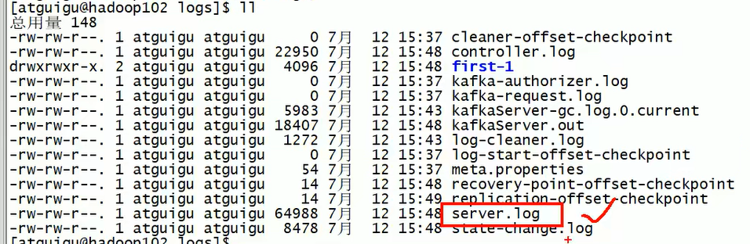

# docker logs


docker查看日志的三种方式：

1.docker logs --tail=1000 容器名称 （查看容器前多少行的日志） 

````shell
# 动态显示
docker logs -f --tail 100 container_id
````


2.docker 容器启动后,可以进入以下位置查看日志（/var/lib/docker/containers/容器ID/容器ID-json.log）（进入容器内部查看日志）

``````shell
#  产生的日志 直接放在外面直接看就行了  
# 相当于 server.log 直接查看日志揪心了；kakfa 可以直接看 seerver.log
``````



3.docker attach 容器名称（实时查看，但是CTRL+C强制退出以后也会影响容器的进程，导致强制退出），设置 docker attach --sign-proxy=false 容器名称（实时查看日志内容）

