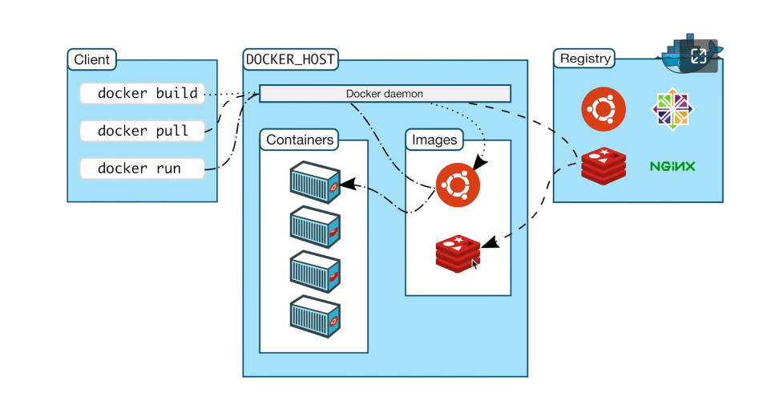

# docker run 的参数问题

> docker run  and docker pull 一定要加 tags  也就是版本；
>
>

docker run

​	--name  容器名字
​	-p  映射端口
​	--network  容器网络 --net  网络  负责默认的是 docker0

```php
- v 数据卷 volumes
-e
	环境变量的设置
		MYSQL_ROOT_PASSWORD=root
-d
	//后台运行 
		//是否会把 输出结果 输出在宿主机上 -d 会输出到logs 日志上面去
	// 在前台运行，会阻塞到当前的进程； 当退出的时候，该nginx 就不会再运行，当访问的时候就会报错；
    // 所以可以在后台运行； 
-t
	terminnal
		docker 开启一个终端 可以进行命令的交互
-i
	即使未连接，也要保持 STDIN 打开 交互  internative  容器终端的保持打开
    
--rm
	运行完删除该容器
bash  // 这里运行什么命令；
	交互式用的是 shell 
--restart=always
	--restart
		always
			这将redis使用始终重启策略运行容器， 以便如果容器退出，Docker 将重启它。

​	 docker pull nginx:1.20.2-alpine
​		可以 这样些 要求alpine 
​			他的包管理工具 ，就是apk 
```


## docker  架构

> 注意 container  and images 都是保存在本地的；
>
>client  客户端，本地的docker 就相当于是服务端；
>
>C/S 架构；

