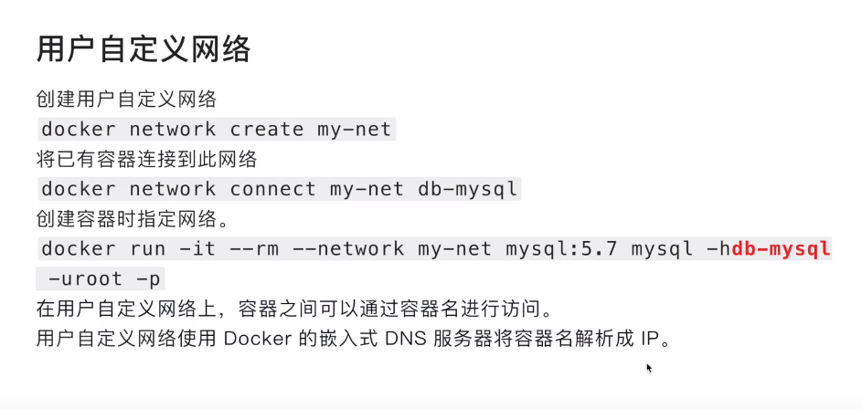

## docker 网络

#### 基础命令

----

| 命令                                            | 效果                               |
| ----------------------------------------------- | ---------------------------------- |
| docker network create -d bridge xxx             | 创建网桥                           |
| docker network ls                               | 查看所有的docker                   |
| docker network inspect xxx                      | 查看网桥的详细情况                 |
| docker network connect net_xxx container_xxx    | **已经运行**的容器连接到自定义网络 |
| docker network disconnect nex_xxx container_xxx | 容器与网络断开连接                 |
| docker network prune                            | 删除所有的没有被使用的网络         |
| docker network rm xxx [xxx...]                  | 删除一个或者多个网络               |

注意：docker network create -d bridge  xxx  子网值是不确定的，仅仅是为了满足IP寻址目的。可以使用参数--subnet= 指定子网值（CIDR(classless inter-domain Routing)无类型域间选路）；

docker给创建的容器一个默认的网络docker0，**注意在这个网络的容器只能实现Ip的互联；**所以默认创建的**docker0**就是实现IP互联的原因；所以要实现容器名的访问只能用**link**，或者**自定义网络**；  （接上一篇博客，容器互联）

如果创建 容器的时候不设置自定义网络，默认是bridge，只能通过ip互联，但是不能通过容器名来进行访问；

**docker run -ti  --rm busybox   // 这个一般会做一个测试容器； 里面有很多的命令；** 

---

## 网络的连接方式

* 桥接方式    需要NAT 转换成 宿主机ip 然后进行访问； 安全的，外部网络访问不到内网的容器；

  ​	宿主机 会有一个虚拟网卡，来和容器来互联；

* host   公用宿主机的网络；

   不需要NAT 进行转换；

* none  没有网络；

