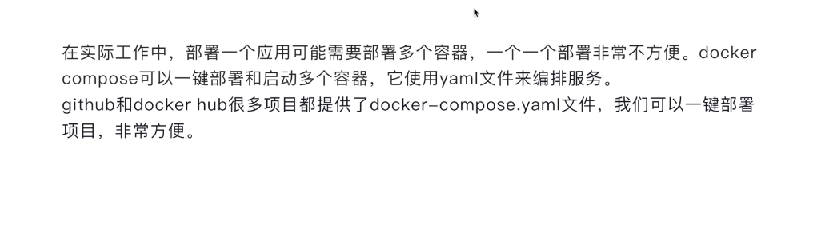
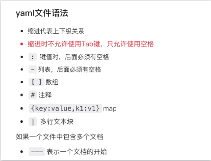
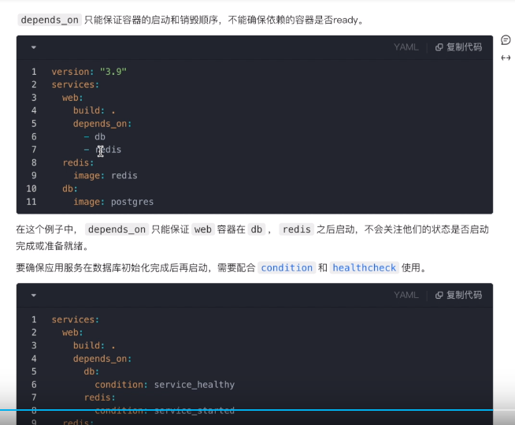
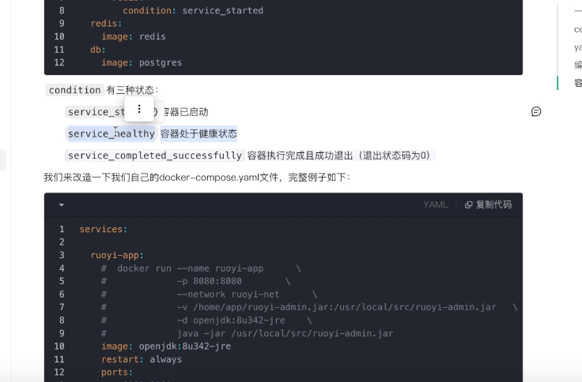

# Dcoker-Compose + kit（工具）

>docker-compose 单机部署；
>
>hub.docker.com 镜像的网址；存放镜像的网址；


docker 国内镜像的问题

vim /etc/docker/daemon.json

systemctl restart docker 

docker info 


### 境像地址

https://www.daocloud.io/mirror

aliyun

https://cr.console.aliyun.com/cn-hangzhou/instances/mirrors?accounttraceid=5f492271d3c04075a0b95593fca93969exkr


### 线上的docker

https://labs.play-with-docker.com/


### 加载那个php.ini

* php -i  查看配置所在的位置； 运行加载的php.ini 的位置

​		php -i | grep php.ini  

* strace -e open php -m   查看要加载那个php.ini ； 


​	php -m  查看php的扩展；


###更新apt的源


vim 语法  ：  **:%s/a/b/g


## docker-compose 

> 使用

docker-compose up -d 启动       up         Create and start containers   创建和启动容器；

docker-compose restart 

docker-compose stop；

docker-compose down;  **删除 容器 ，但是并不会删除数据卷；volume；**  

**如果需要删除数据卷，需要自己单独的删除；docker volume rm  也可以 docker -compose rm -v 容器名字；**


`````php
#docker-compse -p my up -d 前缀，容器名字的前缀
version: "3"
services:
  nginx:
      image: nginx
      ports:
        - "80:80"
        - "443:443"
      links:
        - "php7.2"
      volumes:
        - ./conf/nginx.conf:/etc/nginx/nginx.conf
        - ./conf/vhost/:/etc/nginx/vhost/
        - ../:/datadisk/website/
      container_name: nginx

  mysql:
      #image: mysql:5.7.21
      image: mysql:5.5.60
      ports:
        - "3306:3306"
      expose:
        - "3306"
      volumes:
	# 这个是字符串；
#       - ./conf/my.cnf:/etc/mysql/my.cnf
        - ../:/datadisk/website
        - ./mysql/:/var/lib/mysql/

      environment:
	##environment 环境变量；
        MYSQL_ALLOW_EMPTY_PASSWORD: 'yes'
      container_name: mysql


  redis:
      image: redis:4.0.8
      ports:
        - "6379:6379"
      expose:
        - "6379"
      volumes:
        - ./conf/redis.conf:/etc/redis.conf
        - ../:/datadisk/website
      command: "redis-server /etc/redis.conf"

      container_name: redis


  php7.2:
      build:
        ./php7.2/
      ports:
        - "9000:9000"
        - "9501:9501"
      expose:
        - "9000"
        - "9501"
      links:
        - "redis"
        - "mysql"
      volumes:
        - ../:/datadisk/website
#        - ../meitu_local_config/:/www/privdata/
        - ./php7.2/conf.d/docker-php-ext-xdebug.ini:/usr/local/etc/php/conf.d/docker-php-ext-xdebug.ini
#        使用自己的配置文件，将下面几行注释取消掉
        - ./php7.2/php.ini-production:/usr/local/etc/php/php.ini
        - ./php7.2/php-fpm.conf:/usr/local/etc/php-fpm.conf
#        - ./php7.2/php-fpm.d/:/usr/local/etc/php-fpm.d/
      container_name: php7.2
          
   ##参数的方式；
    version: '3.8'
services:
  myservice:
    build:
      context: .
      dockerfile: Dockerfile
      args:
        - buildno=1
# docker-compose d的数据类型
            
#字符串：表示为纯文本，可以使用单引号或双引号括起来。
#数字：可以是整数或浮点数，可以选择是否用引号括起来。
#布尔值：可以是true或false，不需要引号括起来。
#列表：表示为以短横线开头的项目列表，每个项目可以是任何数据类型。 -  - + 空格类型，是一个数组；expose  ports volumes 端口的映射；
#映射：表示为键值对的集合，使用冒号分隔键和值。  key: value;
#eg:
            
build:
	context: .
    dockfile: Dockfile
    args:
		- buildno=1
`````


# 其他的一些参数 


networks  连接的网络 docker-compose 会创建默认的网络；当然你也可以创建自己的网络；


`````compose
version: "3"
services:
some-service:
networks:
- some-network
- other-network
networks:
some-network:
other-network:
`````


````php
# depends_on
depends_on
解决容器的依赖、启动先后的问题。以下例子中会先启动 redis db 再启动 web

ersion: '3'
services:

web:
build: .
depends_on:
- db
- redis
redis:
image: redis
    
db:
image: postgres
注意： web 服务不会等待 redis db 「完全启动」之后才启动。
````


````compose
dns
自定义 DNS 服务器。可以是一个值，也可以是一个列表。
dns: 8.8.8.8
dns:
- 8.8.8.8
- 114.114.114.114

````


``````php
version: '3'
 
services:
  mysql:
    image: mysql:8.0.27
    container_name: mysql
    environment:
      # 时区上海
      TZ: Asia/Shanghai
      # root 密码
      MYSQL_ROOT_PASSWORD: root
      # 初始化数据库(后续的初始化sql会在这个库执行)
      MYSQL_DATABASE: ry-vue
    ports:
      - "3306:3306"
    volumes:
      # 数据挂载
      - /docker/mysql/data/:/var/lib/mysql/
      # 配置挂载
      - /docker/mysql/conf/:/etc/mysql/conf.d/
    command:
      # 将mysql8.0默认密码策略 修改为 原先 策略 (mysql8.0对其默认策略做了更改 会导致密码无法匹配)
      --default-authentication-plugin=mysql_native_password
      --character-set-server=utf8mb4
      --collation-server=utf8mb4_general_ci
      --explicit_defaults_for_timestamp=true
      --lower_case_table_names=1
    privileged: true
    restart: always
    networks:
      ruoyi_net:
        ipv4_address: 172.30.0.36
 
  nginx-web:
    image: nginx:1.21.3
    container_name: nginx-web
    environment:
      # 时区上海
      TZ: Asia/Shanghai
    ports:
      - "80:80"
      - "443:443"
    volumes:
      # 证书映射
      - /docker/nginx/cert:/etc/nginx/cert
      # 配置文件映射
      - /docker/nginx/conf/nginx.conf:/etc/nginx/nginx.conf
      # 页面目录
      - /docker/nginx/html:/usr/share/nginx/html
      # 日志目录
      - /docker/nginx/log:/var/log/nginx
    privileged: true
    restart: always
    networks:
      - ruoyi_net
 
  redis:
    image: redis:6.2.6
    container_name: redis
    ports:
      - "6379:6379"
    environment:
      # 时区上海
      TZ: Asia/Shanghai
    volumes:
      # 配置文件
      - /docker/redis/conf:/redis/config:rw
      # 数据文件
      - /docker/redis/data/:/redis/data/:rw
    command: "redis-server /redis/config/redis.conf"
    privileged: true
    restart: always
    networks:
      ruoyi_net:
        ipv4_address: 172.30.0.48
 
  minio:
    image: minio/minio:RELEASE.2021-10-27T16-29-42Z
    container_name: minio
    ports:
      # api 端口
      - "9000:9000"
      # 控制台端口
      - "9001:9001"
    environment:
      # 时区上海
      TZ: Asia/Shanghai
      # 管理后台用户名
      MINIO_ACCESS_KEY: ruoyi
      # 管理后台密码，最小8个字符
      MINIO_SECRET_KEY: ruoyi123
      # https需要指定域名
      MINIO_SERVER_URL: ""
      # 开启压缩 on 开启 off 关闭
      MINIO_COMPRESS: "off"
      # 扩展名 .pdf,.doc 为空 所有类型均压缩
      MINIO_COMPRESS_EXTENSIONS: ""
      # mime 类型 application/pdf 为空 所有类型均压缩
      MINIO_COMPRESS_MIME_TYPES: ""
    volumes:
      # 映射当前目录下的data目录至容器内/data目录
      - /docker/minio/data:/data
      # 映射配置目录
      - /docker/minio/config:/root/.minio/
    command: server --address ':9000' --console-address ':9001' /data  # 指定容器中的目录 /data
    privileged: true
    restart: always
    networks:
      ruoyi_net:
        ipv4_address: 172.30.0.54
 
  ruoyi-server1:
    image: ruoyi/ruoyi-server:4.1.0
    container_name: ruoyi-server1
    environment:
      # 时区上海
      TZ: Asia/Shanghai
    volumes:
      # 配置文件
      - /docker/server1/logs/:/ruoyi/server/logs/
    privileged: true
    restart: always
    networks:
      ruoyi_net:
        ipv4_address: 172.30.0.60
 
  ruoyi-server2:
    image: "ruoyi/ruoyi-server:4.1.0"
    container_name: ruoyi-server2
    environment:
      # 时区上海
      TZ: Asia/Shanghai
    volumes:
      # 配置文件
      - /docker/server2/logs/:/ruoyi/server/logs/
    privileged: true
    restart: always
    networks:
      ruoyi_net:
        ipv4_address: 172.30.0.61
 
  ruoyi-monitor-admin:
    image: ruoyi/ruoyi-monitor-admin:4.1.0
    container_name: ruoyi-monitor-admin
    environment:
      # 时区上海
      TZ: Asia/Shanghai
    volumes:
      # 配置文件
      - /docker/monitor/logs/:/ruoyi/monitor/logs
    privileged: true
    restart: always
    networks:
      ruoyi_net:
        ipv4_address: 172.30.0.90
 
  ruoyi-xxl-job-admin:
    image: ruoyi/ruoyi-xxl-job-admin:4.1.0
    container_name: ruoyi-xxl-job-admin
    environment:
      # 时区上海
      TZ: Asia/Shanghai
    volumes:
      # 配置文件
      - /docker/xxljob/logs/:/ruoyi/xxljob/logs
    privileged: true
    restart: always
    networks:
      ruoyi_net:
        ipv4_address: 172.30.0.92
 
networks:
  ruoyi_net:
    driver: bridge
    ipam:
      config:
        - subnet: 172.30.0.0/16
``````


## ports  and  expose 的区别？


???  ports  一般是 端口，指的是容器与容器之间的通信，需要的端口？？//


 expose 与外部的连接？？ 暴漏端口，与宿主机通信；


---





---

## yml文件的语法

>缩进代表的是上下级关系；
>
>缩进千万不能用 tab ，要用空格；
>
>： 表示键值对，后面必须要有空格；
>
>\- 列表，后面必须要有空格；  1,2,3,4,5,  列表；
>
>[] 数组；
>
>\#  注释；
>
>{key:value1,key:value2}  map；
>
>| 多行文本块；
>
>一般带s的一般都是列表；ports  envirment环境变量；




## 列表和数组的区别？？

> **主要是动态扩展 + 数据类型是否一致；**
>
>**列表 会占用更多的存储空间；比如 php的zval； 就是一个结构体；比单独的数据类型要占用更多的存储空间；**
>
>**php 中  数组 就是列表    关联数组 就是map；**

java 中的；

3.数组（Array）与列表（ArrayList）的区别
列表（ArrayList）是对数组（Array）的一个加强

（1）空间大小
Array的空间大小是固定的，空间不够时也不能再次申请，所以需要事前确定合适的空间大小。
ArrayList的空间是动态增长的，如果空间不够，它会创建一个空间比原空间大0.5倍的新数组，然后将所有元素复制到新数组中，接着抛弃旧数组。而且，每次添加新的元素的时候都会检查内部数组的空间是否足够。
（2）存储内容
Array数组可以包含基本类型和对象类型。
ArrayList却只能包含对象类型。// php 应该存储的都是结构体；

（3）删除方法
Array数组没有提供删除方法
ArrayList中有remove()方法
建议：基于效率和类型检验，应尽可能使用Array， 无法确定数组大小时使用ArrayList，
解决一般化的问题时，建议使用ArrayList。


---

##   docker-compose  的依赖问题 depends_on

> 仅仅是启动顺序
>
>比如 redis  mysql  php nginx 启动的顺序；不然会报错；

depends_on 启动的依赖问题；

````php

version: '3.1'

services:    

  ruoyi-app:
    #  docker run --name ruoyi-app      \
    #             -p 8080:8080        \
    #             --network ruoyi-net      \
    #             -v /home/app/ruoyi-admin.jar:/usr/local/src/ruoyi-admin.jar   \
    #             -d openjdk:8u342-jre    \
    #             java -jar /usr/local/src/ruoyi-admin.jar
    image: openjdk:8u342-jre
    ports:
      - 8080:8080
    volumes:
      - /home/app/ruoyi-admin.jar:/usr/local/src/ruoyi-admin.jar
    command: java -jar /usr/local/src/ruoyi-admin.jar
    networks:
      - ruoyi-net
    depends_on:
      - ruoyi-db
  
  ruoyi-db:
    #  docker run --name ruoyi-db -p 3303:3306 \
    #             --network ruoyi-net        \
    #             -v ruoyi-data:/var/lib/mysql  \
    #             -v /home/app/sql:/docker-entrypoint-initdb.d   \
    #             -e MYSQL_DATABASE=ry         \
    #             -e MYSQL_ROOT_PASSWORD=123456    \
    #             -d mysql:5.7      \
    #             --character-set-server=utf8mb4 --collation-server=utf8mb4_unicode_ci --skip-character-set-client-handshake
    image: mysql:5.7
    environment: 
      - MYSQL_ROOT_PASSWORD=123456
      - MYSQL_DATABASE=ry
    command: [
      "--character-set-server=utf8mb4",
      "--collation-server=utf8mb4_general_ci",
      "--skip-character-set-client-handshake"
      ]
    volumes:
      - /home/app/sql:/docker-entrypoint-initdb.d
      - ruoyi-data:/var/lib/mysql
    networks:
      - ruoyi-net


volumes:
  ruoyi-data:

networks:
  ruoyi-net:


## command

#推荐使用数组或列表的方式
#数组
command:
	["java",
  "-jar",
  "/usr/local/src/ruoyi-admin.jar"
	]
#列表
command: 
	- java
  - -jar
  - /usr/local/src/ruoyi-admin.jar

# shell命令模式
command: java -jar /usr/local/src/ruoyi-admin.jar
    
    
## 
# 使用map
environment:
    MYSQL_DATABASE: exampledb
    MYSQL_USER: exampleuser
    MYSQL_PASSWORD: examplepass
    MYSQL_RANDOM_ROOT_PASSWORD: '1'

#使用列表  列表
environment:
    - MYSQL_ROOT_PASSWORD=123456
    - MYSQL_DATABASE=ry
    - LANG=C.UTF-8
        
 
## 健康检测问题
        
 services: 

  ruoyi-app:
    #  docker run --name ruoyi-app      \
    #             -p 8080:8080        \
    #             --network ruoyi-net      \
    #             -v /home/app/ruoyi-admin.jar:/usr/local/src/ruoyi-admin.jar   \
    #             -d openjdk:8u342-jre    \
    #             java -jar /usr/local/src/ruoyi-admin.jar
    image: openjdk:8u342-jre
    restart: always
    ports:
      - 8080:8080
    networks:
      - ruoyi-net
    volumes:
      - /home/app/ruoyi-admin.jar:/usr/local/src/ruoyi-admin.jar
    command: [ "java", "-jar", "/usr/local/src/ruoyi-admin.jar" ]
    healthcheck:
      test: ["CMD", "curl", "-f", "http://localhost:8080"]
      interval: 10s
      timeout: 5s
      retries: 5
      start_period: 10s
    depends_on:
      ruoyi-db:
        condition: service_healthy

  ruoyi-db:
    #  docker run --name ruoyi-db -p 3303:3306 \
    #             --network ruoyi-net        \
    #             -v ruoyi-data:/var/lib/mysql  \
    #             -v /home/app/sql:/docker-entrypoint-initdb.d   \
    #             -e MYSQL_DATABASE=ry         \
    #             -e MYSQL_ROOT_PASSWORD=123456    \
    #             -d mysql:5.7      \
    #             --character-set-server=utf8mb4 --collation-server=utf8mb4_unicode_ci --skip-character-set-client-handshake
    image: mysql:5.7
    environment:
      - MYSQL_DATABASE=ry
      - MYSQL_ROOT_PASSWORD=123456
    volumes:
      - ruoyi-data:/var/lib/mysql
      - /home/app/sql:/docker-entrypoint-initdb.d
    networks:
      - ruoyi-net
    command:
      [
        "--character-set-server=utf8mb4",
        "--collation-server=utf8mb4_unicode_ci",
        "--skip-character-set-client-handshake"
      ]
    healthcheck:
      test: ["CMD", 'mysqladmin', 'ping', '-h', 'localhost', '-u', 'root', '-p$$MYSQL_ROOT_PASSWORD']
      interval: 10s
      timeout: 5s
      retries: 5
      start_period: 10s

##  这里并不是列表；注意一下； 不需要 - ;
volumes:
  ruoyi-data:

networks:
  ruoyi-net:

## expose 暴漏端口的映射

##    EXPOSE指定容器在运行时监听的网络端口，它并不会公开端口，仅起到声明的作用，公开端口需要容器运行时使用-p参数指定。
## 仅仅是一个声明的作用，可以使用，也可以不使用，公开端口需要容器运行的参数 -p；
ports:
 - "3306:3306"
      expose:
        - "3306"
````








## `ENTRYPOINT`和`CMD`的区别

```
dockerfile`应该至少包含一个`ENTRYPOINT`或`CMD
```

`ENTRYPOINT`指定容器启动时执行的默认程序,一般运行容器时不会被替换或覆盖。

​                             除非使用`--entrypoint`进行指定。

```bash
docker run -it --entrypoint /bin/bash redis 
```

`CMD`可以在启动容器时被替换和覆盖。

例如`docker run -it --rm mysql:5.7 /bin/bash`

如果镜像中`ENTRYPOINT`和`CMD`都存在，则`CMD`将作为`ENTRYPOINT`的参数使用。
