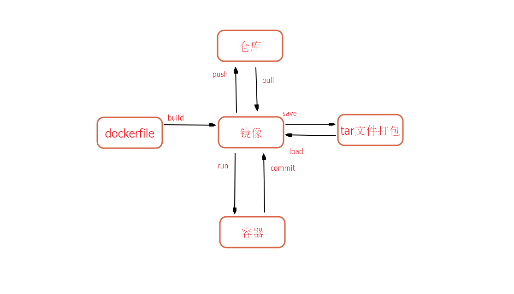

# docker


### commit  一般不会用 因为这样你的镜像就会变成一个黑匣子，很久之后不知道这个镜像是干什么了，所以最好用  build；


docker commit container_name mirror_new_name


### 可以没网络的时候可以打包一下；或者是懒得下载；不过直接通过仓库来传递会好一些；


docker save mirror_name > 1.tar

docker load < 1.tar


### 基本的概念图；




docker image prune删除 所有的虚悬镜像  虚悬镜像  一般是 新旧版本的更新 镜像名字一样 新的镜像会覆盖 旧的镜像会变成<none> 也就是虚悬镜像(dangling)


在[docker](https://so.csdn.net/so/search?q=docker&spm=1001.2101.3001.7020) build 的过程中会出现中间镜像。中间镜像不一定会自动删除。会占用存储空间
可以通过以下命令查找悬空的镜像

```bash
# 虚悬镜像的删除
docker rmi $(docker images -f dangling=true -q) 
docker image prune
```