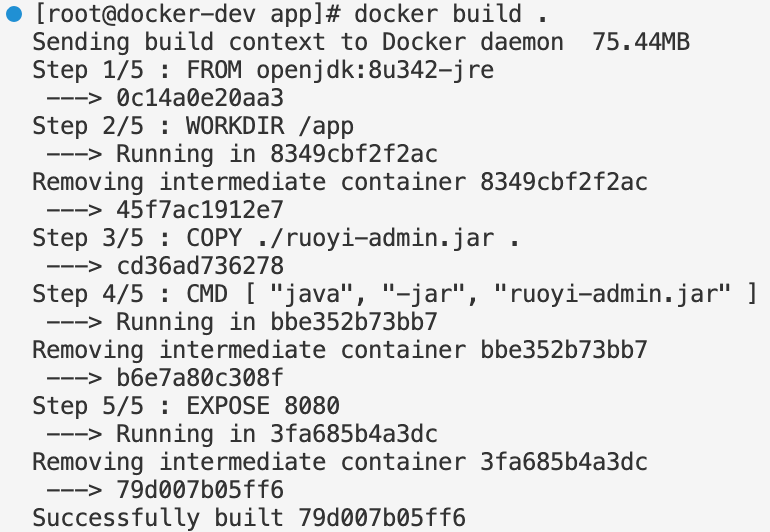
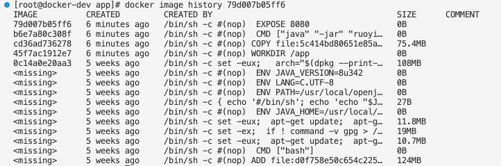
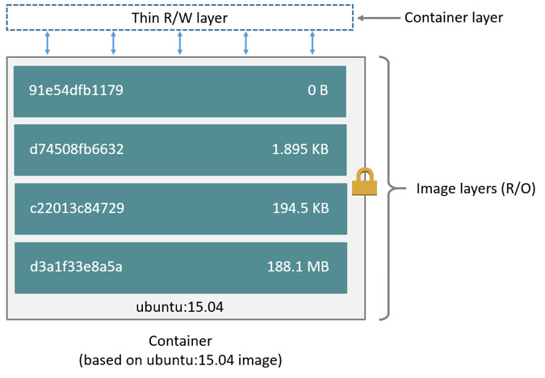

# #Dockerfile

>构建docker镜像的一个配置文件，说明了docker镜像是怎么创建的；
>
>千万不要用commit，这样久了，就不知道这个镜像做了些什么，成为了一个黑匣子；


### 参数

* **基础参数**

  * FROM

    ````shell
    #基于那个镜像
    FROM alpine:latest
    ````

    

  * WORDIR

    `````shell
    #工作目录； 不存在的话创建；就是方便可以直接使用相对目录了；不然只能一直使用绝对目录；
    #设置工作目录 设置工作目录 之后  之后的路径 都是可以相对于 这个工作目录的路径；
    WORKDIR /app 
    `````

    

  * COPY                       ADD

    ```shell
    # COPY  源（可以是主机）到容器
    
    # ADD ADD 可以解压 并且可以是链接到容器；
    ```

    

  * RUN

    ```shell
    #运行shell语句；
    ```

    

  * CMD

    ```shell
    #容器的运行；
    # 数组的形式；
    #容器时候可以长期运行和CMD有关；
    
     "Cmd": [
                    "nginx",
                    "-g",
                    "daemon off;"
                ]
                
               # cmd  就是这个格式
                
                #或者  tail -f 1.txt
    
    ```
    
    

* **扩展参数**

  * EXPOSE

  * VOLUME   

  * ENV     一直会有效；环境变量；

    ```shell
    #两种表示方法  表示一个变量；
    1. ENV key="value"
    2. ENV key "value"
    ```

    

  * ARG 参数  只有构建的时候才会有效；当运行容器的时候不生效；

    ```shell
    docker build -t tag_name --build-arg=122  可以改变传递的arg参数；
    ```

  * LABEL  仅仅是一个标识；没有实质性的意义；

* **不常用的参数；**

  * ONBUILD  他的子镜像 会继承 ENV  而本镜像不会继承这个参数

    ````shell
    ONBUILD
    ````

  * STOPSIGNAL   SIGINT SIGKILL SIGTERM  信号

  * HEALTHCHECK  健康检测

  * SHELL  运行的shell 是那种 SHELL  一般是 linux bash  或者 windows的cmd


### 执行 docker build -t 

````shell
#. 代表 必须在当前目录 也就是上下文中又Dockerfile 才可以创建一个镜像；
# -t tag 格式 ："name:tag" 
# . 当前目录 ,,,  ./ceshi   只有使用当前目录下的才会使用 /;   .. 是代表上一个目录；
docker build -t alpine-test .   

docker images
docker rmi 
docker history image_name
````

````shell
cat >> test.txt <<EOF
ssk
sssk
EOF;
````


## 详细案例


###VOLUME 定义匿名卷

格式为：
**VOLUME ["<路径1>", "<路径2>"...]**
**VOLUME <路径>**

之前我们说过，**容器运行时应该尽量保持容器存储层不发生写操作，对于数据库类需要保存**
**动态数据的应用，其数据库文件应该保存于卷(volume)中**，后面的章节我们会进一步介绍
Docker 卷的概念。

为了防止运行时用户忘记将动态文件所保存目录挂载为卷，在
Dockerfile 中，**我们可以事先指定某些目录挂载为匿名卷，这样在运行时如果用户不指定挂**
**载，其应用也可以正常运行，不会向容器存储层写入大量数据。**

VOLUME /data

**这里的 /data 目录就会在运行时自动挂载为匿名卷，任何向 /data 中写入的信息都不会记**
**录进容器存储层，从而保证了容器存储层的无状态化。当然，运行时可以覆盖这个挂载设**
**置。比如：**

docker run -d -v mydata:/data xxxx
在这行命令中，就使用了 **mydata 这个命名卷挂载到了 /data 这个位置，替代了**
**Dockerfile 中定义的匿名卷的挂载配置。**

````shell
# 查看一下 匿名卷
docker volume ls
````


### ARG

ARG 构建参数
格式： ARG <参数名>[=<默认值>]

**只能通过  = 来进行赋值吗？**  **可以直接用 ceshi=123 来进行赋值 不能用 空格来进行赋值；**


构建参数和 ENV 的效果一样，都是设置环境变量。所不同的是， ARG 所设置的构建环境的
环境变量，**在将来容器运行时是不会存在这些环境变量的**。但是不要因此就使用 ARG 保存密
码之类的信息，因为 docker history 还是可以看到所有值的。

Dockerfile 中的 ARG 指令是定义参数名称，以及定义其默认值。该默认值可以在构建命令

````php
#docker build 中用 --build-arg <参数名>=<值> 来覆盖。
````


### ENV  环境变量

ENV 设置环境变量

**格式有两种：**
**ENV <key> <value>**
**ENV <key1>=<value1> <key2>=<value2>...**

这个指令很简单，就是设置环境变量而已，无论是后面的其它指令，如 RUN ，还是运行时的
应用，都可以直接使用这里定义的环境变量。
ENV VERSION=1.0 DEBUG=on \
NAME="Happy Feet"
这个例子中演示了如何换行，以及对含有空格的值用双引号括起来的办法，这和 Shell 下的行
为是一致的。
定义了环境变量，那么在后续的指令中，就可以使用这个环境变量。比如在官方 node 镜像
Dockerfile 中，就有类似这样的代码：

````shell
ENV NODE_VERSION 7.2.0
RUN curl -SLO "https://nodejs.org/dist/v$NODE_VERSION/node-v$NODE_VERSION-linux-x64.ta
r.xz" \
&& curl -SLO "https://nodejs.org/dist/v$NODE_VERSION/SHASUMS256.txt.asc" \
&& gpg --batch --decrypt --output SHASUMS256.txt SHASUMS256.txt.asc \
&& grep " node-v$NODE_VERSION-linux-x64.tar.xz\$" SHASUMS256.txt | sha256sum -c - \
&& tar -xJf "node-v$NODE_VERSION-linux-x64.tar.xz" -C /usr/local --strip-components=
1 \
&& rm "node-v$NODE_VERSION-linux-x64.tar.xz" SHASUMS256.txt.asc SHASUMS256.txt \
&& ln -s /usr/local/bin/node /usr/local/bin/nodejs
在这里先定义了环境变量 NODE_VERSION ，其后的 RUN 这层里，多次使用 $NODE_VERSION 来
进行操作定制。可以看到，将来升级镜像构建版本的时候，只需要更新 7.2.0 即
可， Dockerfile 构建维护变得更轻松了。
下列指令可以支持环境变量展开：
ADD 、 COPY 、 ENV 、 EXPOSE 、 LABEL 、 USER 、 WORKDIR 、 VOLUME 、 STOPSIGNAL 、 ONBU
ILD 。
可以从这个指令列表里感觉到，环境变量可以使用的地方很多，很强大。通过环境变量，我
们可以让一份 Dockerfile 制作更多的镜像，只需使用不同的环境变量即可。
````


###LABEL
你可以给镜像**添加标签来帮助组织镜像、记录许可信息、辅助自动化构建等**。每个标签一
行，**由 LABEL 开头加上一个或多个标签对**。下面的示例展示了各种不同的可能格式。 # 开
头的行是注释内容。

注意：**如果你的字符串中包含空格，必须将字符串放入**  **引号中或者对空格使用转义**。**如**
**果字符串内容本身就包含引号，必须对引号使用转义。**

**Set one or more individual labels**
LABEL com.example.version="0.0.1-beta"
LABEL vendor="ACME Incorporated"
LABEL com.example.release-date="2015-02-12"
LABEL com.example.version.is-production=""
一个镜像可以包含多个标签，但建议将多个标签放入到一个 LABEL 指令中。

Set multiple labels at once, using line-continuation characters to break long lines
LABEL vendor=ACME\ Incorporated \
com.example.is-beta= \
com.example.is-production="" \
com.example.version="0.0.1-beta" \
com.example.release-date="2015-02-12"


### ENTRYPOINT 

入口点 ENTRYPOINT 的格式和 RUN 指令格式一样，**分为 exec 格式和 shell 格式**。 

**ENTRYPOINT 的目的和 CMD 一样，都是在指定容器启动程序及参数。** 

**使用原则：**

当是shell的时候以ENTRYPOINT为准；

当cmd 和entrypoint 是json那么两者拼接；


**当指定了 ENTRYPOINT 后， CMD 的含义就发生了改变，不再是直接的运行其命令，而是将**
**CMD 的内容作为参数传给 ENTRYPOINT 指令，换句话说实际执行时，将变为：**
<ENTRYPOINT> "<CMD>"

那么有了 CMD 后，为什么还要有 ENTRYPOINT 呢？这种 <ENTRYPOINT> "<CMD>" 有什么好处
么？让我们来看几个场景。


### CMD


CMD 容器启动命令
CMD 指令的格式和 RUN 相似，**也是两种格式：**
**shell 格式： CMD <命令>**
**exec 格式： CMD ["可执行文件", "参数1", "参数2"...]**

参数列表格式： **CMD ["参数1", "参数2"...] 。在指定了 ENTRYPOINT 指令后，用 CMD 指**
**定具体的参数。**


之前介绍容器的时候曾经说过，<font color=red>**Docker 不是虚拟机，容器就是进程。既然是进程，那么在启**
**动容器的时候，需要指定所运行的程序及参数。 CMD 指令就是用于指定默认的容器主进程的**
**启动命令的。**</font>

在运行时可以指定新的命令来替代镜像设置中的这个默认命令，比如， ubuntu 镜像默认的
CMD 是 /bin/bash ，如果我们直接 docker run -it ubuntu 的话，会直接进入 bash 。我们
也可以在运行时指定运行别的命令，如 docker run -it ubuntu cat /etc/os-release 。这就是
用 cat /etc/os-release 命令替换了默认的 /bin/bash 命令了，输出了系统版本信息。

**在指令格式上，一般推荐使用 exec 格式，这类格式在解析时会被解析为 JSON 数组，因此**
**一定要使用双引号 " ，而不要使用单引号。**

如果使用 shell 格式的话，实际的命令会被包装为 sh -c 的参数的形式进行执行。比如:
CMD echo \$HOME
在实际执行中，会将其变更为：
CMD [ "sh", "-c", "echo $HOME" ]

这就是为什么我们可以使用环境变量的原因，因为这些环境变量会被 shell 进行解析处理。
**提到 CMD 就不得不提容器中应用在前台执行和后台执行的问题。这是初学者常出现的一个混**
**淆。**
**Docker 不是虚拟机，容器中的应用都应该以前台执行**，而不是像虚拟机、物理机里面那样，
用 upstart/systemd 去启动后台服务，容器内没有后台服务的概念。
一些初学者将 CMD 写为：
CMD service nginx start

然后发现容器执行后就立即退出了。甚至在容器内去使用 systemctl 命令结果却发现根本执
行不了。这就是因为没有搞明白前台、后台的概念，没有区分容器和虚拟机的差异，依旧在
以传统虚拟机的角度去理解容器。

对于容器而言，其启动程序就是容器应用进程，**容器就是为了主进程而存在的，主进程退**
**出，容器就失去了存在的意义，从而退出，其它辅助进程不是它需要关心的东西。**
而使用 service nginx start 命令，则是希望 upstart 来以后台守护进程形式启动 nginx 服
务。而刚才说了 CMD service nginx start 会被理解为 CMD [ "sh", "-c", "service nginx
start"] ，因此主进程实际上是 sh 。**那么当 service nginx start 命令结束后， sh 也就结**
**束了， sh 作为主进程退出了，自然就会令容器退出。**
正确的做法是直接执行 nginx 可执行文件，并且要求以前台形式运行。比如：
**CMD ["nginx", "-g", "daemon off;"]**

<font color=red>注意：docker run -d images_Name cmd  这里可以修改这个容器运行的主进程；cmd ，运行完之后退出，这个就是它存在的生命周期；</font>


### ADD更高级的复制文件

**格式：**
**ADD <源路径>... <目标路径>**
**ADD ["<源路径1>",... "<目标路径>"]**

**因此在 COPY 和 ADD 指令中选择的时候，可以遵循这样的原则，所有的文件复制均使用 COPY 指令，仅在需要自动解压缩的场合使用 ADD 。**

ADD 指令和 COPY 的格式和性质基本一致。但是在 COPY 基础上增加了一些功能。

**源地址可以是：**

* 解压
* url


### COPY复制文件


**格式：**
**COPY <源路径>... <目标路径>**
**COPY ["<源路径1>",... "<目标路径>"]**


和 RUN 指令一样，也有两种格式，**一种类似于命令行，一种类似于函数调用。**
COPY 指令将从**构建上下文目录中 <源路径> 的文件/目录 **  复制到**新的一层的镜像内的 <目标路**
**径> 位置**。比如：

<font color=red>**注意：源文件必须是上下文的目录或者文件,所以如果你想移动到 容器里面去必须放在Dockerfile的上下文内**</font>

COPY package.json   /usr/src/app/


**<目标路径> 可以是容器内的绝对路径，也可以是相对于工作目录的相对路径（工作目录可以 用 WORKDIR 指令来指定）。**


###EXPOSE 声明端口
格式为 EXPOSE <端口1> [<端口2>...] 。

**EXPOSE 指令是声明运行时容器提供服务端口，这只是一个声明，在运行时并不会因为这个声**
**明应用就会开启这个端口的服务。**在 Dockerfile 中写入这样的声明有两个好处，一个是帮助
镜像使用者理解这个镜像服务的守护端口，以方便配置映射；另一个用处则是在运行时使用
随机端口映射时，也就是 docker run -P 时，会自动随机映射 EXPOSE 的端口。

此外，在早期 Docker 版本中还有一个特殊的用处。以前所有容器都运行于默认桥接网络中，
因此所有容器互相之间都可以直接访问，这样存在一定的安全性问题。于是有了一个 Docker
引擎参数 --icc=false ，当指定该参数后，容器间将默认无法互访，除非互相间使用了 --
links 参数的容器才可以互通，并且只有镜像中 EXPOSE 所声明的端口才可以被访问。这个
--icc=false 的用法，在引入了 docker network 后已经基本不用了，**通过自定义网络可以很**
**轻松的实现容器间的互联与隔离。**

**要将 EXPOSE 和在运行时使用 -p <宿主端口>:<容器端口> 区分开来。 -p ，是映射宿主端口和**
**容器端口，换句话说，就是将容器的对应端口服务公开给外界访问，而 EXPOSE 仅仅是声明**
**容器打算使用什么端口而已，并不会自动在宿主进行端口映射。**


###WORKDIR 指定工作目录
**格式为 WORKDIR <工作目录路径> 。**

<font color=red>**是指定容器内的工作目录；然后就可以使用相对目录进行访问了；**</font>

**使用 WORKDIR 指令可以来指定工作目录（或者称为当前目录），以后各层的<font color=red>当前目录就被改为指定的目录</font>，如该目录不存在， WORKDIR 会帮你建立目录。** 

`````shell
#进入 docker 容器内部的初始目录；
docker exec -it nginx sh 
`````


之前提到一些初学者常犯的错误是把 Dockerfile 等同于 Shell 脚本来书写，这种错误的理解
还可能会导致出现下面这样的错误：
RUN cd /app
RUN echo "hello" > world.txt

<font color=red>**注意：**</font>

如果将这个 Dockerfile 进行构建镜像运行后，会发现找不到 /app/world.txt 文件，或者其
内容不是 hello 。原因其实很简单，在 Shell 中，连续两行是同一个进程执行环境，因此前
一个命令修改的内存状态，会直接影响后一个命令；而在 Dockerfile 中，这两行 RUN 命令
的执行环境根本不同，是两个完全不同的容器。**这就是对 Dockerfile 构建分层存储的概念**
**不了解所导致的错误。**

**之前说过每一个 RUN 都是启动一个容器、执行命令、然后提交存储层文件变更。第一层 RUN**
**cd /app 的执行仅仅是当前进程的工作目录变更，一个内存上的变化而已，其结果不会造成任**
**何文件变更。而到第二层的时候，启动的是一个全新的容器，跟第一层的容器更完全没关**
**系，自然不可能继承前一层构建过程中的内存变化。**

**因此如果需要改变以后各层的工作目录的位置，那么应该使用 WORKDIR 指令。**


### 实例

````shell
#Dockerfile

[root@localhost dockfile]# vim Dockerfile 

  1 From alpine:latest #基础镜像
  2 MAINTAINER qiu shuaiqiu@163.com
  3 LABEL version 1.16 
  4 
  5 WORKDIR /dockfile
  6 #容器运行时应该尽量保持容器存储层不发生写操作，对于数据库类需要保存动态数据的应用，其数据库文件应该保存于卷(volume)中
  7 VOLUME ./data
  8 
  9 EXPOSE 80
 10 
 11 ENV version 7.22
 12 
 13 ARG ceshi=123
 14 
 15 COPY source_apt .
 16 
 17 RUN echo "ceshi" > 1.txt
 18 
 19 CMD tail -f 1.txt

docker build -t test:v1 .

docker run -d test:v1

#VOLUME  数据卷信息； ./data
[root@localhost dockfile]# docker volume ls
DRIVER              VOLUME NAME
local               1e6716dcead6726b6c83fd1c6b9ff320e6f58367a2672a645b4e91f7a82be21a
local               adcf0a8ba2816661e0c0d97189ee610479bfdb3d4f5c2655d9c8be98439a0d6d
#详情
docker volume inspect volume_name 

[root@localhost dockfile]# docker volume inspect 185249fc3ea0c375c0d9eb42a5cb6b27efd3711b56db0875019002df03f5e536
[
    {
        "Driver": "local",
        "Labels": null,
        "Mountpoint": "/var/lib/docker/volumes/185249fc3ea0c375c0d9eb42a5cb6b27efd3711b56db0875019002df03f5e536/_data",
        "Name": "185249fc3ea0c375c0d9eb42a5cb6b27efd3711b56db0875019002df03f5e536",
        "Options": {},
        "Scope": "local"
    }
]


````


ide

```dockerfile
FROM alpine:latest

MAINTAINER qiu shuaiqiu@163.com

LABEL VERSION_PHP 1.16

WORKDIR /dockfile

VOLUME ./data

EXPOSE 80

ENV version 7.22

ARG ceshi=123

COPY source_apt .

RUN echo "ceshi" > 1.txt

CMD tail -f 1.txt

# docker build -t test:v1 --build-arg ceshi=234 .

#docker build 中用 --build-arg <参数名>=<值> 来覆盖。

# docker run -d --name ceshi

#查看容器使用了那些 数据卷
3docker inspect test:v1 -iC10 volumes
   "Mounts": [
            {
                "Type": "volume",
                "Name": "5c16714ef1c0679650a15dd8ce6f70574f3363b91e77b5bad10c901a0062e19a",
                "Source": "/var/lib/docker/volumes/5c16714ef1c0679650a15dd8ce6f70574f3363b91e77b5bad10c901a0062e19a/_data",
                "Destination": "data",
                "Driver": "local",
                "Mode": "",
                "RW": true,
                "Propagation": ""
            }
        ]
        # 找到数据卷
        
 #docker volume ls | grep -i 5c16714ef1c0679650a15dd8ce6f70574f3363b91e77b5bad10c901a0062e19a  
 
# docker rm -v 删除容器的时候删除数据卷

## 进入到容器里面 操作
# 进入到数据卷；
cd /data 
$ docker exec -it 245ea sh
/data # touch ceshi.txt

##删除容器 不删除数据卷 当再启功数据卷的时候 里面的数据是否还在？？？
# 停止容器
$ docker stop 245ea
245ea
# 删除容器
$ docker rm 245ea
245ea
##重新启动一个容器  但是容器内部的数据 没有了；
docker run -d --name ceshi 
docker exec -it ceshi sh 
cd /data  

## docker tag 为镜像加一个标签
docker tag image_id tag_name

## docker images 查看镜像id
 docker images
```


## iamge镜像和 layer 层级的关系


image文件由一系列层构建而成，dockerfile每一个命令都会生成一个层。每一层都是只读的。

例如前面我们制作镜像，就产生了4个层。





​						也可以使用`docker image history ruoyi-java:4.7.4`命令查看		

​						可以用 docker images history --help 看一下；

​                         $ docker image history --no-trunc 2cd7ceff3e53




​			创建容器时，会创建一个新的可写层，通常称为“容器层”。对正在运行的容器所做的所有更改（如写入新文件、修改现有文件和删除文件）都将写入容器层，而不会修改镜像。




---

## docker cp 复制的问题；

想问下，怎么将主机文件复制进容器，我使用sudo docker cp命令，报错Error response from daemon: Error processing tar file(exit status 1): cannot overwrite non-directory "/bin/bash" with directory "/bin"

你复制到别的目录试试，错误描述说你用一个文件去覆盖目录，所以失败了

