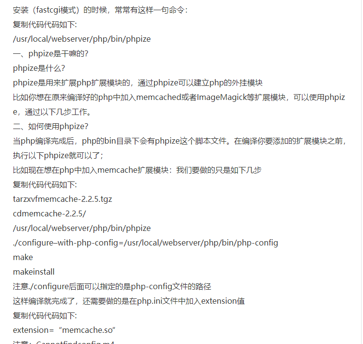

# docker 安装php扩展

>tcp  socket  是四目运算的；  src:port ---> dst:port   建立 连接生成socket 都可以接收发送的消息；
>
>容器 nginx 可以接收 两个80的；因为他们两个nginx 处于不同的容器；不同的进程吗？？？//todo
>
>We provide the helper scripts `docker-php-ext-configure`, `docker-php-ext-install`, and `docker-php-ext-enable` to more easily install PHP extensions.
>


---

## 普通安装

````shell
curl -o /tmp/redis.tar.gz url
tar -xzvf redis.tar.gz
cd phpredis
phpize   # 添加扩展的外挂模块， 因为他底层是c，所以已经编译好了，所以我们需要通过一个命令来添加一个外挂扩展；
./congfigure   # 检测安装环境，依赖库问题；
make && make install   // 编译和安装；

php.ini 添加扩展；extension.so  然后才会启动；
docker-php-ext-enable 直接通过conf.d 来添加扩展；

````





---


https://hub.docker.com/_/php

//扩展

``````shell
# -------------------------------------------------
# 查看 php.ini  的位置；i  ini   配置文件；
php -i | grep php.ini 

#### --------------------------------------------------------------
#  这个地方可以映射出去的；
root@33413a6b6cd0:/usr/local# php -i | grep php.ini
Configuration File (php.ini) Path => /usr/local/etc/php

``````


`````shell
#linux的目录结构

bin  boot  dev	etc  home  lib	lib64  media  mnt  opt	proc  root  run  sbin  srv  sys  tmp  usr  var
src 源文件

//unix system resource  usr 是 unix system resources 的缩写；

//proc  opt  var tmp lib  库文件；

//usr  安装文件； /usr/local/etc/   usr/local/php  /usr/local
/bin ： 存储常 用用户指令

/dev ： 存储 设备文件
/etc ： 存储 系统、 服 务的配置目录 与 文件
/home ： 存放 个人主目录
/lib ： 存放库 文件， 诸如 核心模块、驱动
/lost+found ： 存储 fsck分区扫描信息用的文件
/mnt ：系统 加载 文件系统时用的 常 用 挂载点

/root ： root 用户的主目录
/sbin ： 存储 系统 管理 用指令


他们之间的关系相辅相成的 因个人习惯不同作用可能也会有不同 一般都是一个默认值


/opt ：第三 方工具 使用的安装目录
/proc ：虚拟文件系统，包含系统 讯 息 等资料
/boot ： 存储 核心、模块 映像等启 动用文件
/usr ： 存放与 用户 直 接相关的文件 与 目录
/var ： 存储 在系统 运 行中可能 会 更改的数 据
/tmp ： 临 时文件的 暂存点
`````


``````php
#  安装扩展的四个命令；
docker-php-source extract | delete
 // 一些基础的源码 抓取一些扩展源码；
docker-php-ext-install
 //源码安装；
    
docker-php-ext-configure 
// ./configure  配置  在install 之前去配置；

docker-php-ext-enable
// 就是在php.ini 里面添加配置； 这个原理就直接在conf.d生成一个配置文件；就可以了；不需要手动添加；
``````


----


## 前言

此篇，主要是演示docker-php-source , docker-php-ext-install ,docker-php-enable-docker-configure 这四个命令到底是用来干嘛的，它们在PHP容器中都做了哪些事情。
很多人很不理解在Dockerfile中安装PHP扩展的时候总是出现这几个命令，本篇就就是为你揭开这些命令的神秘面纱而准备的，所有案例都是本人自己运行过的。

##### Docker 中的PHP容器安装扩展的方式有

1. 通过pecl方式安装
2. 通过php 容器中自带的几个特殊命令来安装，这些特殊命令可以在Dockerfile中的RUN命令中进行使用。

这里，我们主要讨论的是第二种方案，如何通过PHP容器中的几个特殊命令来安装PHP扩展

## PHP中安装扩展有几个特殊的命令

- docker-php-source
- docker-php-ext-install
- docker-php-ext-enable
- docker-php-ext-configure

### 演示这三个命令的作用

都是在PHP容器中进行演示的，PHP容器启动太简单，不作过多介绍

#### docker-php-source

**此命令，实际上就是在PHP容器中创建一个/usr/src/php的目录，里面放了一些自带的文件而已。我们就把它当作一个从互联网中下载下来的PHP扩展源码的存放目录即可。事实上，所有PHP扩展源码扩展存放的路径： /usr/src/php/ext 里面。**

**格式**：

```cpp
docker-php-source extract | delete
```

**参数说明**：
**\* extract : 创建并初始化 /usr/src/php目录**
**\* delete : 删除 /usr/src/php目录**

**案例**：

```ruby
root@803cbcf702a4:/usr/src# ls -l
total 11896 #此时，并没有php目录
-rw-r--r-- 1 root root 12176404 Jun 28 03:23 php.tar.xz
-rw-r--r-- 1 root root      801 Jun 28 03:23 php.tar.xz.asc

root@803cbcf702a4:/usr/src# docker-php-source extract
root@803cbcf702a4:/usr/src# ls -l
total 11900 #此时，生产了php目录，里面还有一些文件，由于篇幅问题，就不进去查看了
drwxr-xr-x 14 root root     4096 Aug  9 09:01 php
-rw-r--r--  1 root root 12176404 Jun 28 03:23 php.tar.xz
-rw-r--r--  1 root root      801 Jun 28 03:23 php.tar.xz.asc

root@803cbcf702a4:/usr/src# docker-php-source delete
root@803cbcf702a4:/usr/src# ls -l
total 11896 #此时，将已创建 php 目录给删除了
-rw-r--r-- 1 root root 12176404 Jun 28 03:23 php.tar.xz
-rw-r--r-- 1 root root      801 Jun 28 03:23 php.tar.xz.asc

root@803cbcf702a4:/usr/src#
```


#### docker-php-ext-enable 

这个命令，就是用来启动 **PHP扩展** 的。我们使用pecl安装PHP扩展的时候，**默认是没有启动这个扩展的，如果想要使用这个扩展必须要在php.ini这个配置文件中去配置一下才能使用这个PHP扩展。**

**而 docker-php-ext-enable 这个命令则是自动给我们来启动PHP扩展的，不需要你去php.ini这个配置文件中去配置。**
**案例**

```perl
# 查看现有可以启动的扩展
root@517b9c67507a:/usr/local/etc/php# ls /usr/local/lib/php/extensions/no-debug-non-zts-20170718/
opcache.so  redis.so  sodium.so
root@517b9c67507a:/usr/local/etc/php#

# 查看redis 扩展是否可以启动
root@517b9c67507a:/usr/local/etc/php# php -m | grep redis
root@517b9c67507a:/usr/local/etc/php#

# 启动 redis 扩展
root@517b9c67507a:/usr/local/etc/php# docker-php-ext-enable redis
##结果；
Installing shared extensions:     /usr/local/lib/php/extensions/no-debug-non-zts-20190902/
find . -name \*.gcno -o -name \*.gcda | xargs rm -f
find . -name \*.lo -o -name \*.o | xargs rm -f
find . -name \*.la -o -name \*.a | xargs rm -f
find . -name \*.so | xargs rm -f
find . -name .libs -a -type d|xargs rm -rf
rm -f libphp.la      modules/* libs/*

# 启动 成功
root@517b9c67507a:/usr/local/etc/php# php -m | grep redis
redis
root@517b9c67507a:/usr/local/etc/php#

#说明，php容器中默认是没有php.ini配置文件的,加载原理如下所示

root@517b9c67507a:/usr/local/etc/php# php -i | grep -A 5 php.ini
Configuration File (php.ini) Path => /usr/local/etc/php
Loaded Configuration File => (none)
# 核心是 /usr/local/etc/php/conf.d 目录下的扩展配置文件
Scan this dir for additional .ini files => /usr/local/etc/php/conf.d
Additional .ini files parsed => /usr/local/etc/php/conf.d/docker-php-ext-redis.ini,
/usr/local/etc/php/conf.d/docker-php-ext-sodium.ini
root@517b9c67507a:/usr/local/etc/php#


## 结果 测试结果
##  直接这样安装就好了呀；
root@33413a6b6cd0:/tmp# php -i | grep -A 5 php.ini
Configuration File (php.ini) Path => /usr/local/etc/php
Loaded Configuration File => (none)
Scan this dir for additional .ini files => /usr/local/etc/php/conf.d
Additional .ini files parsed => /usr/local/etc/php/conf.d/docker-php-ext-redis.ini,
/usr/local/etc/php/conf.d/docker-php-ext-sodium.ini

# 最后运行一下 docker-php-source delete 不会再有 php 扩展源码；
root@33413a6b6cd0:/usr/src# ls
php  php.tar.xz  php.tar.xz.asc
root@33413a6b6cd0:/usr/src# docker-php-source delete
root@33413a6b6cd0:/usr/src# ls
php.tar.xz  php.tar.xz.asc

```


#### docker-php-ext-install

这个命令，是用来安装并启动**PHP扩展**的。
命令格式：
docker-php-ext-install “源码包目录名”

<font color=red>**注意点：**</font>

- **“源码包“需要放在 /usr/src/php/ext 下**
- **默认情况下，PHP容器没有 /usr/src/php这个目录，需要使用 docker-php-source extract来生成。**
- **docker-php-ext-install 安装的扩展在安装完成后，会自动调用docker-php-ext-enable来启动安装的扩展。**
- **卸载扩展，直接删除/usr/local/etc/php/conf.d 对应的配置文件即可。**

**案例**

```ruby
# 卸载redis 扩展
root@803cbcf702a4:/usr/local# rm -rf /usr/local/etc/php/conf.d/docker-php-ext-redis.ini
root@803cbcf702a4:/usr/local# php -m 
[PHP Modules]
Core
ctype
curl
date
dom
fileinfo
filter
ftp
hash
iconv
json
libxml
mbstring
mysqlnd
openssl
pcre
PDO
pdo_sqlite
Phar
posix
readline
Reflection
session
SimpleXML
sodium
SPL
sqlite3
standard
tokenizer
xml
xmlreader
xmlwriter
zlib

[Zend Modules]

root@803cbcf702a4:/usr/local#

#PHP容器默认是没有redis扩展的。所以我们通过docker-php-ext-install安装redis扩展
#curl -o  -o, --output <file> Write to file instead of stdout

root@803cbcf702a4:/# curl -L -o /tmp/redis.tar.gz https://codeload.github.com/phpredis/phpredis/tar.gz/5.0.2

root@803cbcf702a4:/# cd /tmp
root@517b9c67507a:/tmp# tar -xzf reids.tar.gz
root@517b9c67507a:/tmp# ls
phpredis-5.0.2	reids.tar.gz
root@517b9c67507a:/tmp# docker-php-source extract
root@517b9c67507a:/tmp# mv phpredis-5.0.2 /usr/src/php/ext/phpredis

#检查移过去的插件源码包是否存在
root@517b9c67507a:/tmp# ls -l /usr/src/php/ext | grep redis
drwxrwxr-x  6 root root 4096 Jul 29 15:04 phpredis
root@517b9c67507a:/tmp# docker-php-ext-install phpredis

# 检查redis 扩展是否已经安装上
root@517b9c67507a:/tmp# php -m | grep redis
redis
root@517b9c67507a:/tmp#
```

#### docker-php-ext-configure

**docker-php-ext-configure 一般都是需要跟 docker-php-ext-install搭配使用的。它的作用就是，当你安装扩展的时候，需要自定义配置时，就可以使用它来帮你做到。**

**案例**

```shell
FROM php:7.1-fpm
RUN apt-get update \
	# 相关依赖必须手动安装
	&& apt-get install -y \
        libfreetype6-dev \
        libjpeg62-turbo-dev \
        libmcrypt-dev \
        libpng-dev \
    # 安装扩展
    && docker-php-ext-install -j$(nproc) iconv mcrypt \
    # 如果安装的扩展需要自定义配置时
    && docker-php-ext-configure gd --with-freetype-dir=/usr/include/ --with-jpeg-dir=/usr/include/ \
    && docker-php-ext-install -j$(nproc) gd
```


````shell
root@33413a6b6cd0:/usr/local/etc/php/conf.d# docker-php-ext-install rdkafka
error: /usr/src/php/ext/rdkafka does not exist

````


## 安装composer 

docker pull php:7.3-fpm用这个命令拉下来的镜像 没有composer 和gd,zip，mysql,等扩展，需要自己安装
没有gd,zip,bcmath这三个扩展composer 无法正常使用。

1. 先进入容器docker exec -it php bash

2. 然后去按composer官网的方式去安装

3. 安装好后，运行composer --version查看是否安装好

4. 如果没有梯子先把composer镜像换成国内镜像，有梯子可以忽略这一步。
  composer config -g repo.packagist composer https://mirrors.aliyun.com/composer/ 

  

  ----

  

5. 开始安装gd库，安装gd库需要先安装libwebp-dev libjpeg-dev libpng-dev libfreetype6-dev 这几个库

  `````shell
  apt update  #更新软件源
  apt install -y libwebp-dev libjpeg-dev libpng-dev libfreetype6-dev #安装各种库
  docker-php-source extract #解压源码
  cd /usr/src/php/ext/gd  #gd源码文件夹
  docker-php-ext-configure gd --with-webp-dir=/usr/include/webp --with-jpeg-dir=/usr/include   #准备编译
  docker-php-ext-install gd   #编译安装
  php -m | grep gd	#查看是否安装好
  
  
  
  #https://www.php.net/manual/zh/image.installation.php
  #eg	要激活 jpeg 的支持，加上 --with-jpeg-dir=DIR。 支持 Jpeg 6b、7 或 8。 从 PHP 7.4.0 开始，使用 --with-jpeg 替代。
  #png	要激活 png 的支持，加上 --with-png-dir=DIR。注意，libpng 需要 zlib library，因此配置中还要加上 --with-zlib-dir[=DIR]。 从 PHP 7.4.0 开始，--with-png-dir 和 --with-zlib-dir 已经移除。 需要安装 libpng 和 zlib。
  `````

  

  ``````shell
  1. 6.开始安装PHP-zip扩展
  
  #先安装zip需要的依赖
  
  apt-get install -y zlib1g-dev && apt-get install -y libzip-dev
  
  #安装并启动zip扩展
  
  docker-php-ext-install zip
  ``````


  `````shell
  # 安装 bcmath 精确计算；
  7.安装PHP-bcmath扩展
  docker-php-ext-install bcmath
  1
  到这里compsoer update 已经可以正常使用了。
  
  `````

  `````shell
  #但是mysql pdo 还是无法使用，，需要安装pdo_mysql 扩展
  8.安装mysql扩展
  docker-php-ext-install pdo
  docker-php-ext-install pdo_mysql
  
  9.安装xdebug扩展
  `````

  

````shell
# 下载安装xdebug扩展

pecl install xdebug

# 添加到配置文件

docker-php-ext-enable xdebug
````


``````shell
1.2、安装 php-kafka(rdkafka) 扩展git clone https://github.com/arnaud-lb/php-rdkafka.git

cd php-rdkafka/

/usr/local/php/bin/phpize

./configure --with-php-config=/usr/local/bin/php-config

make && make install

# 在php.ini 文件中加入rdkafka扩展

extension=rdkafka.so

##  sudo apt -t stretch-backports install librdkafka-dev ///aa女装最新的librdkafka


Add backports repository. Current ext-rdkafka depends on librdkafka version 0.11.0 or greater. So follow official instructions, but use stretch-backports.Install librdkafka-dev package from backports:
# official instructions https://backports.debian.org/Instructions/
#  换一下源安装一下；

sudo apt -t stretch-backports install librdkafka-dev
Update apt:

sudo apt update
Install PECL-package:

sudo pecl install rdkafka
Enable PHP-extension in PHP config. Add to php.ini:

extension=rdkafka.so
FYI: You need to restart php-fpm service to apply new config params
``````

````php
About Backports
Debian Backports provides new packages with new features on supported Debian stable releases.

As a matter of Backports policy, packages in the stable-backports suite are taken from Debian testing; however, in rare cases such as security updates, packages are taken from unstable. Backports Policy permits this exclusively when such packages will be part of the next Debian stable release. In any case, the new packages are recompiled for use on Debian stable. Backports are expected to make use of the versions of libraries available in Debian stable whenever possible; however, when required, the backporting of additional dependencies is permitted.

When a new Debian release is made, the previous stable suite becomes old-stable. While old stable releases may have Long Term Support, old-stable-backports are only made available for a period of one year after a new Debian stable release has been made. For example, Debian Buster was released 6 July 2019 and stretch-backports was retired one year later. Packages in old-stable-backports must track the versions in stable (or stable/updates for security fixes).

Backports cannot be tested as extensively as Debian stable, and are thus supported on a best-effort basis; there is a risk of incompatibilities with other components in Debian stable, so backports should be used with care! That said, Debian Backports Policy does not allow backports of libraries that would break all dependent packages in stable (eg: new Qt 5.x releases), and by virtue of this, Debian Backports are considered generally safe when used as intended on an individual package basis.

The coinstallability of all available backports is not tested, and it is strongly recommended to opt-into the use of specific backported packages on an as-needed basis.
    
 backport的解释：Backports are packages taken from the next Debian release (called “testing”)
意思就是配上backport源就可以使用下一个debian版本上比较新的软件了。目的就是让现在使用中的old版本来 使用新版本debian上的软件
````


##  熟悉一下 docker-compose up -d的命令


如果希望在后台启动并运行所有的容器，使用docker-compose up -d。

如果服务容器已经存在，并且在创建容器后更改了服务的配置(docker-compose.yml文件)或者镜像，那么docker-compose会停止容器，然后重新创建容器。


