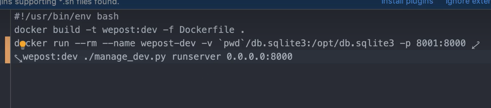
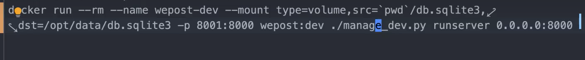

# docker 数据存储


## FROM 镜像的语法：

 >FROM [<用户名/镜像提供商>]<仓库名>:标签；
 >
 >对于Docker 官方维护镜像来说，用户名省略！！！


## 数据存储


### 路径绑定

> **一定要使用绝对路径！！！！**
>
> 可以用一下的.sh 来解决相对目录的问题！！！



`````shell
# docker run --rm --name test -v absolute_path:/opt/db.name -p 8080:8081 test:v1 command
`````


### 存储绑定 存储挂载  数据卷的挂载

>docker中“-v”与“-mount”的区别是：挂载主机目录使用“-v”时，如果宿主机上没有指定文件不会报错，会自动创建指定文件；当使用“-mount”时，如果宿主机中没有这个文件会报错找不到指定文件，不会自动创建指定文件。
>
>挂载volume命令格式：[type=volume,]source=my-volume,destination=/path/in/container[,...]
>
>建立bind mount命令格式：type=bind,source=/path/on/host,destination=/path/in/container[,...]

`````shell
# 上面是绑定一个路径；
# 也可以绑定一个数据卷名；

# docker run --rm --name test -v volume_name:/opt/db.name -p 8080:8081 test:v1 command  # 他会自动给你创建一个数据卷！
#
`````


```shell
 # docker volume create test_db # 创建一个数据卷！
 # docker volume inspect test_db;
 
 # docker run --rm --name test -v test_db:/opt/db.name -p 8080:8081 test:v1 command
```


`````shell
# 推荐使用 --mount ,少用-v
# --mount的用法！！！
#type=bind,是路径的绑定！！
#type=volume,是数据卷的绑定！！ 还是比较简单的！！！
`````




docker exec 就是在一个容器里面执行一条命令！！！

````shell
docker exec container_name command
````

