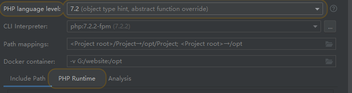
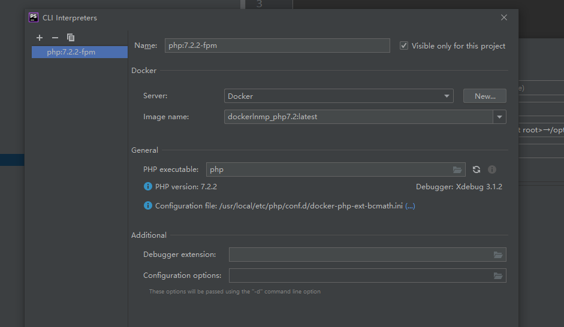

# 大坑--- linux  docker maping

设置 

**maping path**

**对应起来把；**

CLI interpreter 客户端解释器；

​	

# :set ff=unix   文件格式的问题； file format 

>shell中查看配置，使用的也是，:set ff 就可以了，没有=直接查看；

set ff=unix : 告诉 vi 编辑器，使用unix换行符

老式的电传打字机使用两个字符来代表换行。一个字符把滑动架移回首位 (称为回车, )，另一个字符把纸上移一行 (称为换行, )。
当计算机问世以后，人们对换行的处理没有达成一致意见。

UNIX 开发者决定用 一个字符来表示行尾。
Apple 开发者规定了用 。

开发 MS-DOS (Windows）开发者则决定沿用。

**在Windows下每一行结尾是\n\r，而Linux下则是\n，所以才会有 多出来的\r。**

这就是说，把一个文件从一种系统移到另一种系统，就有换行符的麻烦。如：用 vi 来尝试编辑一个采用 MS-DOS 格式的文件，你将会发现每一行的末尾有个 ^M 字符。(^M 就是 )。

**set ff=unix ，就是告诉 vi 编辑器，使用unix换行符**
**set ff=dos ，就是告诉 vi 编辑器，使用dos换行符**

方法一：
操作步骤：
1.用vi命令打开文件
2.直接输入
：set ff=unix（需要在linux环境下添加）

方法二：
**sed -i ‘s/\r$//’ file.sh**
**将file.sh中的\r都替换为空白，问题解决**