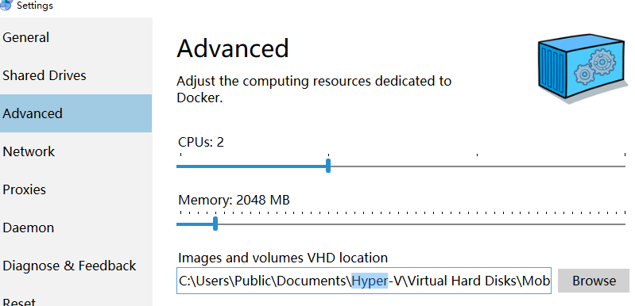

# volume 数据卷的问题


>容器文件系统与容器具有相同的生命周期。因此,为了在容器被移除后仍然保存容器数据,我们必须将数据生命周期与容器生命周期分开,在这种情况下,我们将使用 docker volume。
>
>使用数据卷来做数据的持久化；
>
>就是容器删除了，但是数据还是存在的 ；
>
>把容器生命周期和数据生命周期分开；

docker volume ls

查看数据卷的情况

docker volume  inspect volume_name 查看数据卷的详细信息；	


`````shell
#删除数据卷
# 
$ docker volume rm my-vol
#数据卷 是被设计用来持久化数据的，它的生命周期独立于容器，Docker 不会在容器被删除后
#自动删除 数据卷 ，并且也不存在垃圾回收这样的机制来处理没有任何容器引用的 数据卷 。如
#果需要在删除容器的同时移除数据卷。
#可以在删除容器的时候使用 docker rm -v 这个命令。
#无主的数据卷可能会占据很多空间，要清理请使用以下命令
$ docker volume prune


# 一般都是删除 容器的时候删除数据卷就可以
###   这是一个很重要的命令###  
docker rm -v  // 删除容器并且删除数据卷；


##  windows docker for windows 数据卷数据存放在那里？？？
##

`````


这里就是  数据卷 所处的位置；

C:\Users\Public\Documents\Hyper-V\Virtual hard disks




---


## 不同的操作系统存放位置不同；


不同系统Docker容器与镜像默认存放位置

Linux 存放位置如下

Linux:
cd /var/lib/docker - 容器与镜像存放在此目录下
镜像位置: /var/lib/docker/image
容器位置: /var/lib/docker/containers
Mac

MacOS:
容器和镜像在如下目录下,不同版本或许可能文件版本不一样
/Users/xxxxmyname/Library/Containers/com.docker.docker/Data
可以到上面的目录中，查看文件大小, du -sh *
本机存放位置如下
/Users/xxxxmyname/Library/Containers/com.docker.docker/Data/vms/0/data/Docker.raw
 也可通过图形界面查找

点击Preferences进入配置界面，然后找到Resources->ADVANCED，找到Disk image location即可


Windows

打开界面设置，

Settings -> Resources -> Advanced -> Disk image location


---

## dockerfile --- volumes

`````dockerfile
`````


