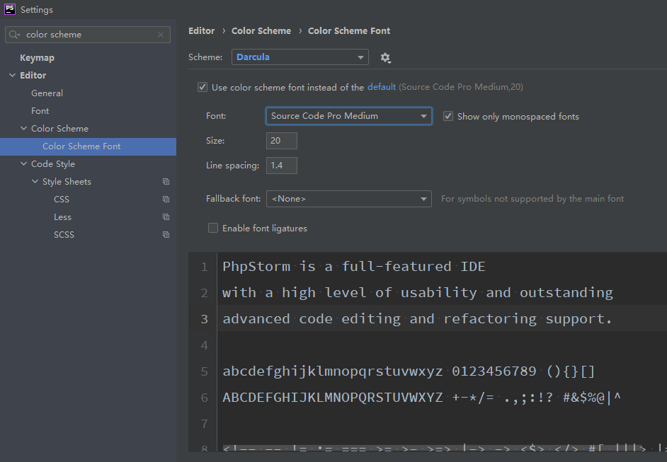
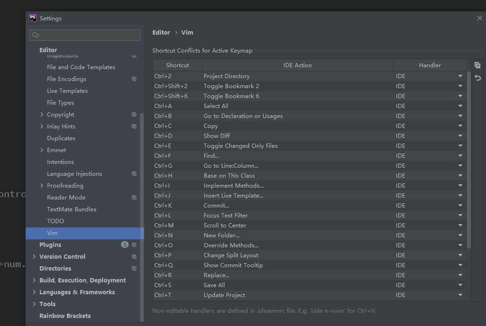

个人配置 phpstorm


###scheme 主题 和个性化设置；


**source code pro**   字体 很喜欢的字体；可以很好的区分开 i 1 l     0 o O 





### 代码模板模块

**怎么使用呢？？？**

> 平常的业务代码，保守估计有百分之三十左右是重复的操作。
> 从MVC流行以来，无非就是换个表名，重写一遍增删改查CURD
> 我这个人比较懒，懒到什么程度呢，就是基本的复制粘贴我都嫌麻烦，为什么这么矫情，因为有矫情的资本。
> 看看下面这个图，这就是创建 在线模板 `live templates` 的设置弹框页面


> step1
> file —— setting —— editor ——- live templates
>
> step2
> 添加 `templates group` ：我们添加了一个 `thinkphp` 组
> 添加 `live template` : 我们添加了一个 `ctrl` 短命令
>
> step 3
> 输入短命令的名字 `ctrl` 根据自己的习惯起名字
>
> step4
> 短命令的描述说明
>
> step5
> 该短命令生成的模板代码

```php
namespace app\admin\controller;
use think\controller;
class ClassName extend Controller
{ 
    /* @var \app\admin\model\ModelName $model */
    private $model;
    public function __construct()
    { 
        parent::__construct();
        $this->model = model('ModelName');
    }
}
```

然后在模板代码的下方有个 `change`，这里是选择模板适用于的语言的，我们选择`PHP`

> step6 & step7
> 应用后确认
>
> step8
> 我们新建一个PHP文件 输入 `ctrl` 然后按 `tab` 键，会自动将模板的内容填充到当前位置


比较常用

fore tab

forek tab

prof

pubf

prif

prosf  static  静态方法；


###  自定义 注释模板‘；


点击 ”File”-> “setting”->”File and code Templates” -> ”Includes” -> “PHP Function Doc Comment”，右边添加如下：

```
/**
 * @Notes: 文件描述
 * @Author: fc
 * @Time: ${DATE} ${TIME}
 * @Interface ${NAME}
${PARAM_DOC}
#if (${TYPE_HINT} != "void") * @return ${TYPE_HINT}
#end
${THROWS_DOC}
* @Return mixed
*/
```


**当创建php文件的时候会创建这个注释；**


###  自定义快捷键   keymap


### vim emulate vim的模仿

>**deitor ->vim**




### phpstorm  ide 的清理缓存模块


### editor tabs   编辑的标签页；

tab placement   标签页的放置；放置的位置；  固定的标签；

依次点击编辑器菜单的

File -> Settings -> Editor -> General -> Editor Tabs

**把打开文件的标签关闭  直接通过 ctrl+e来查找文件；返回上一个文件；**


### php interpreter  maping 自动配置模块；


  注意：

这里使用的是默认配置

# virtual space  虚拟空间


###   phpstorm 终端设置

shift + shift   search  shell  path

1.打开设置页，Tools -> Terminal

2.shell path 设置为 ： git安装目录Gitinash.exe

3.字符编码 git log 显示 乱码 , 设置utf8 ，在 git安装目录 Gitetcash.bashrc,文件最后添加 

```bash
# 解决 IDEA 下的 terminal 中文 Unicode 编码问题
export LANG="zh_CN.UTF-8"
export LC_ALL="zh_CN.UTF-8"
```


### windows  x86 就是32位   x64就是64位；

**x86是Intel 的CPU的型号的代称,具体有8086/80286/80386等,x代表86前面的数字,简称x86,由于Intel芯片在行业内的名气,所以用x86来代表32位的x86架构的操作系统**


### 修改 phpstorm 的终端 terminal


1、配置cmder的环境变量


2、打开Phpstorm的设置选项 更改shell_path 为 "cmd.exe" /k "D:\\Program Files\\cmder\\vendor\\init.bat" 后面的是自己的路径,不要照抄，路径尽量为全英文，否择可能出现“此时不应有 \cmder\vendor\lib\lib_base""。”的错误提示


重启Pphstorm


##  phpstorm 可以打开多个项目


## google 缓存的问题

也可以通过 ctrl + f5 来实现不去走缓存直接去服务器访问；这两种方式都可以；


## phpstorm  占用 太多内存的问题

解决：

* 减少project的大小；

* 没用的插件 plugins disable

* invalidate caches and restart 无效化缓存 和重启，有可能是缓存的问题；

  其实最根本的问题是 indexing module “website”（project） 索引模块加载的次数太多了；
