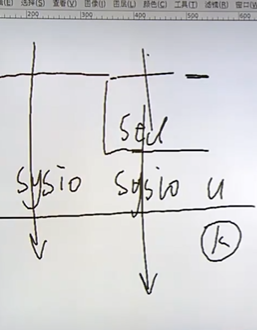

# IO

>IO：input & output 是一切实现的基础；数据的持久化，都需要IO；如果没有io那么程序的结果是没有的；
>
>stdio sysio 标准io和系统io（文件io）；

----

## 标准io

> 优先使用标准io
>
> 标准io移植性比较好；
>
> 

----

````c
//比如 标准io fopen 这是一个标准io，虽然都会用到底层的系统IO，但是不同的操作系统内核是不一样的，
///linux --> open 系统调用IO
//windows --> openfile IO
// 下面的图，说明了，标准io实现需要系统io；
// u-->user  k--> kernel 内核；

//标准io函数
//fopen();  man 3 fopen;
//fclose();
//fgetc();
//fputc();
//str
//fgets();
//fputs();
//文件块的读写；
//fread();
//fwrite();

///gnu c
//printf();
//scanf();

//fseek();
//ftell();
//rewind();

//fflush();


//FILE类型 贯穿始终，就是一个结构体struct;
//


//man 3  fopen();

FILE *fopen(const char *path, const char *mode);
//man 7 socket   手册第七章；
// man 7 tcp
````




# 辅助知识


## man

在man-pages项目中，这些man-page被分为8个章节（section）：

|      | 说明                                                         | 说明                                             |
| ---- | ------------------------------------------------------------ | ------------------------------------------------ |
| 1    | User commands; man-pages includes a very few Section 1 pages that document programs supplied by the GNU C library. | **用户命令，比如ls cd pwd等 shell 命令；**       |
| 2    | System calls documents the system calls provided by the Linux kernel. | **Linux系统调用API, 比如open,，write，read等**   |
| 3    | Library functions documents the functions provided by the standard C library. | **标准C库函数，比如fopen，fwrite，fread等**      |
| 4    | Devices documents details of various devices, most of which reside in /dev. | 设备说明，这些设备一般位于/dev目录下，比如loop等 |
| 5    | Files describes various file formats and filesystems, and includes proc(5), which documents the /proc file system. | **文件格式和文件系统描述**                       |
| 6    | Section 6 of the manual describes the games and funny little programs available on the system. | 游戏相关描述                                     |
| 7    | Overviews, conventions, and miscellaneous.                   | **概述，惯例和杂项**                             |
| 8    | Superuser and system administration commands; man-pages includes a very few Section 8 pages that document programs supplied by the GNU C library. | 系统管理员命令                                   |