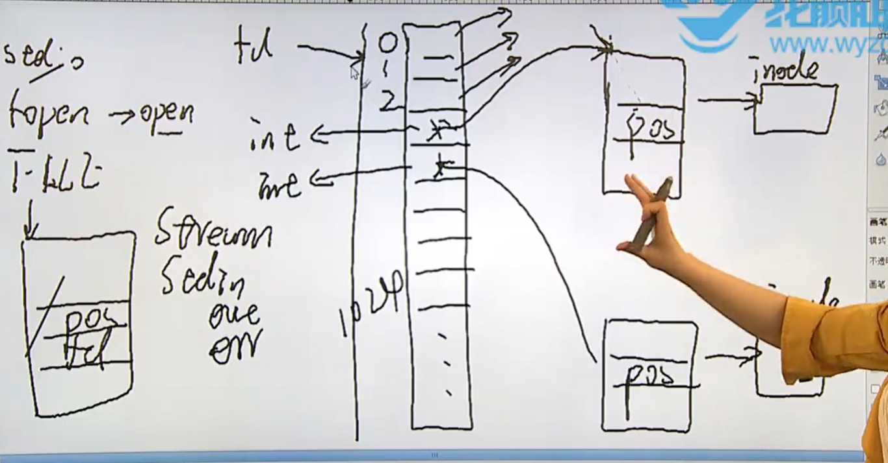
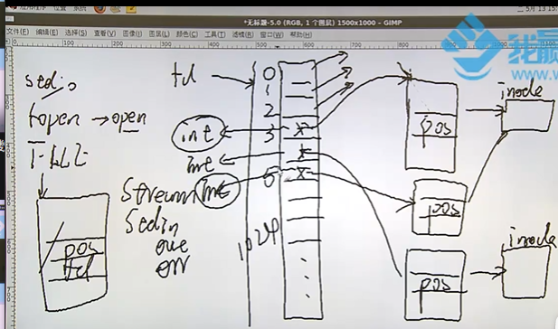
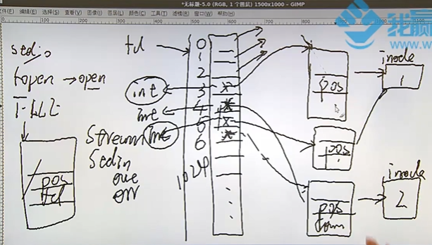
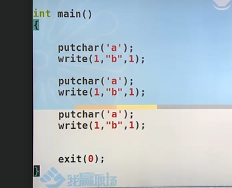
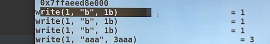

# 系统IO/文件IO

>系统io linux 中的open，read write close；
>
>文件描述符（fd）是在文件IO中贯穿始终的类型；

---

## 文件描述符

>文件描述符的概念；
>
>文件IO操作，open close，read write lseek；
>
>标准io的实现都是依赖于文件IO来实现的！！！
>
>IO的效率问题？？
>
>文件IO 和标准io的区别？？
>
>文件共享问题？？
>
>原子操作？？
>
>程序中的重定向是怎么实现的？ dup dup2
>
>同步： 了解一下，数据的同步？？？ sync,fsync,fdatasync;
>
>fcntl();
>
>ioctl();
>
>/dev/fd/目录：

`````c
//文件描述符 ???
//什么是文件描述符！！
// 就是打开文件的索引；
// 就是指针数组  FILE* arr[1024]// 就是一个1024的指针数组；我们可以通过ulimit去修改，其实就是去修改数组的长度；
//索引 我们就叫他为文件描述符，我们拿到文件描述符，就可以拿到FILE * ，就可以去操作文件！！
//每一个进程都会有一个指针数组；都会有自己的FILE; 同一个文件在不同的进程内会有不同的FILE 结构体；
`````




在一个进程中同一个文件打开多次，打开几次就会产生几个FILE 结构体；	会free掉一个；



不同的描述符，指向同一个FILE；

FILE 肯定有一个count 来计数，文件描述符指向的FILE次数；




## 文件io和标准io的区别

>举例：传达室老大爷跑邮局；
>
>fflush force flush 强制刷新缓冲区；输出或者输入！！

`````c
//fflush刷新缓冲区；马上跑邮局；就是直接输出和输入！！1
//标准io会有缓冲区；---- 仅仅满足一下条件的时候才回进行刷新缓冲区；
// 满了，回车,或者 fflush强制刷新缓冲区；无缓冲，或者块缓冲； //fflush 强制刷新缓存！
//force flush  强制刷新！！ 强制刷星！！！！
//文件io，就是实时性会比较强，调用的话，就输出和输入；
 //  fflush - flush a stream // 
 //int fflush(FILE *stream)// 刷新 一个流；直接输出，而不是放在缓冲区；
`````

### 区别

* 响应速度(rt) & 吞吐量（**throughput capacity;**）；
* 系统io响应速度快；
* 标准io吞吐量比较大；

###  如何使一个程序变快；

`````c
//主要从两方面来考虑，吞吐量 & 响应速度；

//用户主要看的是吞吐量；--- 所以主要是使用标准io；

//
`````

### 提醒

> **标准io 和 文件io不能混用！！**

````c
//fileno 标准io转换成文件io来使用 就是FILE 转fd；
//FILE *fdopen(int fd,const char *mode); // fd 转 FILE //系统io转标准io来使用； 
//伪代码
FILE *fp;

fputc(fp) -> pos++;
fputc(fp) -> pos++ 
    // 
//标准io，仅仅做的更新仅仅在缓冲区，并没有持久化，没有落盘；
//fsync才能落盘对嘛？
//文件io ->pos++;  才会在磁盘的持久化；
````


## 测试代码

````c
int main() {
    //
    putchar('a');
    write(1,"b",1);
    //
    putchar('b');
    write(1,"b",1);
    //
    putchar('a');
    write(1,"b",1);
}
////  res
b
b
b
aaa // 标准io 有缓存一起输出；

````



`````c
//res
先输出 三个b 然后一起输出三个b
//strace ./ab  追踪系统调用；  追踪系统调用！！！

`````



## 文件效率问题


