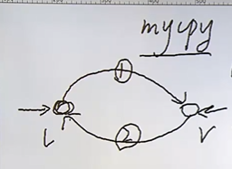

# 高级IO

> 非阻塞IO and 阻塞IO；
>
>man 7 手册，讲的是机制！！！
>
>man 7 tcp;
>
>阻塞IO就是拿不到数据会一直在这里等；必须把这个事情做成！！
>
>非阻塞IO，就是尝试去拿这个数据，拿到就往下操作，拿不到就返回呗；

----

## 有限状态机编程原理

>* 中继原理；

### 中继原理

>流程：
>
>1. **rl->wr->rr->wl**  
>2. 1. **rl->wr**
>   2. **rr->wl**
>
>就是上面的一个流程！！！阻塞就是一个点阻塞住，会一直等待，非阻塞就是会执行下一点！！




### 有限状态机 （finite state machine）

>**来解决复杂流程的问题！！！ 仅仅是多几个case；**
>
> 简单流程：自然流程是结构化 的，就是简单流程；
>
>**复杂流程：自然流程不是结构化的，就是复杂流程！**
>
>infinite无限；
>
>unlimit  无限；
>
>limit 限制；
>
>有限： limited finite  有限；数量的有限 finite
>
>1. limited
>2. finitude

````c
//code
//有限状态机，复杂流程的问题！！


````

