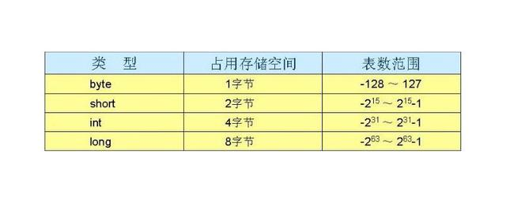
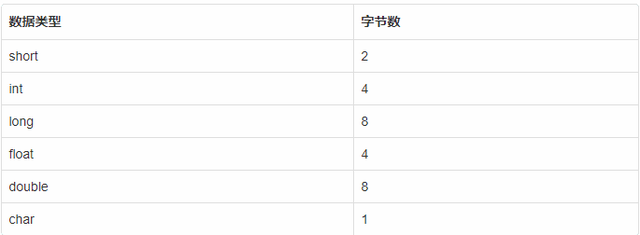

# socket的学习流程


讨论： 跨主机的传输需要注意的问题！！

1. 字节序问题:

    >**注意单字节数据是没有大小端的问题；必须是多字节才会有大小端的问题；**
   >
    >**char是不存在大小端的问题的！！1**

   大端： 低地址处放高字节；
   
   小端：低地址处放低字节；
   
   

传输的时候，永远是低地址先出去；

主机字节序：host 

网络字节序：network

_to _  _ : htons, htonl,ntohs,htohl;

2.  对齐： 

   ````c
   // 参与网络的结构体，一定要禁止对齐！！！
   struct
   {
       int i;
       float f;
       char ch;
   };
   //对齐；
   //4+4+4 = 12个字节！
   struct 
   {// 16个字节！！
       int i;
       char ch1;
       float f;
       char ch;
   }
   ````

3. 类型长度问题；

   `````c
   int
   char
   //解决：int32_t,       uint32_t,      int64_t,    int8_t, uint8_t;  
    //    32位有符号整型， 32位无符号的整型  64位整型，	char有符号，char 无符号；
       
   //code 
   #include <stdio.h>
   #include <stdlib.h>
   #include <stdint.h>
   
   /**
    * int 占用的字节数
   */
   
   int main() 
   {
       int64_t i = 1;
       int32_t a = 1;
       int8_t c = 'c';
       //  8 个字节
       printf("%d\n",sizeof(i));//8
       printf("%d\n",sizeof(a));//4
       printf("%d\n",sizeof(c));//1
       exit(0);
   }
   `````

   ## socket 是什么：
   
   

报式套接字： (datagram )  数据报！udp；

>1. **User Datagram Protocol**: 用户数据报协议；户数据报协议；使用者数据包通讯协议；用户数据报文协议
>2. **datagram socket**: 数据报套接字；数据包通讯端；数据包套接字；资料通讯端
>3. **multicast datagram**: 多播数据报；组播数据报
>4. **datagram service**: 数据报业务；数据报服务；数据包业务
>5. **Datagram Sockets**: 数据报套接字；数据报套接口；数据报Sockets；自寻址套接字

* 主动端：  snder 发送方；

  1. 取得socket；
  2. 给socket取得地址；bind 监听，一般会形成一个listen一个端口； （主动端可以省略！！）
  3. 收/发消息；
  4. 关闭socket；

* 被动端(先运行) rcver.c 接收方！ receive 接收方！！rcv

  1. 取得socket；
  2. 给socket去的地址；
  3. 收/发消息；
  4. 关闭socket；

  


流式套接字：


# 辅助知识


**不同的编译器，占据的字节也不同，在一般的电脑中即32位编译器，int占用4字节，在16位编译器中占两个字节。**

编译器可以根据自身硬件来选择合适的大小，但是需要满足约束：short和int型至少为16位，long型至少为32位，并且short型长度不能超过int型，而int型不能超过long型。这即是说各个类型的变量长度是由编译器来决定的，而当前主流的编译器中一般是32位机器和64位机器中int型都是4个字节。





16位编译器

char ：1个字节 char*即指针变量: 2个字节 short int : 2个字节 int： 2个字节unsigned int : 2个字节float: 4个字节double: 8个字节long: 4个字节long long: 8个字节unsigned long: 4个字节

32位编译

char ：1个字节char*: 4个字节 short int : 2个字节int： 4个字节unsigned int : 4个字节float: 4个字节double: 8个字节long: 4个字节long long: 8个字节unsigned long: 4个字节





换算

1Byte（字节） = 8bit（比特）

int类型占用4个Byte，也即是占用了32个bit位。传统的ASCII编码是用0~255来表示各个可印刷字符和非可印刷字符的，只占用一个字节，但是随着Unicode编码和utf编码的出现，汉字这些等等具有复杂数量的字符，255个数字表示的二进制数显然不够。


整型数据的一般分类如下：


基本型：类型说明符为int，在内存中占2个字节。

短整型：类型说明符为short int或short。所占字节和取值范围均与基本型相同。

长整型：类型说明符为long int或long，在内存中占4个字节。

无符号型：类型说明符为unsigned。无符号型又可与上述三种类型匹配而构成：

无符号基本型：类型说明符为unsigned int或unsigned。

无符号短整型：类型说明符为unsigned short。

无符号长整型：类型说明符为unsigned long。


## 守护进程

 >守护进程 要脱离控制终端！！！ 
 >
 >一定不要关闭全部的文件描述符！！ // w
 >
 >socket 其实也是一种文件描述符！！