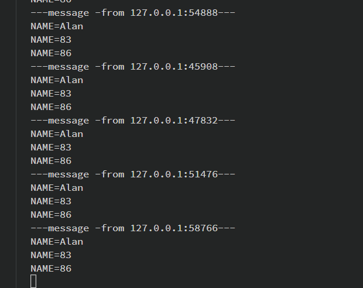

# socket 网络编程

>socket 套接字
>
>特别重要的！！
>
>推荐几本书：
>
>unix 网络编程；
>
>tcp/ip详解！！tcp/ip卷1；
>
>unix 操作系统编程！！

-----

## 函数

>* socket
>* bind

### socket

````c
NAME
       socket - create an endpoint for communication

SYNOPSIS
       #include <sys/types.h>          /* See NOTES */
       #include <sys/socket.h>

       int socket(int domain, int type, int protocol);

RETURN VALUE
       On success, a file descriptor for the new socket is returned.  On error, -1 is returned, and errno is set appropriately.
           
//1. domain,协议族；
//2. type,
//3. protocol 协议；


  socket() creates an endpoint for communication and returns a descriptor.
//domain
     //  The  domain  argument  specifies  a  communication domain; this selects the protocol family which will be used for communication.  These families are    
       defined in <sys/socket.h>.  The currently understood formats include:
//AF == address family看成一个协议族就可以了；
       Name                Purpose                          Man page
       AF_UNIX, AF_LOCAL   Local communication              unix(7)
//一般用这个       AF_INET             IPv4 Internet protocols          ip(7)
       AF_INET6            IPv6 Internet protocols          ipv6(7)
       AF_IPX              IPX - Novell protocols
       AF_NETLINK          Kernel user interface device     netlink(7)
       AF_X25              ITU-T X.25 / ISO-8208 protocol   x25(7)
       AF_AX25             Amateur radio AX.25 protocol
       AF_ATMPVC           Access to raw ATM PVCs
       AF_APPLETALK        Appletalk                        ddp(7)
           //// low level 底层包接口！！！
       AF_PACKET           Low level packet interface       packet(7)
           
 //type                                             //全双工，都可以发送信息和接收信息！
        SOCK_STREAM 流式套接字     Provides sequenced, reliable, two-way, connection-based byte streams.  An out-of-band data transmission mechanism may be supported. 
           
   SOCK_DGRAM      Supports datagrams（报文） (connectionless, unreliable messages of a fixed maximum length（最大值式固定的）).
           // 报式套接字；udp；

       SOCK_SEQPACKET  Provides a sequenced, reliable, two-way connection-based data transmission path for datagrams of fixed maximum length; a consumer  is    
                       required to read an entire packet with each input system call.

       SOCK_RAW        Provides raw network protocol access.

       SOCK_RDM        Provides a reliable datagram layer that does not guarantee ordering.

       SOCK_PACKET     Obsolete and should not be used in new programs; see packet(7).

````


### bind

`````c
NAME
      // bind - bind a name to a socket  给socket 绑定一个地址；

SYNOPSIS
       #include <sys/types.h>          /* See NOTES */
       #include <sys/socket.h>

       int bind(int sockfd, const struct sockaddr *addr,
                socklen_t addrlen);
// const struct sockaddr *addr  
// 不同的协议族，这个结构体是不一样的！！！
address format
 The  rules  used  in  name binding vary between address families.  Consult the manual entries in Section 7 for detailed information.  For AF_INET see    
       ip(7), for AF_INET6 see ipv6(7), for AF_UNIX see unix(7), for AF_APPLETALK see ddp(7), for AF_PACKET see packet(7), for AF_X25  see  x25(7)  and  for    
       AF_NETLINK see netlink(7).

    //!!!!!!//   The actual structure passed for the addr argument will depend on the address family.  The sockaddr structure is defined as something like:

           struct sockaddr {
               sa_family_t sa_family;
               char        sa_data[14];
           }


// man 7 ip  这是AF_INET 使用的结构体
      struct sockaddr_in {`
               sa_family_t    sin_family; /* address family: AF_INET */
               in_port_t      sin_port;   /* port in network byte order */
               struct in_addr sin_addr;   /* internet address */
           };
     /* Internet address. */
           struct in_addr {
               uint32_t       s_addr;     /* address in network byte order */
           };


//atoi (表示 ascii to integer)是把字符串转换成整型数的一个函数
//atol  后面也是宽度

//htons
//htonl
//ntohs
//ntohl
//s short  //宽度 代表是2个字节！ short 两个字节！！ 哈哈 卧槽！！！
//l long
SYNOPSIS
       #include <arpa/inet.h>

       uint32_t htonl(uint32_t hostlong);
       // 两个字节就够了
       uint16_t htons(uint16_t hostshort);

       uint32_t ntohl(uint32_t netlong);

       uint16_t ntohs(uint16_t netshort);

NAME
       htonl, htons, ntohl, ntohs - convert values between host and network byte order
    
    
 // ip地址 点分式 和 大整数的转换；
 // ip点分式 仅仅是为了记忆！！！
  // 大整数才是原型，直接用int来保存数据就可以了！！！
  //函数
  inet_pton(); //  inet_pton - convert IPv4 and IPv6 addresses from text to binary form

SYNOPSIS
       #include <arpa/inet.h>
	//方便记忆，point to int 转换成整型把；点分式抓换成 int类型；
       int inet_pton(int af, const char *src, void *dst);

//The af argument must be either AF_INET or AF_INET6.
//AF 协议族；address family 地址族；
    
`````

### recvfrom

`````c
NAME
       recv, recvfrom, recvmsg - receive a message from a socket

SYNOPSIS
       #include <sys/types.h>
       #include <sys/socket.h>
	//流式套接字；没必要每次都记录是谁？？？ 已经建立了，点对点联系；就是打电话，交流没必要每次会话都带有对方的名字！！！
       ssize_t recv(int sockfd, void *buf, size_t len, int flags);
	//报式套接字
       ssize_t recvfrom(int sockfd, void *buf, size_t len, int flags,
                        struct sockaddr *src_addr, socklen_t *addrlen);
	ssize_t recvmsg(int sockfd, struct msghdr *msg, int flags);
`````

### send 

```````c
// man 3 send
NAME
       send - send a message on a socke 
//DGRAM
ssize_t sendto(int socket, const void *message, size_t length,
              int flags, const struct sockaddr *dest_addr,
              socklen_t dest_len);
//STREAM

SYNOPSIS
       #include <sys/socket.h>

       ssize_t send(int socket, const void *buffer, size_t length, int flags);   
// 主要是这两种模式！！！  
SOCK_STREAM
              Provides sequenced, reliable,  bidirectional,  connection-mode  byte   
              streams,  and  may  provide a transmission mechanism for out-of-band   
              data.

       SOCK_DGRAM
              Provides datagrams, which are connectionless-mode,  unreliable  mes-   
              sages of fixed maximum length.
```````

### code


````c
//snder.c
#include <stdlib.h>
#include <stdio.h>
#include <sys/types.h>     
#include <sys/socket.h>
#include <stdint.h>
#include <arpa/inet.h>
#include <string.h>
#include "proto.h"

/***
 * 服务端地址
*/
int main(int argc,char *argv[]) 
{
    int sd;
    //要发送的数据；
    struct msg_st sbuf;
    //要发送的ip地址的格式；
    struct sockaddr_in raddr;
    if (argc < 2) 
    {
        fprintf(stderr,"Usage......!参数数量不对");
        exit(2);
    }

    sd = socket(AF_INET,SOCK_DGRAM,0);
    if (sd < 0) {
        perror("socket()");
        exit(1);
    }

    //bind(); 发送端 可以省略；

    strcpy(sbuf.name,"Alan");  // 单字符的不需要考虑大小端的问题！！！
    // 
    sbuf.math = htonl(rand()%100);
    sbuf.chinese = htonl(rand()%100);

    raddr.sin_family = AF_INET;
    raddr.sin_port = htons(atoi(RCVPORT));
    // raddr.sin_addr = inet_pton(atoi(argv[1]));
    inet_pton(AF_INET, argv[1],&raddr.sin_addr);

    if(sendto(sd,&sbuf,sizeof(sbuf),0,(void *)&raddr,sizeof(raddr)) < 0) {
        perror("sendto()");
        exit(1);
    }
    puts("OK!");
    close(sd);
    exit(0);
}
````

`````c
// rever.c
#include <stdlib.h>
#include <stdio.h>
#include <sys/types.h>     
#include <sys/socket.h>
#include <stdint.h>
#include <arpa/inet.h>

#include "proto.h"

#define IPSTRSIZE 40
//主动端必须要有监听环节，也就是bind 绑定端口环节，而发送端，可以是随机取一个发送的！！！
int main() 
{
    
    int sd;
    //laddr local addr 
    //raddr remote addr
    struct sockaddr_in laddr,raddr;
    struct msg_st recvbuf;
    socklen_t raddr_len;

    char ipstr[IPSTRSIZE];
    sd = socket(AF_INET,SOCK_DGRAM,0/**IPPROTO_UDP**/);
    if (sd <  0) {
        perror("socket() fail!");
        exit(1);
    }
    laddr.sin_family = AF_INET;
    //因为post要在进行传输 所以我们要做转换！！ 转换成网络字节 ；
    laddr.sin_port = htons(atoi(RCVPORT));
    //万能地址，any address 可以匹配任何的地址；
    //万能地址；
    inet_pton(AF_INET,"0.0.0.0",&laddr.sin_addr);
    // (void *)//??????是什么意思？？？ 转换成void *的形式，那么他就可以用任何的指针形式来接收了对嘛？
    // 后面看一下！！！！
    //必须要绑定端口  // 主动接收放！！！
    if (bind(sd,(void *)&laddr,sizeof(laddr)) <0 ) {
        perror("bind()");
        exit(1);
    }

    /**!!!!!*/
    raddr_len = sizeof(raddr);
    while (1)
    {
        recvfrom(sd,&recvbuf,sizeof(recvbuf),0,(void *)&raddr,&raddr_len);

        inet_ntop(AF_INET,&raddr.sin_addr,ipstr,IPSTRSIZE);
        printf("---message -from %s:%d---\n",ipstr,ntohs(raddr.sin_port));
        printf("NAME=%s\n",recvbuf.name);
        printf("NAME=%d\n",ntohl(recvbuf.math));
        printf("NAME=%d\n",ntohl(recvbuf.chinese));
    }
    close(sd);
    exit(0);
}

`````


res执行成功

``````c
//可以看到udp已经在运行了；
[root@19de37f7be96 linuxc]# netstat -anu
Active Internet connections (servers and established)
Proto Recv-Q Send-Q Local Address           Foreign Address         State
udp        0      0 0.0.0.0:1989            0.0.0.0:*

udp        0      0 127.0.0.11:39076        0.0.0.0:*

[root@19de37f7be96 linuxc]# lsof -i udp
COMMAND PID USER   FD   TYPE DEVICE SIZE/OFF NODE NAME
rcver   132 root    3u  IPv4  20242      0t0  UDP *:tr-rsrb-p3 
``````




# 辅助知识

## 函数参数

`````c
//函数

func(const struct sockaddr *addr)  //struct sockaddr *addr = void*  // 指针可以接收任void * 任意的指针类型！！
{
    // 如果直传，不(void *) 那么//struct sockaddr *addr = struct sockaddr_in *addr;肯定是有问题的，数据类型对不上！！！
    //数据类型并不匹配！！所以要强转！！！
}
int main() {
    struct sockaddr_in laddr,raddr;
    //其实就是赋值！！！函数的传递！！！
    //
    func((void *)&laddr);
}
`````

## memset();

````c
MEMSET(3)                           Linux Programmer's Manual                           MEMSET(3)

NAME
       memset - fill memory with a constant byte

SYNOPSIS
       #include <string.h>

       void *memset(void *s, int c, size_t n);
//code
// 指针符 memory set  内存设置！！！
memset(&sbuf,'\0',sizeof(sbuf)); //sbuf 是代表首地址，填充啥，填充的长度；
````

