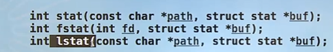
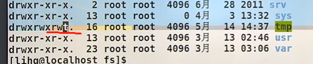
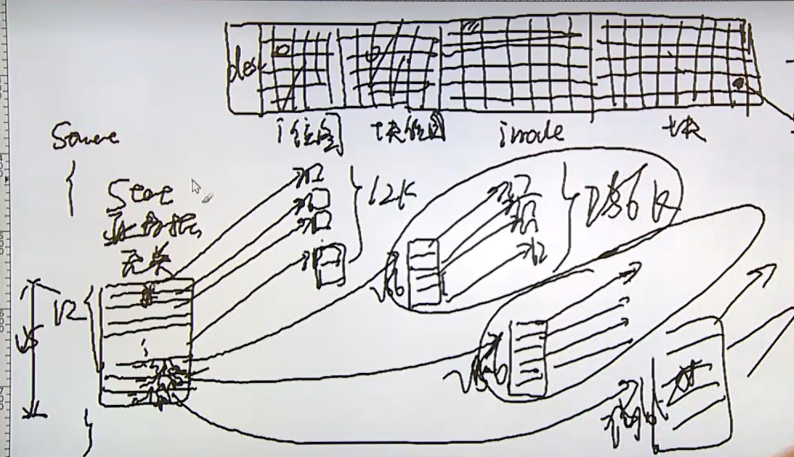

# 文件系统简介n

>1. 目录和文件
>2. 系统数据文件和信息 -- 
>3. 进程环境

----

## 文件目录

>1. 获取文件属性；
>2. 类似于ls的实现；myls
>3. 文件访问权限问题；
>4. umask
>5. chmod fchmod 文件权限的更改/管理
>6. 粘住位
>7. 文件系统是什么东西？？？ FAT，UFS；区别这两个文件系统；
>8. 什么叫硬链接，符号链接（不叫软连接）；
>9. utime
>10. 目录的创建和销毁，mkdir rm -rf
>11. 切换目录，切换当前工作路径；
>12.  分析目录/读取目录内容；

----

````c
//cmd --长格式 -短格式 非选项的传参；
//ls --all
//ls -a 

// touch -a  // 创建一个文件-a
//touch -- -a  --代表格式结束，非选项的传参开始；
//touch ./-a  带上路径；

//ls -a -i -n -l 
 //n是用户id 和组id  l是用户名和组名；
/etc/group
/etc/passwd 
 
````

### 获取文件属性

````c
//命名规则：stat fstat lstat;  文件属性相关的内容；
//默认是跟路径有关；
//就是把路径文件的属性回填到buf当中；
//stat 命令；
int stat(const char *path,struct stat *buf);
// 跟fd 文件描述符有关；   //fstat 就是跟文件描述符有关！！
int fstat(int fd,struct stat *buf);
//link 跟连接有关； //link 跟连接有关！！
int lstat(const char *path,struct stat *buf);

RETURN VALUE
       On success, zero is returned.  On error, -1 is returned, and errno is set appropriately.

    // 看一下这个数据类型；结构体；
    struct stat {
               dev_t     st_dev;     /* ID of device containing file */ //device id 是什么意思？？？
        
               ino_t     st_ino;     /* inode number */
        		//权限信息；是以位图的形式存放的；
               mode_t    st_mode;    /* protection */ //权限管理；
        		//16位的，  9位的基本位,
        		//硬连接数；
               nlink_t   st_nlink;   /* number of hard links */
        
               uid_t     st_uid;     /* user ID of owner */
               gid_t     st_gid;     /* group ID of owner */
        
               dev_t     st_rdev;    /* device ID (if special file) */ //todo 设备id 是什么意思？？？？
        
               off_t     st_size;    /* total size, in bytes */
        	// block size  一个block 是多大；blocksize 一般就是块得大小，一般就是4k;
               blksize_t st_blksize; /* blocksize for file system I/O */
               blkcnt_t  st_blocks;  /* number of 512B blocks allocated */
        	//最后一次 访问时间
               time_t    st_atime;   /* time of last access */
        	//最后一次 数据修改时间
               time_t    st_mtime;   /* time of last modification */
        	//最后一次状态得改变；名字 或者 文件的 权限；
               time_t    st_ctime;   /* time of last status change */
           };

//stat 命令来获取文件的属性；

[root@3192f38073f9 ~]# stat test.c 
  File: 'test.c'
  Size: 0               Blocks: 0          IO Block: 4096   regular empty file
Device: 801h/2049d      Inode: 657029      Links: 1
Access: (0644/-rw-r--r--)  Uid: (    0/    root)   Gid: (    0/    root)
Access: 2023-05-06 10:58:17.421042000 +0000
Modify: 2023-05-06 10:58:17.421042000 +0000
Change: 2023-05-06 10:58:17.421042000 +0000
 Birth: -
     
//小工具tags工具！！！索引树？？？
     
     
     
//linux 中 size 仅仅是一个属性，实际占用的磁盘空间需要看,stat blocks数目得多少！！！
````



### 传参操作

````c
#include <stdio.h>
#include <stdlib.h>

//文件系统

/**
 * char * argv[]  ===>  字符指针数组
 * 传参得时候 
 *  [] === *
 * 注意这个写法；
*/
int main(int argc,char **argv) 
{
    // fs.exe
    if (argc < 2) {
        //报错；
        return 1;
    }
    //.\fs.exe sss
    //第一个参数就是sss
    //就是传递得第一个参数；
    printf("%s\n",argv[1]);
}
````


### st_mode权限

>16位；
>
>3位，文件类型；
>
>9位，基础权限user,group,other的权限！！
>
>3位，特殊权限位；
>
>
>
>以0开头，代表的是8进制；以3bit为一个8进制；
>
>0x是16进制；

```c
//其中文件类型一共七种
//需要三个bit；
// dcb-lsp
//d 目录directory 目录；
//c character device //字符设备； 美 /ˈkærəktər/
//b block 块设备；
//- 文件 regular file  -type f 
//l link 连接 符号连接；  硬连接，是目录下的同义词，并不会有任何的表示！！
//s  socket
//p pipe 管道文件；匿名管道，一般是看不到的！！！ 特指named命名管道！！

```


### umask

`````c
umask  
0022
0666 & ~umask 

110110110
000010010
111101101
//res
//110100100  644的权限；// 产生的文件权限 都是644；
 //umask 就是为了防止 创建的文件权限太低的问题； 防止产生权限过松的文件！！！
 //umask 0002 就是所有的创建文件权限都是600;
 //
    

`````

### chmod + fchmod

````shell
# 可以改变一个文件的权限；
chmod 666 big.c
chmod a+x big.c                  #u+x g+x o+x  添加执行权限；

## fchmod
int chmod(const char *path, mode_t mode);  ##修改一个文件的权限，我们使用的shell命令，chmod 就是通过这个来实现的；
int fchmod(int fd,mode_t mode); # 修改一个打开的文件的权限信息；所以用到了fd；
````


### stick   t位 ，粘住位；----了解一下；

`````c
//粘住位
//作用，在内存保留使用痕迹，下一次调用会非常快；现在又pagecache 来缓存了；
// 
`````



# 文件系统

><font color=red>**文件或数据的存储（存储格式）和管理；**</font>
>
>**不同的文件系统就会有不同的文件数据存储和管理方式！！！**
>
>* UFS unix file systrm，unix早期的文件系统，最新的就是ext3，ext4;开源；
>*  FAT  file  allocate table   windows早期的文件系统！！！不开源；
>* 同一个时期的产物开源的和不开源的差别有多大；
>
>

## FAT文件系统

>**本质： **   **静态单链表；**
>
>现在还在有人用，比如一些sd卡，或者u盘，因为比较小，所以还会有人用！！！
>
>不开源！！！
>
>缺点： 惧怕大文件！
>
>* **承载的文件是有上限的！**
>
>* 数组的大小是有限制的，所以是有限的；方向是有限制的，不能回退；
>
>* 分区； windows分区，C，D，F盘；为什么要做分区？ 也是因为以前的FAT的文件系统的原因；
>
>  ````c
>  //为什么要做分区，也是静态单链表； 承载的文件有上限！！？？？
>  
>  // todo //
>  //分区的优点：
>  //局部查找数据比较快！！！
>  // 
>  ````

````c
// FAT文件系统； file allocate table 文件分配表； 
// FAT/16/32 :静态存储的单链表 ；
#define MAXSIZE 1000
typedef char ElemType;

typedef struct SLinked
{
    int next;
    ElemType data;
    //这是创建了一个数组 //各个元素都是Slinked的数据类型；
} SLinkedList[MAXSIZE]; // 因为数组申请的是连续的；所以会存在大小的限制；

//大小是由限制的，假如每一个块的大小是4k  4k*1000 =  4M；
````


## UFS

>**unix file system;**
>
>开源；开源比闭源强；
>
>优点：
>
>**不会受到文件大小限制；**
>
>缺点：
>
>**小文件太多的时候，查询速度会变慢，innode 全部被沾满，块区，还有很多剩余的问题；**
>
>**不善于管理小文件，就是因为，产生一个新的文件都会产生一个新的inode；就是inode被占用完的问题；符号链接是不占用空间！还有空文件也是不占用空间的**

`````c
//UFS


//文件名

///a/b/c/d  
//目录文件； ==》 可以根据文件名来获取inode ?????
//可以找到innode 和文件名的映射！！

/// 不害怕大文件，所以我们一般都不会分区；
//假如 一个块是4K 64位系统 一个指针式8个字节；所以
//数据块（block）指针组会有15个指针；
//前12块是直接数据块指针； 48K的数据；
//剩下的3个分别是1级渐进块指针 2级渐进块，3级渐进块指针；
// 一个块 包括 800个指针；800*4k = 3200K == 3.2M
//多级指针来实现 大文件的问题！！！
// 一级渐进块 = 3.2M
//2级渐进块指针 === 800*800*4k = 
//3级 渐进块指针 ==== > 800*800*800*4k的文件大小；

//inode 是一个结构体stat函数取出来的所有信息基本都是从inode结构体 取出来的；


//inode 位图来保证，那些inode没有使用；
// 块图也是这个这个功能，那些block没有使用，我们使用的du查看磁盘空间也是这部分功能来实现的；数一下 0，或者1的个数占比就行，就能计算出使用了多少空间； 常用来空间的统计；
`````





###  接触一下位图

>**位图的使用！！！**      **很多人喜欢用这个数据方式，位图；；；；；；**

````c
//一个无符号int，二进制有多少个1，多少个0；
/**
 * 一个无符号的数字由多少个1；
*/
int get1count(unsigned int i)
{
    int count = 0;
    while (i) {
        if (i & 1)
            count++;
        i = i >> 1;
    }
    return count;
}

//1.不用判断表达式，来比较两个无符号数的大小！！
// getmax 就是下面的方法！！！

#include <stdio.h>
#include <stdlib.h>

//文件系统

/**
 * char * argv[]  ===>  字符指针数组
 * 传参得时候 
 *  [] === *
 * 注意这个写法；
*/
int getmax(unsigned int a, unsigned int b);
int getmax1(unsigned int a, unsigned int b);
int main(int argc,char **argv) 
{
    // fs.exe
    // if (argc < 2) {
    //     //报错；
    //     return 1;
    // }
    // //.\fs.exe sss
    // //第一个参数就是sss
    // //就是传递得第一个参数；
    // printf("%s\n",argv[1]);
    int res;
    res = getmax(3,999999999);
    printf("%d\n",res);

}

/**
 * 不适用判断语句来判断两个数的大小
*/

/**
 * 位运算来实现判断
*/
int getmax(unsigned int a, unsigned int b) 
{
    int buff[2] = {a,b};
    unsigned int z = a - b;
    z = z >> 31;
    return buff[z]; // 1 是负数，b大，0是正数 a大；
}

/**
 *数学的知识
 * 
*/
int getmax1(unsigned int a, unsigned int b) 
{
    //得到是大的那个数的两倍；
    return ((a+b+abs(a-b))/2);
}
````


##链接 和目录的访问！！

>符号链接 和 硬链接！！！

`````c
//目录文件，目录文件；
//vim /etc/ 会打开一个目录文件；

//硬链接 和 符号链接； link 
//硬链接与目录项是同义词，且建立硬链接有限制；不能给分区建立，不能给目录建立； 跨分区的话，innode 重复怎么办！！！
//符号链接优点，可以跨分区，可以给目录建立；
ln sourcefile destinationfile  
stat destinationfile  
inode不会变，links +1；
仅仅是两个指针指向同一个空间；
源文件删除，destfile_link 并不会受到影响；links - 1；
 regular file  普通文件
    
//symbol 符号链接； 类似于windows上的快截方式；
ln -s srcfilename destfilename
 
srcfilename  和 destfilename 是两个不同的文件，不同的inode；
links  也是1； 连接数；links
size 是文件名的大小；
block 0；不占用磁盘块；
 删除源文件，再次访问会报错！！！
 文件类型是符号链接文件；
  
  //目录的几个函数；
 // 几个函数  link  unlink  remove(rm 底层就是remove)  rename(change the name or location of  a file === 命令 mv)
    
 // utime 更改文件的时间； change file last access and modification times;  
 // unix 不记录文件的创建时间；
 //要做坏事！！！
 
  //目录的创建和销毁！！！
   mkdir   directory  //目录；
   rmdir 

  // 更改当前工作路径 ---> 
  cd change working directory ===> chdir();//系统调用！！
  fchdir(int fd);

// getcwd current working directory   当前工作路径；
`````


----

For example, if you always want to help test the testing release, use 'testing'. If you are tracking bookworm and want to stay with it from testing to end of life, use 'bookworm'.


#### Component  组成 ，部件	，元件


[main](http://www.debian.org/doc/debian-policy/ch-archive#s-main) consists of [DFSG](http://www.debian.org/social_contract#guidelines)-compliant packages, which do not rely on software outside this area to operate. These are the only packages considered part of the Debian distribution.

[contrib](http://www.debian.org/doc/debian-policy/ch-archive#s-contrib) packages contain DFSG-compliant software, but have dependencies not in main (possibly packaged for Debian in non-free).

[non-free](http://www.debian.org/doc/debian-policy/ch-archive#s-non-free) contains software that does not comply with the DFSG.


-----

- 先选中移动内容

- 块向右移动：Tab键

- 块向左移动：Shift + Tab键  

  

​	phpstorm中得；vscode  需要测试一下；  也是一样得命令；


---

## ctags工具，可以了解一下


https://blog.csdn.net/qq1294272813/article/details/104516109


https://www.shuzhiduo.com/A/pRdBPokPJn/


---

## 符号连接 和 硬链接

---


\#目录也是文件：目录里面存放的内容

inode-------文件名  

软链接：创建一个新文件-------->链接文件路径 是一个新的inode  

硬链接：在目录里面找inode去映射一个新的名称 映射的inode  links 数增加 ，并不是一个新的文件；


---

## overlay 

# overlay 文件系统的功能

 将多个文件目录的内容堆叠到一个目录上。


Filesystem     Type    1K-blocks     Used Available Use% Mounted on
overlay        overlay  61664044  7268412  51233572  13% /
tmpfs          tmpfs       65536        0     65536   0% /dev
tmpfs          tmpfs     1023428        0   1023428   0% /sys/fs/cgroup
//10.0.75.1/G  cifs    314572796 16533956 298038840   6% /linuxc
/dev/sda1      ext4     61664044  7268412  51233572  13% /etc/hosts
shm            tmpfs       65536        0     65536   0% /dev/shm
tmpfs          tmpfs     1023428        0   1023428   0% /proc/scsi
tmpfs          tmpfs     1023428        0   1023428   0% /sys/firmware
