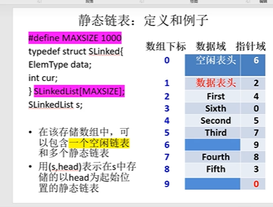

# 静态单链表

>**就是用数组来实现的链表**
>
>这个以后可以看看，就是FAT的底层数据结构；
>
>//todo待做；
>
>**受到了MAXSIZE的限制；**

``````c
//c 


``````

````php
//在php中，对象就是结构体；

class SLinked
{
    //下一个数组的索引；
    public $next;
    public $data;///数据部分；
    public function __construct() {
        
    }
}
#include <stdio.h>

/**
 * 静态链表
 * 由数组来组成的链表；
 * //todo 以后可以去做；
*/


#define MAXSIZE 1000
typedef char ElemType;

typedef struct SLinked
{
    int next;
    ElemType data;
    //这是创建了一个数组 //各个元素都是Slinked的数据类型；
} SLinkedList[MAXSIZE];


/**
 *静态链表的初始化
 * 简单的初始化；
 * 
 * 一个静态表 就是一个数组，space[0].next 就是下一个指针结点；
 * 所以FAT每一个文件保存的数据是有限的；
*/

/**
 * 链表的初始化 init
 * 不应该是数组的初始地址吗？
 * 这里传的参数是数组名；数组名，就是地址；
 * 可以使用 *(space+i)的形式访问数组元素,也可以使用space[i]的形式来访问；
*/
void initSlink(SLinkedList space) {
    int i;
    for (i = 0; i < MAXSIZE -1;i++) {
        space[i].next = i + 1;
    }
    space[MAXSIZE - 1].next = 0;
}


/**
 * 分配一个结点
*/

int allocNode(SLinkedList *space) {

}

````


## 图示

>**空闲表头，代表的数组链表的结束**；


