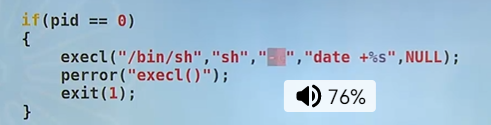

# 用户权限和组权限的实现原理

>

---

# 用户权限和组权限

>权限 u+s  g+s

uid 

* real uid
* effective uid
* save uid

gid

* real gid
* effective gid
* save gid

----

## 函数

>**identity == id 身份！！**！

```c
//比较常用的函数
getuid(); //real uid
geteuid(); //effective uid
getgid(); //real gid
getegid(); //effective gid有效的组id；


setuid(); //设置 effective uid  //sets the effective user ID of the calling process;
setgid(); //设置有效的组id

//原子性的交换！
setreuid(); // 交换 real 和 effective 的uid；
setregid(); // 交换 real 和 effective 的gid；

setegid();  // 有效组id；？？？
NAME
       seteuid, setegid - set effective user or group ID

SYNOPSIS
       #include <sys/types.h>
       #include <unistd.h>

       int seteuid(uid_t euid);
       int setegid(gid_t egid);

```

----

# code

>code

```c
//G:\cwebsite\linuxc\process\mysu.c
#include <stdio.h>
#include <stdlib.h>
#include <unistd.h>

/**
 * 实现一个sudo 权限的切换；
 * sudo root cat /etc/shadow  
 * ./mysu 0 cat /etc/shadow 用0好用户来查看这个文件；
 * shadow阴影； 别的用户是没有查看shadow权限的！！！
*/
//这里仅仅是一个指针数组把 并不是二级指针  多注意一下！！！别被骗了
int main(int argc, char **argv) {
    pid_t pid;
    if (argc < 3) {
        //惯例 用法！！！
        fprintf(stderr, "Usage...\n");
        exit(1);
    }
    pid = fork();
    if (pid < 0) {
        perror("fork()");
        exit(2);
    }
    if (pid == 0) {
        //子进程；
        //不带路径执行命令；
        //????//todo
        //修改自己的权限；
        //你谁呀你，你自己肯定修改不了，必须老大哥 root；
        setuid(atoi(argv[1]));
        execvp(argv[2],argv+2);
        perror("execvp()");
        exit(1);
    }
    wait(NULL);
    exit(0);
}
```


## 解释器 

`````shell
chomod  u+x t.exec 
./exec  结果；

# shell
#!/bin/bash
解释器 脚本文件；

//bash 来解释文件的所有内容；
#!/bin/bash   // 不是shell 不认识会跳过去，或者用其他的解释器来运行；
ls 
whoami
cat /etc/shadow

#/bin/cat  用cat 来解释下面文件内容； 用/bin/cat 来解释下面的内容；
ls
whoami
cat /etc/shadow


[root@fce7a0a3deef bin]# cat /etc/passwd
root:x:0:0:root:/root:/usr/bin/top -S 
# 这个用户登录就是root ,并且直接显示top模式！！！
# 就会通过 ,用户就可以通过你的mysh 来进行mysh了；

`````


## system

> system - execute a shell command

​	int system(const );

SYNOPSIS
       include <stdlib.h>

       int system(const char *command);

DESCRIPTION
       system()  executes  a  command  specified in command by calling  
       /bin/sh -c command,

````c
// 和 few.c的区别
//execl的区别 运行shell ，运行shell命令；
//fork + exec +wait 的封装；
````





## 进程时间 

> times();  
>
> time ./primer0 的运行时间；
>
>      times - get process and waited-for child process times == 包括父进程等待子进程的时间！！！
>
> SYNOPSIS
>        include <sys/times.h>
>
>        clock_t times(struct tms *buffer);

# 辅助知识

 >man 

man  5 acct 结构体格式？ 可以用man 5来查看；？？？ 

man acct是一个函数？？？？
