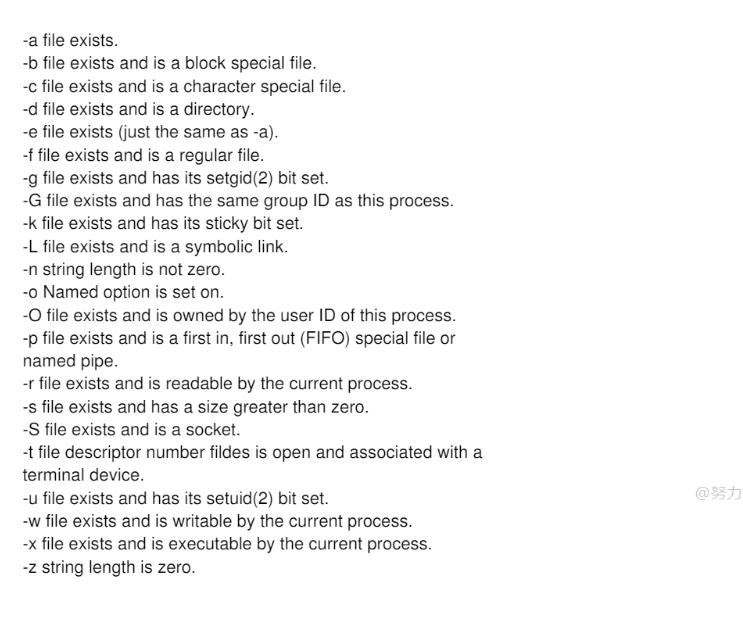

# if的判断条件


//字符串；

-n  notzero  就是变量是不是存在吗？    字符串不为空；值存在；	

````shell
 # 注意这个写法， [ xxx ]   两边都必须有空格；
 [ -n "$ceshi" ] && echo "no zero"
 
 while [ ] 
 do
 done;
 
 for i in {$arrr[]*}
 do
 echo $i;
 done;
 
````


-z   zero  


