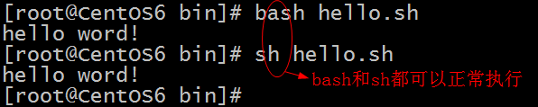

#  shell 脚本执行的四种方法

假设我们编写好的shell脚本的文件名为hello.sh，文件位置在/root/bin目录中并已有执行权限(添加权限的方法：[chmod](https://so.csdn.net/so/search?q=chmod&spm=1001.2101.3001.7020) +x hello.sh)。
1、方法一：切换到shell脚本所在的目录（此时，称为工作目录）执行shell脚本：

./ 是告诉文件相对路径的位置，一个是相对路径一个是绝对路径；  如果只写命令的话，PATH变量又不存在该命令,那么会报错；

**./ 的意思是说在当前的工作目录下执行hello.sh。如果不加上./，bash可能会响应找到不到hello.sh的错误信息。因为目前的工作目录（/root/bin)可能不在执行程序默认的搜索路径之列,也就是说，不在环境变量PASH的内容之中。查看PATH的内容可用 echo $PASH 命令。现在的/root/bin就不在环境变量PASH中的，所以必须加上 ./ 才可执行。**

2、方法二：以绝对路径的方式去执行bash shell脚本(可以在当前目录下执行，也可以不在当前目录下执行)：

3、方法三：切换到工作目录下（/root/bin），直接使用bash 或sh 来执行bash shell脚本，不用给shell脚本加执行权限即可

注意：若是以方法三的方式来执行，那么，可以不必事先设定shell的执行权限，甚至都不用写shell文件中的第一行（指定bash路径）。

**因为方法三是将hello.sh作为参数传给sh(bash)命令来执行的，这时不是hello.sh自己来执行，而是被人家调用执行，所以不要执行权限，那么不用指定bash路径自然也好理解了呀**

**起始 sh 就是一个命令，参数是文件，并不需要执行的权限；执行的权限是直接运行；**

**例如cat file_name file_name 并不需要文件的可执行权限；**

4、方法四：在当前的shell环境中执行用 . hello.sh或source hello.sh来执行 bash shell脚本：

总结：前三种方法执行shell脚本时都是在当前shell（称为父shell)开启一个子shell环境，此shell脚本就在这个子shell环境中执行，shell脚本执行完后子shell环境随即关闭，然后又回到父shell中。而方法四则是在当前shell中执行的。